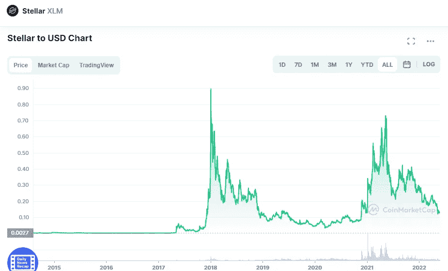

# Stellar 和 Algorand 是好的投资吗？

> 原文：<https://medium.com/coinmonks/are-stellar-and-algorand-a-good-investment-d3a6da6a1809?source=collection_archive---------33----------------------->

# 主要的

Source photo [Stellar price today, XLM to USD live, marketcap and chart | CoinMarketCap](https://coinmarketcap.com/currencies/stellar/)

你对杰德·麦卡勒这个发明了瑞波和恒星的人了解多少？使用 Stellar，银行间支付可能会变得更快、更安全、更经济，就像 RippleNet 平台带给 Ripple net 的一样。鉴于 Stellar 的坚实基础和大约 0.002 美元的当前价格，我们认为它是最有前途的一分钱加密货币…