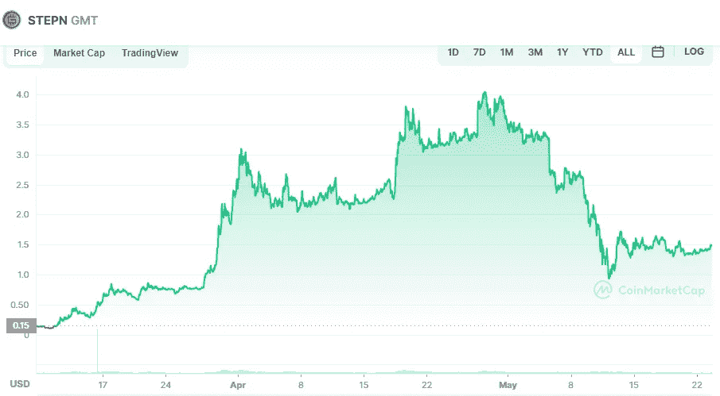

# Stepn (GMT)和 Terra (LUNA)是 5 月份的好投资吗？

> 原文：<https://medium.com/coinmonks/are-stepn-gmt-and-terra-luna-a-good-investment-in-may-1af4a65dbfc2?source=collection_archive---------11----------------------->

# Stepn (GMT)

Source photo [STEPN price today, GMT to USD live, marketcap and chart | CoinMarketCap](https://coinmarketcap.com/currencies/green-metaverse-token/)

作为最具创新性的“移动赚取”数字货币之一，Stepn (GTM)为加密货币和 NFT 的功能带来了新的变化。为了获得步数，用户必须首先购买一双 NFT 鞋，然后记录他们每天走路、慢跑或跑步的步数。你走的步数越多，你的进步就越大