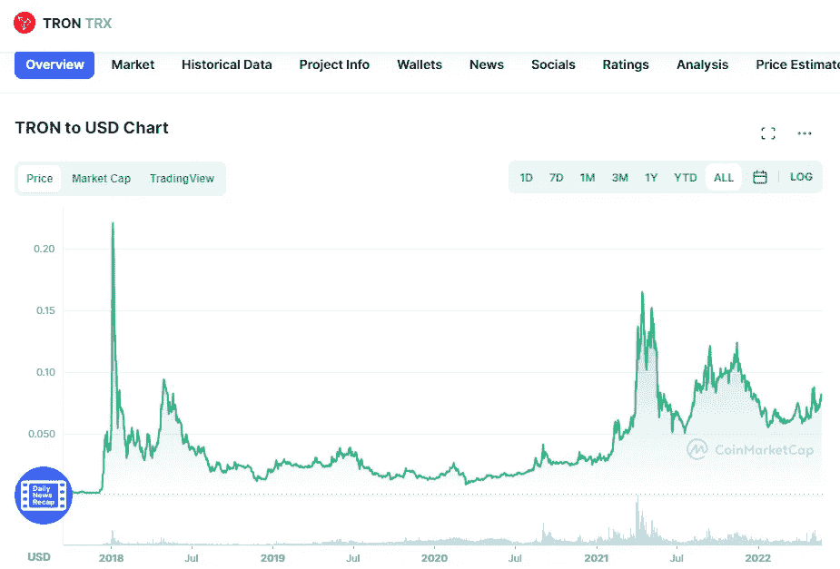

# 创和币安硬币(BNB)是一个好的投资吗？

> 原文：<https://medium.com/coinmonks/are-tron-and-binance-coin-bnb-a-good-investment-e770676270e5?source=collection_archive---------19----------------------->

# 创

Source photo [TRON price today, TRX to USD live, marketcap and chart | CoinMarketCap](https://coinmarketcap.com/currencies/tron/)

作为区块链首屈一指的数字娱乐项目，Tron 加入了我们的最佳 Web 3.0 投资名单。它希望与网飞和苹果电视竞争，但它希望将数字艺术家和制作人直接与观众联系起来，而不是通过一个收取费用的平台作为他们之间的中间人。