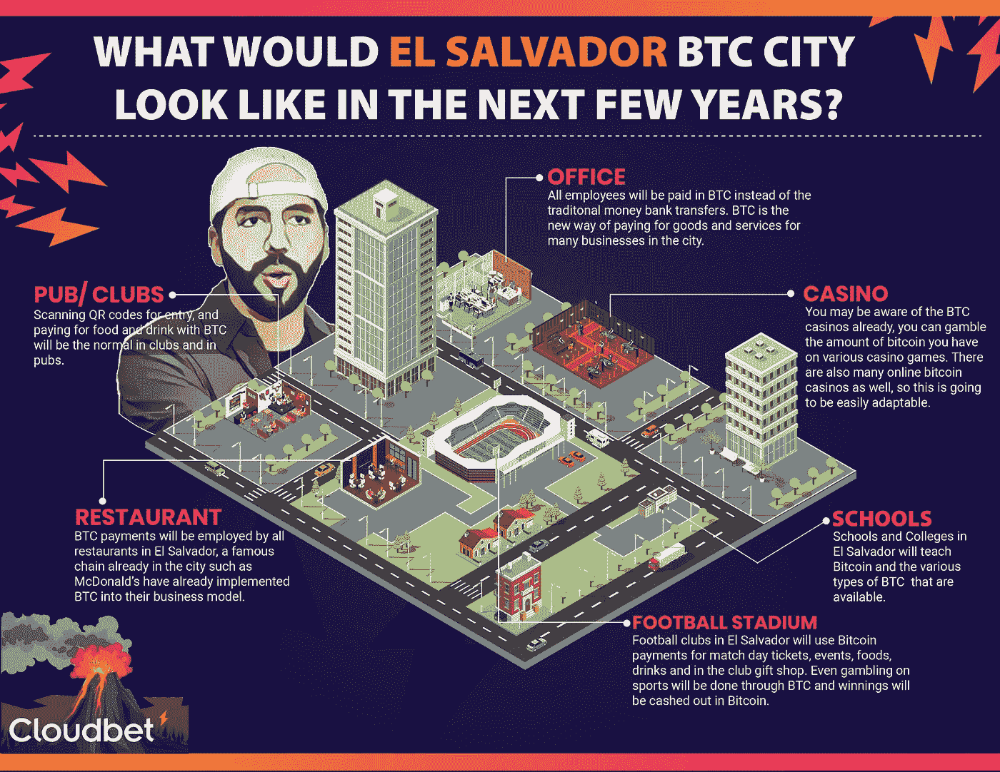

# 随着比特币城市的出现，我们会看到加密技术达到新的高度吗？

> 原文：<https://medium.com/coinmonks/are-we-set-to-see-crypto-reach-new-heights-with-a-bitcoin-city-6ed9c5ca3d70?source=collection_archive---------33----------------------->

[*Bitcoin City El Salvador*](https://cryptonewspipe.com/are-we-set-to-see-crypto-reach-new-heights-with-a-bitcoin-city/)

是的，你没听错，在不久的将来，萨尔瓦多似乎会出现一座比特币城市。尽管总体而言,[比特币](https://cryptonewspipe.com/will-ethereum-network-shine-in-2022/)和[加密](https://cryptonewspipe.com/unix-gaming-metaverse-p2e/)的波动性仍然很高。但未来仍然非常光明，我们可以看到它在未来完全改变货币和投资，这得到了萨尔瓦多总统的支持，他已经…