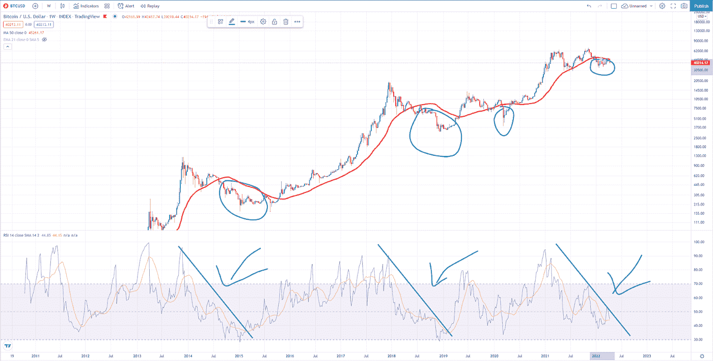
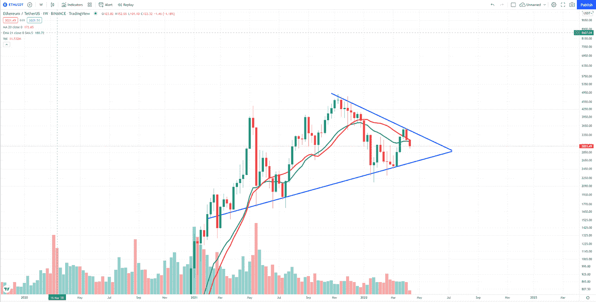

# 你在积累吗？因为我们正处于积累阶段。比特币，以太坊市场分析。

> 原文：<https://medium.com/coinmonks/are-you-accumulating-because-we-are-in-the-accumulation-phase-bitcoin-ethereum-market-analysis-b60533a98cc?source=collection_archive---------57----------------------->

在过去的几周里，加密市场讲述了很多故事。当然，市场还没有成熟到可以不受周围新闻的影响。大事仍在发生，俄罗斯在乌克兰的战争持续了第二个月，埃隆·马斯克在成为 Twitter 最大股东后没有加入公司董事会。

市场分析在这里。

# **比特币**

比特币在 4 月 11 日刚刚经历了一次巨大的抛售，突破了 40000 美元的心理阻力。与上周的“中性”相比，恐惧和贪婪指数处于“极度恐惧”状态。20 天移动平均线在 44545 美元，21 天指数移动平均线在 43162 美元。这意味着，在昨日的大幅抛售之后，多头有相当多的工作要做。但是有一条大鱼要抓，每次价格低于 50 天移动平均线时，都有一个积累阶段。相对强弱指数(RSI)证明了这一点，目前，RSI 刚刚超过 40，显示出买家的巨大机会。见下图，在 50 日均线上，市场总是尊重积累阶段之后的趋势。这个分析告诉我们两个故事:一个是多头需要做大量的工作来打破阻力，另一个是聪明的人将会建立新的头寸。

# 以太坊

ETH，智能合约的象征分散式开源区块链未能守住 20 天移动平均线的支撑。当以太币在心理价位 3000 美元上方交易时，周线蜡烛图正在形成一个三角形。这表明接下来的几周可能会打破或创造这个市场。

注意:投资加密包含风险。提交人对资产损失没有责任。这只是为了教育和信息的目的，因此，它不应该被视为财务建议。请在投资前做好自己的研究。

> 加入 Coinmonks [电报频道](https://t.me/coincodecap)和 [Youtube 频道](https://www.youtube.com/c/coinmonks/videos)了解加密交易和投资

# 另外，阅读

*   [5 款最佳加密交易终端](https://coincodecap.com/crypto-trading-terminals) | [最佳 DeFi 应用](https://coincodecap.com/best-defi-apps)
*   [在美国如何使用 BitMEX？](https://coincodecap.com/use-bitmex-in-usa) | [BitMEX 审查](https://coincodecap.com/bitmex-review)
*   [最佳期货交易信号](https://coincodecap.com/futures-trading-signals) | [期交所评论](https://coincodecap.com/liquid-exchange-review)
*   [南非的加密交易所](https://coincodecap.com/crypto-exchanges-in-south-africa) | [BitMEX 加密信号](https://coincodecap.com/bitmex-crypto-signals)
*   [MoonXBT 副本交易](https://coincodecap.com/moonxbt-copy-trading) | [阿联酋的加密钱包](https://coincodecap.com/crypto-wallets-in-uae)