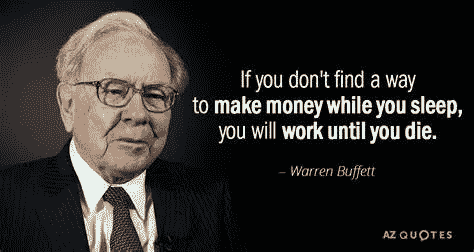

# 你担心股票市场吗？沃伦·巴菲特的投资建议

> 原文：<https://medium.com/coinmonks/are-you-concerned-about-the-stock-market-warren-buffetts-investment-advice-1a6c5e41f021?source=collection_archive---------38----------------------->

Source photo [warren buffett citate — Bing images](https://www.bing.com/images/search?view=detailV2&ccid=PtCs6yjE&id=910FC86D877DC8F4E0FB22A8D6B4E3A84A2659A7&thid=OIP.PtCs6yjEh6JyXq4sChhInQHaD8&mediaurl=https%3a%2f%2fwww.azquotes.com%2fvangogh-image-quotes%2f87%2f85%2fQuotation-Warren-Buffett-If-you-don-t-find-a-way-to-make-money-87-85-65.jpg&cdnurl=https%3a%2f%2fth.bing.com%2fth%2fid%2fR.3ed0aceb28c487a2725eae2c0a18489d%3frik%3dp1kmSqjjtNaoIg%26pid%3dImgRaw%26r%3d0&exph=640&expw=1200&q=warren+buffett+citate&simid=608022427117973302&FORM=IRPRST&ck=D212BA539AD9A74FAED70A4B13409752&selectedIndex=0&ajaxhist=0&ajaxserp=0)

目前全球存在许多不确定性，许多投资者担心这对股票市场的影响。

标准普尔 500 今年迄今下跌了约 13%(技术上进入修正区)，而纳斯达克同期下跌了近 18%。随着乌克兰局势的动荡、持续的供应链问题以及…