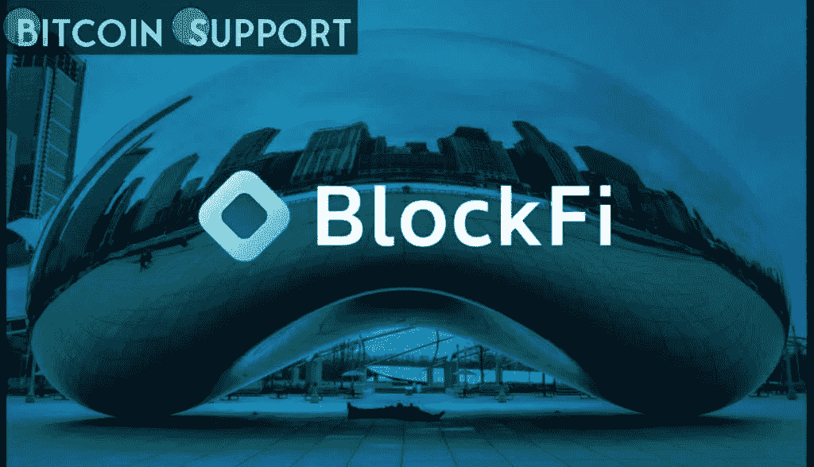

# 你满足于被统治吗？BlockFi 和解的后果不得而知

> 原文：<https://medium.com/coinmonks/are-you-content-to-be-governed-the-consequences-of-the-blockfi-settlement-are-unknown-8919d58c5034?source=collection_archive---------39----------------------->

[https://bitcoinsupports.com/](https://bitcoinsupports.com/)

The $100 million penalties, which is a world record, might usher in a new age for crypto lending services.

It may seem strange that BlockFi founder and CEO Zac Prince would call a $100 million punishment for his firm “a success not only for BlockFi but for the larger bitcoin sector,” yet he did. And he may be correct, albeit that remains to be seen for the time being.

**The agreement**

BlockFi is a crypto financial institution established in New Jersey with 850 employees and one million customers globally. On July 20, 2021, the Securities and Exchange Commission (SEC) and 32 state attorneys general issued a cease and desist order against its popular BlockFi Interest Account product, which has half a million members worldwide, including 407,000 in the United States. BlockFi was accused of “selling unregistered securities in the form of interest-earning cryptocurrency accounts that have collected at least $14.7 billion worldwide,” according to a statement issued by the NJ Attorney General’s Office at the time.

The SEC charged BlockFi with “failing to register the offers and sales of its retail crypto loan product” on February 14\. BlockFi was also accused of deceiving investors by claiming that its institutional loans were “usually” over-collateralized while only about 24% of the loans were actually over-collateralized. This is described as a “operational oversight” that occurred as it became evident that significant financial institutions were unwilling to overcollateralize their loans in the order instituting proceedings.

Finally, BlockFi agreed to pay a $50 million penalty to the Securities and Exchange Commission and another $50 million to the 32 states without admitting wrongdoing or culpability. BlockFi would also “try to bring its business within the terms of the Investment Company Act within 60 days,” according to the filing. In the interim, clients in the United States are unable to add cash to their BlockFi Interest Accounts, and new accounts cannot be opened in the United States or by Americans. BlockFi Yield, a new SEC-compliant lending product, will be created, and existing BlockFi Interest Accounts will be converted to it.

**First past the post is the winner.**

BlockFi has one advantage: it will be regulated.

Stephen Piepgrass, a partner at Troutman Pepper who focuses on state attorneys general, described the events as “the inevitable evolution of any corporation.”

“First they operate in a grey regulatory zone,” Piepgrass told, “then those that can comply come into the light.” BlockFi can benefit from being the first to approach regulation by “helping negotiate new conditions.”

Piepgrass says that attempts by the SEC and state attorneys general to regulate crypto loans are still ongoing behind the scenes. There has already been some action. Last year, the fear of an SEC lawsuit deterred Coinbase from launching its Coinbase Lend programme. The SEC is believed to be investigating Celsius, Gemini, and Voyager Digital.

In the announcement of the settlement, Gurbir S. Grewal, director of the SEC’s Division of Enforcement and former New Jersey attorney general, said, “Crypto lending platforms offering securities like BlockFi’s should take immediate notice of today’s resolution and come into compliance with the federal securities laws.” “Adherence to our registration and disclosure standards is crucial in providing investors with the knowledge and transparency they require to make well-informed crypto asset investment decisions.”

**The road to compliance is rocky.**

Not everyone thinks this is an unequivocal victory for the bitcoin business or its users. In a dissenting statement on the BlockFi settlement, SEC commissioner Hester Peirce pointed out potential outcomes that would be less than ideal. “Today’s settlement may prevent retail crypto loan products from being offered to retail clients in the United States,” she said, rather than mandating transparency.

Peirce also underlined the difficulty of complying with the Investment Company Act’s requirements, describing the planned 60-day deadline as “very ambitious,” even with a 30-day extension. She may have mentioned that approval of the new BlockFi Yield product is not guaranteed.

The BlockFi case, according to Philip Moustakis, a former SEC Division of Enforcement senior counsel and current counsel at Seward & Kissell, is “a shot across the bow of crypto lending platforms.” According to him, the case is significant since BlockFi is the first “major” crypto lender to be charged.

Moustakis told that a “more explicit pathway to compliance” would have been preferable. The SEC may be obliged to examine crypto lending sites individually if it does not take “a broad-based enforcement action with concrete carrots and sticks,” he said.

The BlockFi case represents “the next degree of difficulty” for the SEC, according to Moustakis, in its continuous effort to regulate bitcoin. The $100 million fine is the biggest ever paid by a cryptocurrency firm.

The full impact of the SEC’s prosecution against BlockFi will take some time to emerge. However, the consequences have already begun. Nexo reportedly ceased paying interest to Earn Interest subscribers in the United States on February 18\. The Earn Interest product “will not be offered for new clients in its current form until the restructuring of the Earn Interest Product and the registration process with the relevant regulatory agencies are completed, as per the recently obtained guidelines,” according to the business.

**Disclaimer: These are the writer’s opinions and should not be considered investment advice. Readers should do their own research.**

> 加入 Coinmonks [电报频道](https://t.me/coincodecap)和 [Youtube 频道](https://www.youtube.com/c/coinmonks/videos)了解加密交易和投资

# 另外，阅读

*   [币安 vs FTX](https://coincodecap.com/binance-vs-ftx) | [最佳(SOL)索拉纳钱包](https://coincodecap.com/solana-wallets)
*   [比诺莫评论](https://coincodecap.com/binomo-review) | [斯多葛派 vs 3Commas vs TradeSanta](https://coincodecap.com/stoic-vs-3commas-vs-tradesanta)
*   [Capital.com 评论](https://coincodecap.com/capital-com-review) | [香港的加密借贷平台](https://coincodecap.com/crypto-lending-hong-kong)
*   [如何在 Uniswap 上交换加密？](https://coincodecap.com/swap-crypto-on-uniswap) | [A-Ads 审查](https://coincodecap.com/a-ads-review)
*   [WazirX vs coin dcx vs bit bns](/coinmonks/wazirx-vs-coindcx-vs-bitbns-149f4f19a2f1)|[block fi vs coin loan vs Nexo](/coinmonks/blockfi-vs-coinloan-vs-nexo-cb624635230d)
*   [本地比特币评论](/coinmonks/localbitcoins-review-6cc001c6ed56) | [加密货币储蓄账户](https://coincodecap.com/cryptocurrency-savings-accounts)
*   什么是融资融券交易
*   [维护卡审核](https://coincodecap.com/uphold-card-review) | [信任钱包 vs 元掩码](https://coincodecap.com/trust-wallet-vs-metamask)