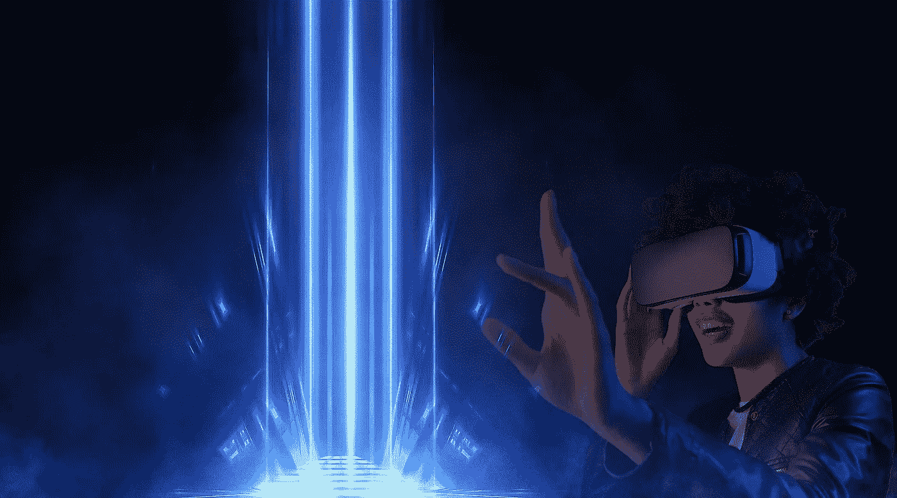

# 你在寻找元宇宙虚拟世界吗？这是十大值得探索的地方。

> 原文：<https://medium.com/coinmonks/are-you-in-search-of-metaverse-virtual-worlds-these-are-the-top-ten-to-explore-fda1a6801e21?source=collection_archive---------20----------------------->

# 分散的土地，超宇宙，和更多的是虚拟世界的舞台，是必不可少的元宇宙。

元宇宙是一个位于区块链的虚拟世界，它正在改变游戏行业。这个游戏的计划是围绕着一个生动的遭遇，玩家可以在玩的时候带来现金，并建立重要的联系。这是一个基于区块链创新的扩展现实游戏。高级资源是这个 3D 开放世界的焦点。这些资源构成了元宇宙环境的基础。这篇文章包括了 10 个主要的元宇宙虚拟世界。

## 分散土地

分散王国将自己描述为一个由以太坊区块链控制的计算机生成的模拟舞台，允许客户制作、洞察和改编内容和应用程序。MANA 是分散式舞台上所有交换的本地令牌。在这个虚拟世界中，客户购买小块土地，他们以后可以探索、扩张和适应。自 2020 年 2 月向公众开放以来，客户在他们的土地上进行了广泛的接触，包括智能游戏、漫无边际的 3D 场景和不同的其他直观接触。投身分散的土地，创造你自己的象征。

## 下层

Bases 是一个多客户端的互联网/元宇宙。与不同的客户交谈或调查不同客户制作的项目和景点。你可以制作一个免费的客户端记录，也可以向世界添加对象！基质中的土地束可以购买，并可以打印为以太坊 NFT。基础是从一开始就被开发的，如果不是太麻烦的话，预计会有粗糙的边缘！

## 超级防御

HyperVerse 是元宇宙必不可少的虚拟世界舞台。每个世界都是一颗行星，超宇宙包含了各种各样的行星，没有任何一个单独的天体声称拥有它们。一个宇宙有许多不同的宇宙。每个生活在超宇宙中的人都被暗指为旅行者。探险者可以制作代币，互相吸引，共同探索地球。

## 星图(Atlas)

星际地图是一款设定在 2620 年的 VR 游戏。成功、政治实力和资产聚集是星图的主要部分。代币可以在整个游戏中获得。索拉纳是这项运动的基本奖项。索拉纳被称为“以太坊杀手”没有过多的天然气成本或适应性问题。

## 矩阵世界

《黑客帝国》是一个巨大的模仿计算机生成的世界体验，它是在二十世纪和二十一世纪之交由人造智能制造的，以保持人类的个性在他们作为自然战俘出现时得到照顾。

## 隐体素

Cryptovoxels 是一个虚拟世界和元宇宙，由以太坊区块链。玩家可以购买土地，建造商店和工艺展览。改变设备、符号和文本访问是潜在的。研究指南，寻找画廊、门户或有组织的收藏。

## 沙箱

基于区块链的沙盒是一种游戏和虚拟存在，在这里你可以购买、出售和交换虚拟地块。沙盒是基于以太坊区块链，这是它的成立。它以其力量和安全性而闻名。这是，然后再一次，不是特别适度的利用。沙盒已经产生了它的以太坊为基础的数字货币，指定为沙，以实现这一点。沙子代币允许你使用你的数字货币在以太坊网络上支付汽油费用。

## Somnium 空间

Somnium Space 是一个开源的舞台。客户可以购买先进的土地，组装房屋和结构，玩超实用的电脑游戏，开始组织，并主张显示和现场活动。Somnium Space 的作者兼首席执行官阿图尔·瑟乔夫(Artur Sychov)于 2017 年送下舞台，并于 2018 年 9 月向普通社会开放。这个空间是通过虚拟现实、个人电脑和网络获得的，这同样也可以在通用上获得。注意力集中在为其客户提供最佳的突出增强模拟体验上。

## NFT 世界

NFT 世界是一个由 10，000 个虚拟世界组成的混合体，它们以 NFT 的形式存在于区块链以太坊。每一个世界都是一个无边无际的宇宙，可以融入客户所能想象的任何事物。基于《我的世界》的顶部，每块土地都是一个比通常的元宇宙更小的地方，客户可以按照他们认为合适的方式进行专业设计、塑造和规划。每个人都有过人之处，允许客人去考察。潜在的结果似乎难以预料，因为 NFT 的业主可以以任何身份塑造他们目前的环境。他们可能会开发新的游戏模式。举例来说，当地发挥了部分乱搞，塔战斗游戏，和第一个个人射手。每一个这些元素发挥采购机制，以获得 WRLD 或由 NFT 世界控制的不同奖项。

## 环球韦布

总的来说，韦伯是一个互操作的像素工艺 MMORPG 元宇宙游戏给著名的 NFT 项目的效用。游戏的目的是为游戏中的 NFT 头像、宠物、土地、NFT 物品和旅程提供 NFT。由一群本地游戏设计者、工匠、编码者和广告商组成的团体，以一种前所未有的思维方式发送；迅速推出新的创新和应用。

> 加入 Coinmonks [电报频道](https://t.me/coincodecap)和 [Youtube 频道](https://www.youtube.com/c/coinmonks/videos)了解加密交易和投资

# 另外，阅读

*   [有哪些交易信号？](https://coincodecap.com/trading-signal) | [Bitstamp vs 比特币基地](https://coincodecap.com/bitstamp-coinbase) | [买索拉纳](https://coincodecap.com/buy-solana)
*   [ProfitFarmers 回顾](https://coincodecap.com/profitfarmers-review) | [如何使用 Cornix 交易机器人](https://coincodecap.com/cornix-trading-bot)
*   [十大最佳加密货币博客](https://coincodecap.com/best-cryptocurrency-blogs) | [YouHodler 评论](https://coincodecap.com/youhodler-review)
*   [my constant Review](https://coincodecap.com/myconstant-review)|[8 款最佳摇摆交易机器人](https://coincodecap.com/best-swing-trading-bots)
*   [MXC 交易所评论](/coinmonks/mxc-exchange-review-3af0ec1cba8c) | [Pionex vs 币安](https://coincodecap.com/pionex-vs-binance) | [Pionex 套利机器人](https://coincodecap.com/pionex-arbitrage-bot)