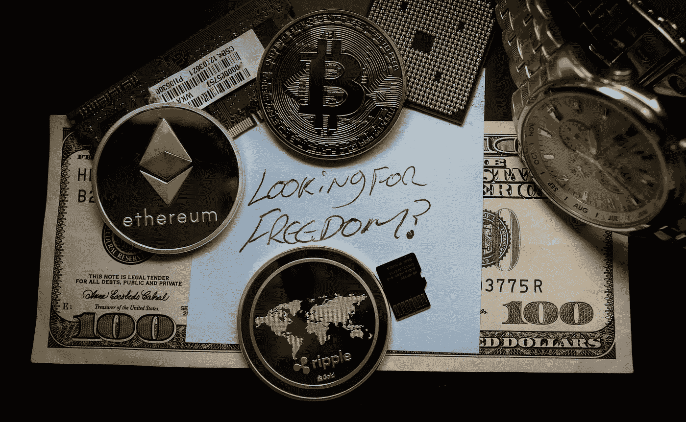

# 你加密要迟到了吗？

> 原文：<https://medium.com/coinmonks/are-you-late-to-crypto-336b28613d7e?source=collection_archive---------95----------------------->

How Far Will You Go

随着拜登的行政命令在 crypto 上签署，你可能想知道这对你意味着什么？如果你已经是秘密经济的一部分，那么你会没事的。如果你一直在新闻上听到比特币(BTC)和以太坊(ETH)，或者你一直在脸书或推特上看到 NFT，你可能会想我需要做什么。真正的答案可能是什么都没有，但也许你想走在曲线的前面。

今天我要谈谈 CBDC(中央银行数字货币)。到今天为止，美国还没有一个 CBDC。这很像你今天使用的法定货币，但在区块链，但他们正在努力。那么，你想等到美国赶上其他已经推出自己的 CBDC 的国家后，再与区块链进行首次互动吗？

尼日利亚在 10 月 21 日发布了 eNaira，中国在 19 日发布了 eCYN，但在 22 届奥运会期间，它在麦当劳和耐克等公司的使用变得更加流行。也是在 21 '年，BTC 成为萨尔瓦多国家认可的法定货币。那么，这些国家的政府是如何让他们的数字货币惠及所有公民的呢？美国政府将如何把他们的 CBDC 带给我们所有人？

这也是他们试图弄清楚的一部分。在萨尔瓦多，他们向任何下载他们官方钱包的人赠送 30 美元的 BTC。中国也有自己的应用程序，可以连接到实体卡上，与它的 eCYN 一起使用，尼日利亚也有自己的钱包，供其公民使用 eNaira。因此，我们可以预计，美国正在打造自己的钱包。

现在，就美国 CBDC 而言，它不会像 BTC 那样随着时间的推移而升值。它将是一枚稳定的硬币——一种在区块链与美元挂钩的货币。现在在加密领域已经有了稳定的硬币，它们倾向于在 DeFi(去中心化金融)中使用。那么是什么使得不同于或戴这两种流行的稳定硬币呢？简而言之，一个是分散的，另一个是集中的。

所以要回答，你如何走在曲线的前面。从准备一个钱包开始，因为一旦 CBDC 在美国上线，你无论如何都需要一个。即使你只买 30 美元的 BTC，就像萨尔瓦多给他们的公民的一样，你也超过了 80%的美国人，就我所知，美国应该通过税收抵免来获得他们的 CBDC。我们都必须纳税，所以为什么不把我们的一些税款放回 CBDC 呢？也许通过下载美国官方钱包，我们可以获得税收抵免。现在我不知道这是否可能，只是我对一种可能情况的想法。

加密很像 90 年代末的互联网。它会一直存在，但很少有人真正了解整个空间，因为它发展得如此之快。除了这次不是我问我妈妈一个问题，她说谷歌一下，我小时候的反应是“谷歌不是所有事情的答案，妈妈”哦，我错了。这次我妈妈问我什么是 CBDC，为什么她需要一个钱包。

在 90 年代，大多数人知道互联网是什么，但不知道它的每一种用途。2022 年的今天，超过 80%的美国成年人知道什么是比特币，但只有大约 20%的人拥有比特币或其他加密货币。现在想象一下，如果你在 90 年代买了谷歌的股票，想象一下如果你今年买了一点 BTC，你的家人会在 2050 年说什么。顺便说一句，2100 万年后，BTC 再也不会被开采了，估计要到 2140 年左右。如果你认为你在这一领域为时已晚，请记住我们的政府刚刚开始对其进行监管，他们在 90 年代中期对互联网做了同样的事情。

*在评论中留下你认为美国应该如何摆脱他们的 CBDC*