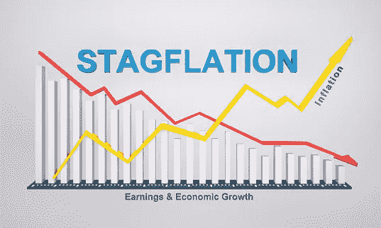

# 你已经老到可以记得滞胀了吗？

> 原文：<https://medium.com/coinmonks/are-you-old-enough-to-remember-stagflation-dce7596b8367?source=collection_archive---------46----------------------->

pixabay

我的研究发现了一个自 20 世纪 80 年代以来就没有在美国使用过的词。这个词就是滞胀。它是由英国大臣莱恩·麦克劳德在 20 世纪 60 年代中期创造的。当高通胀和低经济增长同时发生时，滞胀就发生了。高失业率也导致了滞胀。尽管美国的失业率最近已经从疫情的 14.7%的高点下降了…