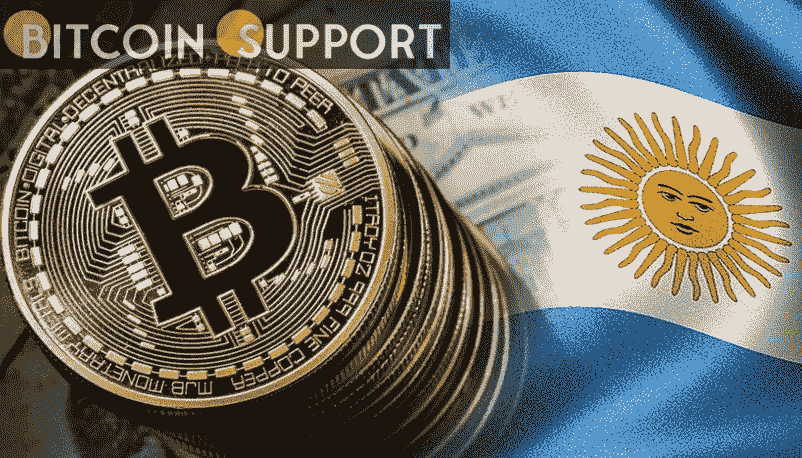
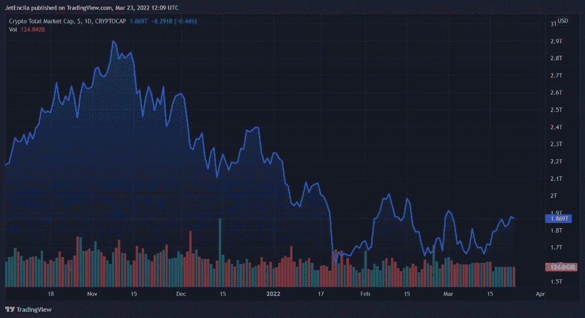

# 阿根廷蜂拥而至，玩加密货币游戏即赚即付

> 原文：<https://medium.com/coinmonks/argentina-flocks-to-earn-as-you-play-cryptocurrency-games-b7b524eb0808?source=collection_archive---------49----------------------->

**Visit our website:-** [**https://bitcoinsupports.com/**](https://bitcoinsupports.com/)

随着近年来该国游戏人口的增加，阿根廷民众正蜂拥至玩赚取加密货币游戏，以补充他们的收入和必需品。据彭博称，由于通货膨胀达到 10 个月来的最高水平，阿根廷人从这些游戏中获得的收入经常超过他们的工资。

阿根廷，南美第二大经济体，在以盈利为导向的赌博方面，已经上升到拉美第一，整体第五。

根据最近的统计，今年有近万名阿根廷人参观了分散式运动会。分散是世界上最大的元宇宙公司，拥有最多的游戏玩家。

**拯救世界的加密游戏**

根据彭博的统计，巴西的邻国阿根廷也榜上有名，目前是第六大最受欢迎的游戏目的地。

两国都遭受恶性通货膨胀，在拉美仅次于委内瑞拉。

阿根廷的基本商品成本正以每年超过 50%的速度增长，但在过去四年中，基本工资的增长速度低于通货膨胀率。根据数据显示，去年巴西的年通胀率飙升至 10%左右。

**Visit our website:-** [**https://bitcoinsupports.com/**](https://bitcoinsupports.com/)

**一边玩一边赚钱**

简单来说，玩赚游戏就是让玩家赚取现实世界奖励的电子游戏。

虽然历史上个人通过“淘金”和未经许可的游戏内物品市场等方法从视频游戏中赚钱，但区块链技术和 NFTs 的出现彻底改变了游戏。

Axie Infinity 是阿根廷最受欢迎的 P2E 游戏之一。Axie Infinity 是一款由越南工作室 Sky Mavis 开发的使用不可替换代币的在线视频游戏。这款游戏因其建立在以太坊区块链上的游戏内经济而闻名。

Axie Infinity 玩家收集并铸造描绘 Axie 的 NFT。Axie Infinity 的拉丁美洲首席执行官毛里西奥拉莫斯(Mauricio Ramos)表示，参与代表美国人和德国人玩的

游戏需要大量投资，因为他们没有能力购买自己的账户。他解释说，许多游戏都需要相当大的初始费用，很容易就能达到数百美元。

分散游戏公司投资者关系总监 Gabriel Mellace 表示:

***“阿根廷和巴西的统计数据表明，这一数字将继续上升……年轻人的动机不仅仅是经济利益。他们也在寻找乐趣。”***

在这场游戏赚钱玩家激增之前，阿根廷已经是比特币的热点。居民越来越多地成为自由职业者，部分原因是可以获得加密货币的报酬。大约 90%的加密货币交易是在 BTC 或 ETH 进行的。

**访问我们的网站:-**[**https://bitcoinsupports.com/**](https://bitcoinsupports.com/)

**免责声明:以上为作者观点，不应视为投资建议。读者应该自己做研究。**

> 加入 Coinmonks [电报频道](https://t.me/coincodecap)和 [Youtube 频道](https://www.youtube.com/c/coinmonks/videos)了解加密交易和投资

# 另外，阅读

*   什么是融资融券交易
*   [维护卡审核](https://coincodecap.com/uphold-card-review) | [信任钱包 vs MetaMask](https://coincodecap.com/trust-wallet-vs-metamask)
*   [Exness 点评](https://coincodecap.com/exness-review)|[moon xbt Vs bit get Vs Bingbon](https://coincodecap.com/bingbon-vs-bitget-vs-moonxbt)
*   [如何开始通过加密贷款赚取被动收入](https://coincodecap.com/passive-income-crypto-lending)
*   [BigONE 交易所评论](/coinmonks/bigone-exchange-review-64705d85a1d4) | [电网交易机器人](https://coincodecap.com/grid-trading)