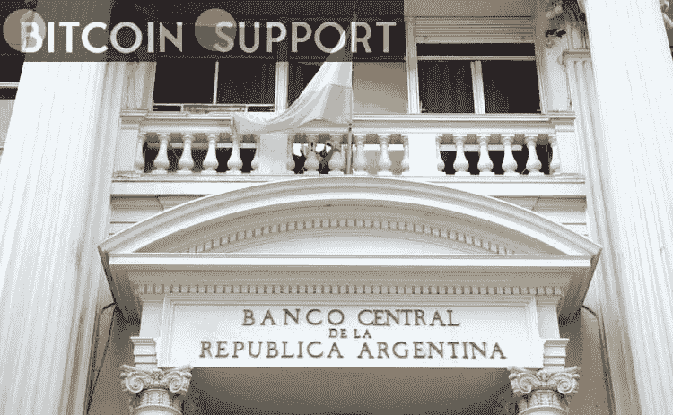

# 阿根廷央行正在为数字钱包制定新法规

> 原文：<https://medium.com/coinmonks/argentinas-central-bank-is-developing-new-regulations-for-digital-wallets-fae7ef1eaf36?source=collection_archive---------67----------------------->

**Visit our website:-** [**https://bitcoinsupports.com/**](https://bitcoinsupports.com/)

阿根廷央行显然正在制定一套新的立法，旨在监管该国所有的数字钱包。这一新的立法框架旨在打击这些文书理应帮助的欺诈行为。据透露给当地媒体的消息，该法案即将公布。

**阿根廷央行瞄准数字钱包**

阿根廷央行已经盯上了数字钱包的使用。该银行的目录显然正在制定一套新的法律，以更好地了解数字钱包中的资金发生了什么，并加强他们的 KYC 要求。关于如何做到这一点，它说:

***“这不是要禁止任何事情，而是要适用银行今天在了解客户方面必须遵守的同样规则。”*央行官员强调，因为不是所有钱包的操作都一样，所以这些法律将不得不在个案的基础上实施。这一举措将使该行能够控制像 Mercado Pago 这样的约 3000 万数字钱包用户。去年，阿根廷央行要求这些公司将 100%的客户资产保留在银行账户中，这实际上消除了企业从部分资金投资中获利的能力。

**没收已经开始**

当中央银行正在为数字钱包制定这一新的法律框架时，阿根廷税务当局 AFIP 已经开始扣押欠费纳税人数字钱包中的资金。预计近 10，000 名纳税人的数字钱包将在未来几个月内被查封。这一阴谋可能已经在进行中，因为当地媒体报道说，这些扣押的第一例已经发生。据报道，AFIP 要求第一次没收，一名法官批准该组织扣押数字账户中的资金，以偿还用户的债务。当局试图先拿走纳税人的银行账户，但这一努力失败了。**

**访问我们的网站:-**[**https://bitcoinsupports.com/**](https://bitcoinsupports.com/)

**免责声明:这些是作者的观点，不应被视为投资建议。读者应该自己做研究。**

> 加入 Coinmonks [电报频道](https://t.me/coincodecap)和 [Youtube 频道](https://www.youtube.com/c/coinmonks/videos)了解加密交易和投资

# 另外，阅读

*   [如何在 Bitbns 上购买柴犬(SHIB)币？](https://coincodecap.com/buy-shiba-bitbns) | [买弗洛基](https://coincodecap.com/buy-floki-inu-token)
*   [CoinFLEX 评论](https://coincodecap.com/coinflex-review) | [AEX 交易所评论](https://coincodecap.com/aex-exchange-review) | [UPbit 评论](https://coincodecap.com/upbit-review)
*   [十大最佳加密货币博客](https://coincodecap.com/best-cryptocurrency-blogs) | [YouHodler 评论](https://coincodecap.com/youhodler-review)
*   [AscendEx 保证金交易](https://coincodecap.com/ascendex-margin-trading) | [Bitfinex 赌注](https://coincodecap.com/bitfinex-staking)
*   [最好的卡达诺钱包](https://coincodecap.com/best-cardano-wallets) | [Bingbon 副本交易](https://coincodecap.com/bingbon-copy-trading)
*   [印度最佳 P2P 加密交易所](https://coincodecap.com/p2p-crypto-exchanges-in-india) | [柴犬钱包](https://coincodecap.com/baby-shiba-inu-wallets)
*   [8 大加密附属计划](https://coincodecap.com/crypto-affiliate-programs) | [eToro vs 比特币基地](https://coincodecap.com/etoro-vs-coinbase)