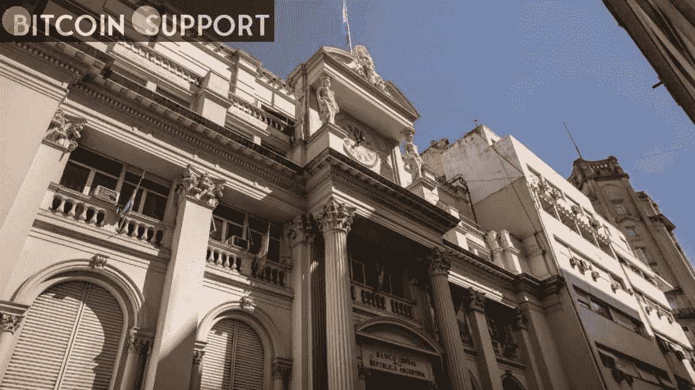

# 阿根廷最大的两家银行已经同意允许加密交易

> 原文：<https://medium.com/coinmonks/argentinas-two-largest-banks-have-agreed-to-allow-crypto-trading-6c7e5d0bf4f5?source=collection_archive---------30----------------------->

**For full blog visit:-**[**https://bitcoinsupports.com/argentinas-two-largest-banks-have-agreed-to-allow-crypto-trading/**](https://bitcoinsupports.com/argentinas-two-largest-banks-have-agreed-to-allow-crypto-trading/)

阿根廷最大的银行采用了加密货币，并将很快允许其客户使用银行账户购买四种加密资产，包括比特币。阿根廷第一大和第二大私人银行 Banco Galicia 和 Brubank 宣布，客户将可以购买加密货币。5 月 2 日，彭博报道称，在阿根廷的一项民意调查中，高达 60%的受访者要求扩大加密货币的使用范围，这促使银行开始启用加密交易。

市场研究公司 Americas Market Intelligence 的子公司伊格纳西奥·卡巴略于 5 月 3 日证实，加利西亚银行已经开始使用该银行的在线界面截图支持比特币(BTC)、以太币(ETH)、美元币(USDC)和 Ripple (XRP)购买。https://twitter.com/IECarballo/status/1521165078560755713

这个南美国家拥有世界第六高的加密采用率。Statista 预计，到 2021 年，21%的阿根廷人将使用或拥有加密货币。允许消费者通过银行购买比特币和其他加密货币可能有助于阿根廷人领先于该国严重的通货膨胀。根据经济数据跟踪机构 Trading Economics 的最新数据，阿根廷 4 月份的通胀率为 55%。支持者称，比特币的稀缺性和分散性使其成为理想的通胀对冲工具。

上个月，阿根廷小镇 Sorradino 购买了采矿钻机，并宣布计划创办一家比特币采矿公司，以对抗通货膨胀。它的采矿收入预计为每月数百美元。阿根廷首都布宜诺斯艾利斯市长奥拉西奥·罗德里格斯·拉雷塔上个月底表示，该市将开始接受加密货币作为公共金融服务的支付手段，理由是其采用率很高。为了市民，这座城市还打算开发一个基于区块链的数字身份(DID)平台。

另一方面，阿根廷并不是南美洲拥抱加密货币最多的国家。4 月 26 日，巴西参议院通过了“比特币法律”法案，这可能为该国的加密经济提供急需的立法框架。在总统 Jair Bolsinaro 签署成为法律之前，它只需要再通过一个委员会。

**完整博客访问:-**[**https://bitcoinsupports . com/argentinas-two-largest-banks-have-agreed-to-allow-crypto-trading/**](https://bitcoinsupports.com/argentinas-two-largest-banks-have-agreed-to-allow-crypto-trading/)

**免责声明:以上为作者观点，不应视为投资建议。读者应该自己做研究。**

> 加入 Coinmonks [电报频道](https://t.me/coincodecap)和 [Youtube 频道](https://www.youtube.com/c/coinmonks/videos)了解加密交易和投资

# 另外，阅读

*   [OKEx vs KuCoin](https://coincodecap.com/okex-kucoin) | [摄氏替代品](https://coincodecap.com/celsius-alternatives) | [如何购买 VeChain](https://coincodecap.com/buy-vechain)
*   [币安期货交易](https://coincodecap.com/binance-futures-trading)|[3 comas vs Mudrex vs eToro](https://coincodecap.com/mudrex-3commas-etoro)
*   [如何购买 Monero](https://coincodecap.com/buy-monero) | [IDEX 评论](https://coincodecap.com/idex-review) | [BitKan 交易机器人](https://coincodecap.com/bitkan-trading-bot)
*   [CoinDCX 评论](/coinmonks/coindcx-review-8444db3621a2) | [加密保证金交易交易所](https://coincodecap.com/crypto-margin-trading-exchanges)
*   [红狗赌场评论](https://coincodecap.com/red-dog-casino-review) | [Swyftx 评论](https://coincodecap.com/swyftx-review) | [CoinGate 评论](https://coincodecap.com/coingate-review)
*   [Bookmap 评论](https://coincodecap.com/bookmap-review-2021-best-trading-software) | [美国 5 大最佳加密交易所](https://coincodecap.com/crypto-exchange-usa)