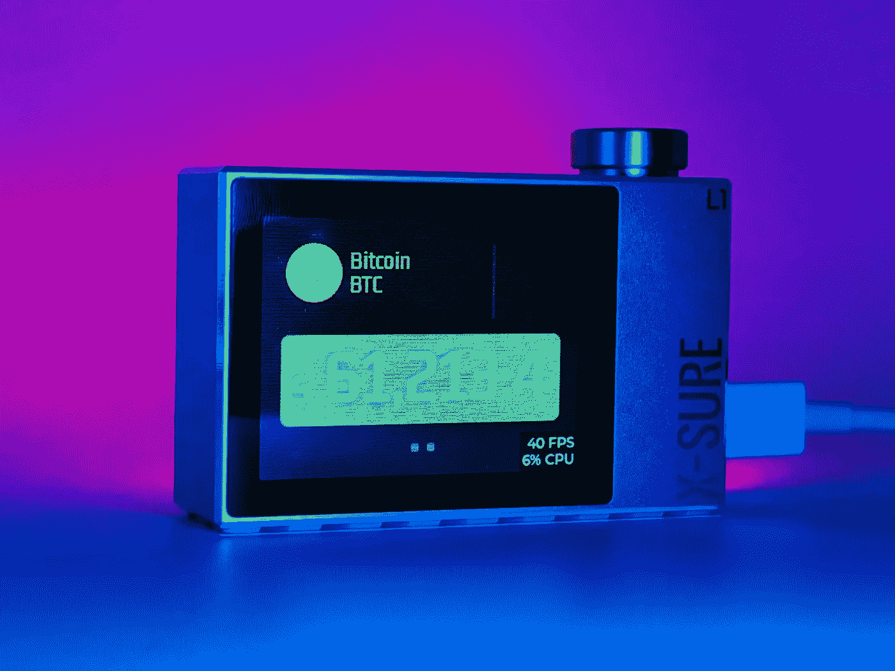
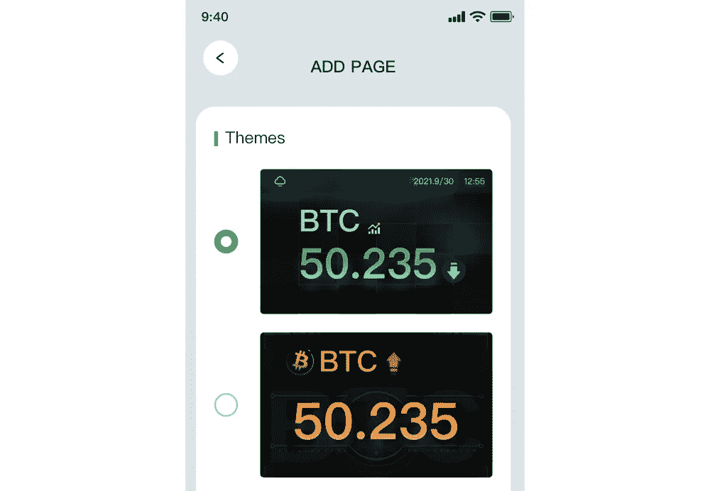
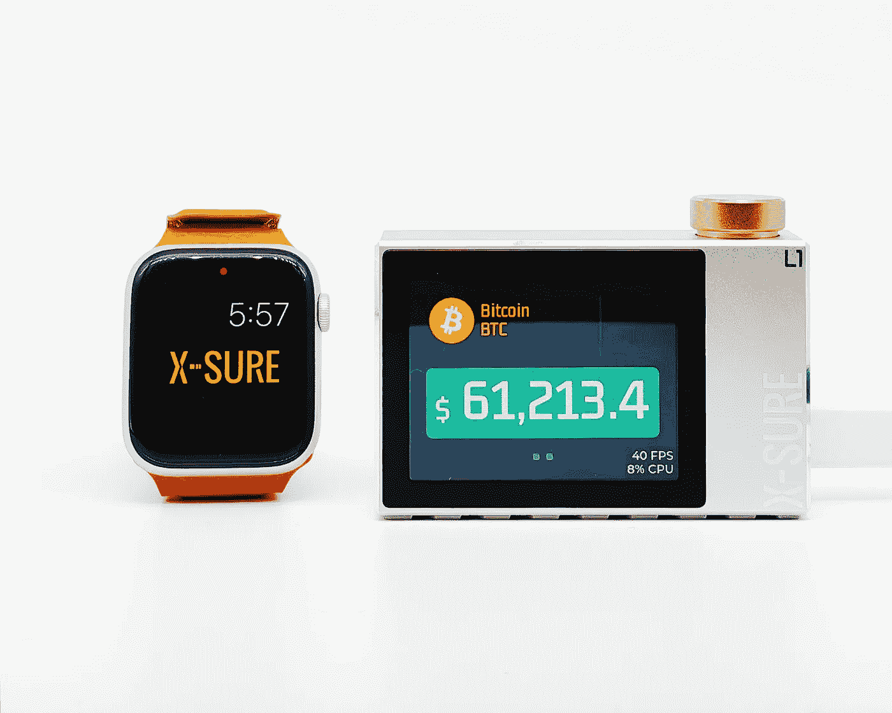
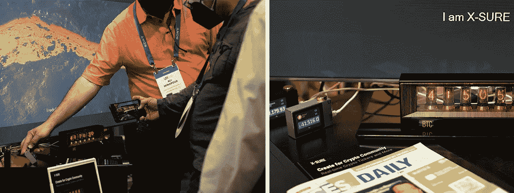

# 作为一个电脑重度用户，我为什么喜欢这种物理加密货币股票？

> 原文：<https://medium.com/coinmonks/as-a-computer-heavy-user-why-do-i-like-this-physical-cryptocurrency-ticker-da29c62f3ff1?source=collection_archive---------41----------------------->

The picture is from [X-SURE.co](https://x-sure.co?utm_source=medium&utm_source=why-do-i-like-this-physical-cryptocurrency-ticker)

之前我的朋友给我运来了他们新产品的演示设备，一个 [**智能物理加密货币股票**](https://x-sure.co/x-sure-l1-real-time-crypto-ticker/?utm_source=medium&utm_source=why-do-i-like-this-physical-cryptocurrency-ticker) 。我认为只要在我的 iPhone 上跟踪价格就足够了，所以我很困惑为什么他们会制造这种产品，这对于密码持有者来说似乎不是必不可少的，除非作为某人最喜欢的收藏或礼物，当然，那也很棒。

然而，由于我玩它，并把它放在我的电脑显示器附近，实际上，它很实用，就像我桌上的第二个或第三个显示器一样。你知道，我不仅是一个密码迷，也是一个网页设计师，我经常使用各种类型的屏幕来检查我的设计，例如不同尺寸的显示器、平板电脑等。

而现在，我不需要在我的 Mackbook 屏幕之间切换，也不需要不时点亮我的手机屏幕来查看加密货币的价格。因此，作为一个电脑重度用户，我只是在工作时不时地通过这个实体报价器直接查看价格。

我知道一些加密 Mac 应用程序可以在 Mac 屏幕的顶部栏添加一个迷你价格报价器，但这种智能设备的价格数字看起来更引人注目，你可以通过移动应用程序为界面设置不同的外观主题，我的朋友说他们将发布越来越多的社区，艺术家和设计师的手表模板。这是我喜欢它的一点。

另一个重要的功能是*“允许用户设置自定义的提示音价格波动提醒，这样你就再也不会错过任何机会了”*。我认为对加密货币投资者来说，没有什么比让你保持关注更重要的了。

让我们回到外观主题特性。我的朋友 Kevin，X-SURE 的创始人和联合创始人 Charles 与我分享了一个有趣的创业概念，他们试图将 NFT(不可替代的代币)与实体产品结合起来，他们称自己为“桥梁”，将 NFT 与现实世界连接起来。因此，这种跑马灯装置的主题设计是最好的支撑体。它支持为这个智能设备的用户界面和机身定制主题，每个买家都可以有一个独特的设计，NFT 是所有权的最好证明，他们可以在市场上转让所有权。当然，购买者也可以决定收集物理设备。

我真的很喜欢这个概念，所以请允许我在这里正式推广这个 smart 团队。X-SURE 是一家专注于加密的初创公司，在拉斯维加斯举行的 CES 2022 上，随着 X-SURE L1 加密股票 和 [**X-SURE 谢妮时钟**](https://x-sure.co/nixie-clock/?utm_source=medium&utm_source=why-do-i-like-this-physical-cryptocurrency-ticker) 的发布，X-SURE 在全球范围内推出。

通过该公司的官方网站[X-SURE.co](https://x-sure.co/?utm_source=medium&utm_source=why-do-i-like-this-physical-cryptocurrency-ticker)了解更多关于该公司的信息

> 加入 Coinmonks [电报频道](https://t.me/coincodecap)和 [Youtube 频道](https://www.youtube.com/c/coinmonks/videos)了解加密交易和投资

# 另外，阅读

*   [如何开始通过加密贷款赚取被动收入](https://coincodecap.com/passive-income-crypto-lending)
*   [加密货币储蓄账户](/coinmonks/cryptocurrency-savings-accounts-be3bc0feffbf) | [加密交易机器人](https://coincodecap.com/best-crypto-trading-bots)
*   [BigONE 交易所评论](/coinmonks/bigone-exchange-review-64705d85a1d4) | [CEX。IO 审查](https://coincodecap.com/cex-io-review) | [交换区审查](/coinmonks/swapzone-review-crypto-exchange-data-aggregator-e0ad78e55ed7)
*   [最佳比特币保证金交易](/coinmonks/bitcoin-margin-trading-exchange-bcbfcbf7b8e3) | [比特币保证金交易](https://coincodecap.com/bityard-margin-trading)
*   [加密保证金交易交易所](/coinmonks/crypto-margin-trading-exchanges-428b1f7ad108) | [赚取比特币](/coinmonks/earn-bitcoin-6e8bd3c592d9)
*   [WazirX vs CoinDCX vs bit bns](/coinmonks/wazirx-vs-coindcx-vs-bitbns-149f4f19a2f1)|[block fi vs coin loan vs Nexo](/coinmonks/blockfi-vs-coinloan-vs-nexo-cb624635230d)
*   [BlockFi 信用卡](https://coincodecap.com/blockfi-credit-card) | [如何在币安购买比特币](https://coincodecap.com/buy-bitcoin-binance)
*   [火币交易机器人](https://coincodecap.com/huobi-trading-bot) | [如何购买 ADA](https://coincodecap.com/buy-ada-cardano) | [Geco？一次回顾](https://coincodecap.com/geco-one-review)
*   [麻雀交换评论](https://coincodecap.com/sparrow-exchange-review) | [纳什交换评论](https://coincodecap.com/nash-exchange-review)
*   [支持卡审核](https://coincodecap.com/uphold-card-review) | [信任钱包 vs 元掩码](https://coincodecap.com/trust-wallet-vs-metamask)