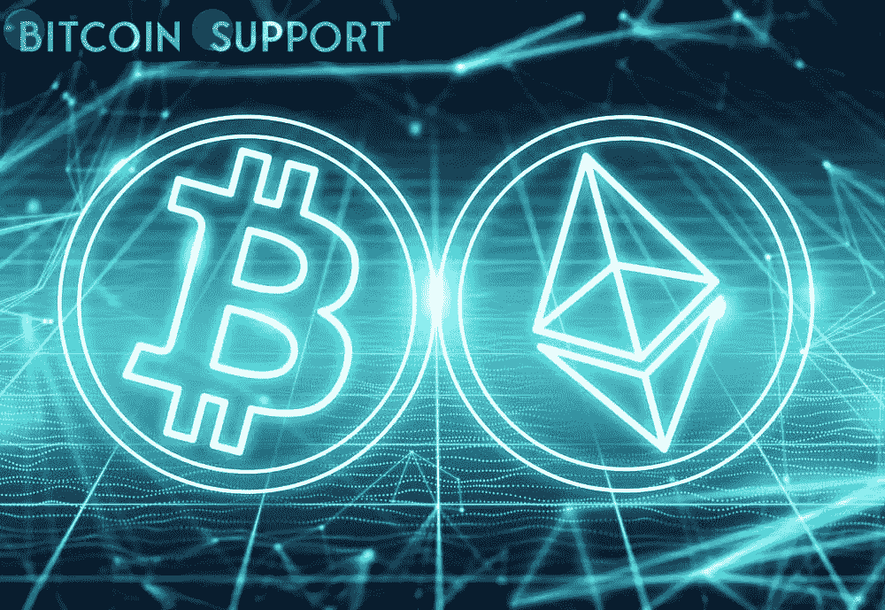
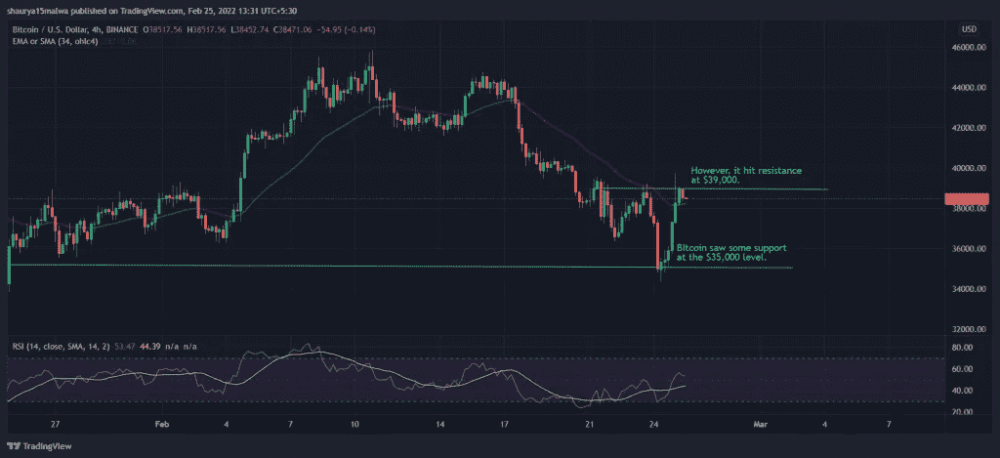

# 随着比特币和以太网上涨 10%，空头头寸平仓 1.43 亿美元

> 原文：<https://medium.com/coinmonks/as-bitcoin-and-ether-gain-10-short-positions-saw-143-million-in-liquidations-35404160eedb?source=collection_archive---------64----------------------->

**Visit our website:-** [**https://bitcoinsupports.com/**](https://bitcoinsupports.com/)

周五，加密货币市场几乎完全扭转了周四的跌幅。随着全球市场从周四的下跌中复苏，押注加密货币上涨的交易员在过去 12 小时内损失了高达 1.43 亿美元。

比特币、以太和其他主要加密货币在过去 24 小时内上涨了约 10%，回到了周三晚上的水平。在本文发表时，比特币的交易价格接近 38400 美元，高于 34725 美元的低点。

在过去的 12 个小时里，始于美国周四凌晨的这波涨势，已经导致近 1.84 亿美元的损失，原因是加密跟踪期货的平仓。根据分析服务 Coinglass 的数据，73%的交易者在“做空”市场，或押注市场不会上涨。在加密交易所 OKX 上，在其他加密期货交易所中，最大的空头被清算，仅比特币追踪期货就有 2300 万美元。币安紧随其后，因卖空而损失 2500 万美元，FTX 紧随其后，损失 1600 万美元。在过去的 12 小时内，8900 万美元的比特币追踪期货、5300 万美元的以太追踪期货和 586 万美元的 Terra LUNA token 追踪期货被清算。短短 24 小时内，这些损失使清算总额增加到 4.05 亿美元。共有 83，000 个交易账户受到影响，Bitmex 上最大的一笔比特币期货合约清算订单超过 795 万美元。

**Visit our website:-** [**https://bitcoinsupports.com/**](https://bitcoinsupports.com/)

加密货币与全球市场走势同步反弹。监测亚洲公司的摩根士丹利资本国际亚太指数在前一天下跌 3.1%后，周五上涨约 1%。在欧洲，基准股指上涨，斯托克欧洲 600 指数上涨超过 1%。美国标准普尔 500 指数周四收高 1.5%，因该国加强了对俄罗斯的制裁。根据一些分析师的说法，未来几天对比特币和其他加密货币的需求可能会增加，因为它们被视为流动性工具。FxPro 的高级金融分析师亚历克斯·库普茨基维奇(Alex Kuptsikevich)表示:“目前，市场对流动性产品的需求最大，这使得比特币的风险略低于替代硬币。”“金融危机的进一步恶化预计将有利于第一种加密货币，作为乌克兰、俄罗斯和一些邻国投资者的资本储蓄手段，”报告称。

**访问我们的网站:-**[**https://bitcoinsupports.com/**](https://bitcoinsupports.com/)

**免责声明:以上为作者观点，不应视为投资建议。读者应该自己做研究。**

> 加入 Coinmonks [电报频道](https://t.me/coincodecap)和 [Youtube 频道](https://www.youtube.com/c/coinmonks/videos)了解加密交易和投资

# 另外，阅读

*   [如何在 FTX 交易所交易期货](https://coincodecap.com/ftx-futures-trading) | [OKEx vs 币安](https://coincodecap.com/okex-vs-binance)
*   [CoinLoan 评论](https://coincodecap.com/coinloan-review) | [YouHodler 评论](/coinmonks/youhodler-4-easy-ways-to-make-money-98969b9689f2) | [BlockFi 评论](https://coincodecap.com/blockfi-review)
*   [XT.COM 评论](https://coincodecap.com/profittradingapp-for-binance)币安评论 |
*   [SmithBot 评论](https://coincodecap.com/smithbot-review) | [4 款最佳免费开源交易机器人](https://coincodecap.com/free-open-source-trading-bots)
*   [比特币基地僵尸程序](/coinmonks/coinbase-bots-ac6359e897f3) | [AscendEX 审查](/coinmonks/ascendex-review-53e829cf75fa) | [OKEx 交易僵尸程序](/coinmonks/okex-trading-bots-234920f61e60)
*   [如何在印度购买比特币？](/coinmonks/buy-bitcoin-in-india-feb50ddfef94) | [瓦济克斯评论](/coinmonks/wazirx-review-5c811b074f5b)
*   [隐料斗替代品](/coinmonks/cryptohopper-alternatives-d67287b16d27) | [HitBTC 审查](/coinmonks/hitbtc-review-c5143c5d53c2)