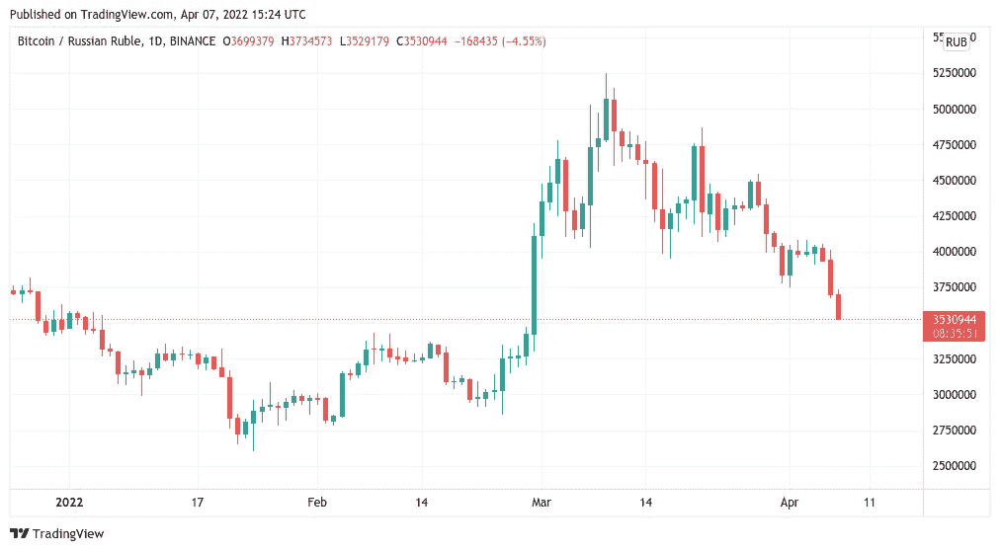
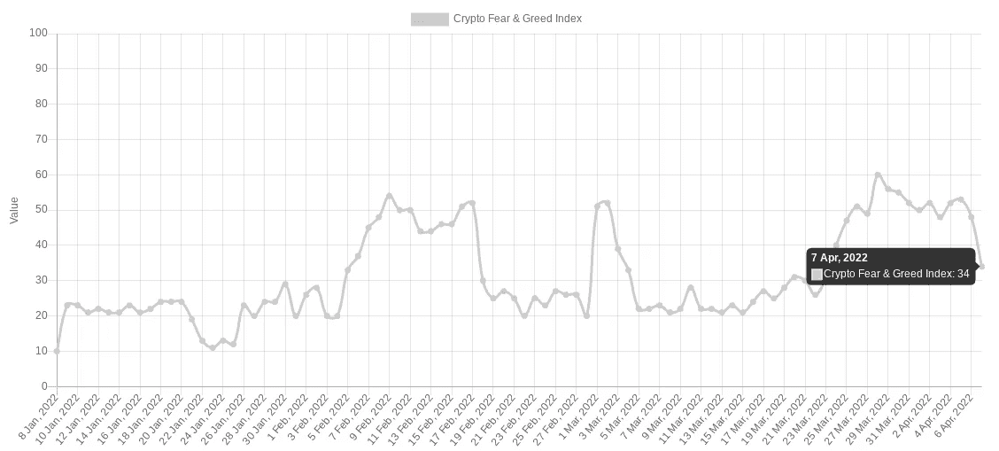

# 随着 BTC 价格接近 42.9 千美元的击穿目标，比特币的情绪转向了“恐惧”

> 原文：<https://medium.com/coinmonks/as-btc-price-action-approaches-the-42-9k-breakdown-target-bitcoin-mood-shifts-to-fear-2b08c7206e9f?source=collection_archive---------72----------------------->

**Visit our website:-** [**https://bitcoinsupports.com/**](https://bitcoinsupports.com/)

随着宏观焦虑渗透到情绪中，比特币 2022 大会开始后，市场鲜有喜悦。4 月 7 日，随着比特币 2022 大会的开始，比特币(BTC)的价格表现继续令霍德勒斯失望。

**Visit our website:-** [**https://bitcoinsupports.com/**](https://bitcoinsupports.com/)

根据 TradingView 的数据，美联储准备每月削减 950 亿美元的资产负债表

】BTC/美元暴跌至多个支撑位以下，创下 3 月 23 日以来的最低水平。最大的加密货币 Bitstamp 周四逆转为 42，741 美元，明显不如一周前积极，分析师迅速指出了影响因素。

中央银行的货币紧缩，特别是美国美联储的货币紧缩，仍然是最受欢迎的，对风险资产具有长期影响。当天，彭博情报公司(Bernstein Intelligence)首席大宗商品策略师迈克·麦格隆指出，“比特币以及原油和铜等宏观经济敏感大宗商品的最大障碍来自预期中的股市下跌。”

**“随着美联储加大反通胀力度，近期风险正在上升，这可能包括抑制财富效应的努力。”**

美联储此前表示，从 5 月份开始，它将每月将其约 9 万亿美元的资产负债表减少 950 亿美元。尽管俄罗斯货币取得了不同寻常的胜利，其交易价格高于战前水平，但俄罗斯-乌克兰战争的连锁效应，特别是报复性制裁，仍在继续蒙上阴影。BTC/卢布的交易价格比历史高点低 32%。

**Visit our website:-** [**https://bitcoinsupports.com/**](https://bitcoinsupports.com/)

与此同时，欧洲央行自身的余额在欧盟创下新高。比特币多头有很多要担心的，最近的领土损失就证明了这一点，这将 back 美元推回到 2022 年的交易区间。著名交易者 Crypto Ed 在发现“支撑位崩溃”后，正确预测了最近的低点

**市场中的情绪正在恶化**

更广泛的隐秘情绪也随之下降，周四隐秘恐惧&贪婪指数的急剧下跌就证明了这一点。在连续两天下跌后，这一传统情绪指标在今年首次达到“贪婪”区间后，又回到了“恐惧”区间。

**Visit our website:-** [**https://bitcoinsupports.com/**](https://bitcoinsupports.com/)

周四，随着 44/100 的分数，该指数的 TradFi 等价物回到了“恐惧”。

**访问我们的网站:-**[**https://bitcoinsupports.com/**](https://bitcoinsupports.com/)

**免责声明:以上为作者观点，不应视为投资建议。读者应该自己做研究。**

> 加入 Coinmonks [电报频道](https://t.me/coincodecap)和 [Youtube 频道](https://www.youtube.com/c/coinmonks/videos)了解加密交易和投资

# 另外，阅读

*   [如何在 Uniswap 上交换加密？](https://coincodecap.com/swap-crypto-on-uniswap) | [A-Ads 审查](https://coincodecap.com/a-ads-review)
*   [加密货币储蓄账户](/coinmonks/cryptocurrency-savings-accounts-be3bc0feffbf) | [YoBit 评论](/coinmonks/yobit-review-175464162c62)
*   [Botsfolio vs nap bots vs Mudrex](/coinmonks/botsfolio-vs-napbots-vs-mudrex-c81344970c02)|[gate . io 交流回顾](/coinmonks/gate-io-exchange-review-61bf87b7078f)
*   [CoinFLEX 评论](https://coincodecap.com/coinflex-review) | [AEX 交易所评论](https://coincodecap.com/aex-exchange-review) | [UPbit 评论](https://coincodecap.com/upbit-review)
*   [AscendEx 保证金交易](https://coincodecap.com/ascendex-margin-trading) | [Bitfinex 赌注](https://coincodecap.com/bitfinex-staking) | [bitFlyer 审核](https://coincodecap.com/bitflyer-review)