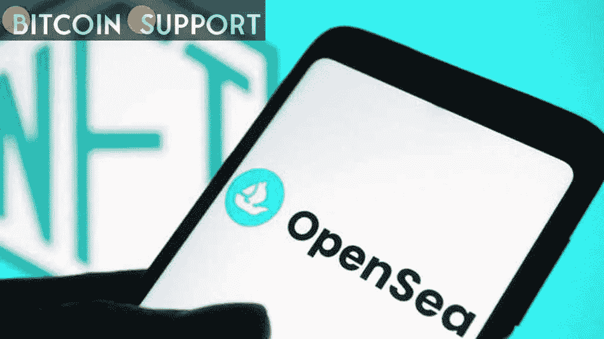

# 合同迁移完成后，OpenSea 会暂时禁用一些功能

> 原文：<https://medium.com/coinmonks/as-contract-migration-is-completed-opensea-briefly-disables-features-6064e38e10ef?source=collection_archive---------69----------------------->

**Visit our website:-** [**https://bitcoinsupports.com/**](https://bitcoinsupports.com/)

在迁移完成之前，禁止出价和购买，以确保列表安全。OpenSea 为期一周的用户移动其不可购买的令牌(NFT)列表的窗口已经结束。截止日期后，该平台宣布，由于此举，网站上的一些功能可能暂时无法使用。

2 月 19 日，OpenSea 发布了新的智能合约，并建议用户开始将他们在 NFT 的房源从旧合约迁移到新合约。根据 NFT 市场的说法，此次升级增加了额外的功能，如批量列表和更具描述性的签名，以及确保所有不活跃的列表过期。

然而，该平台在推出后不久就报告了网络钓鱼攻击，导致一些客户失去了他们的 NFT。在此之后，OpenSea 团队对所发生的事情进行了调查。OpenSea 联合创始人 Devin Finzer 建议受影响的用户联系他们的支持团队。NFT 平台 Mintable 已经承诺恢复在最近的 OpenSea 钓鱼攻击中拍摄的 NFT。一些丢失的 NFT 被列在另一个叫做 LooksRare 的市场上，这个市场是这个团队发现的。据 Mintable 的创建者 Zack Burks 称，他们选择购买 NFT，并将它们归还给原来的主人。

合约转换将于周五完成，平台已警告用户，网站上的活跃发帖可能会变得不可见，底价可能会改变。然而，该平台声称这只是一种暂时的情况。在搬迁完成之前，OpenSea 暂时禁止投标和购买，以保护上市。

[https://twitter.com/opensea/status/1497074117412982786](https://twitter.com/opensea/status/1497074117412982786)

与此同时，区块链社会一直对非婚生子女保持警惕。Youtuber Coffeezilla 和社区成员成功挫败了一起所谓的 NFT 诈骗案，该案试图窃取价值 2000 万美元的数字资产。一位匿名用户提交了一份详细报告，详细列出了对涉嫌 NFT 欺诈团队成员的指控。

**访问我们的网站:-**[**https://bitcoinsupports.com/**](https://bitcoinsupports.com/)

**免责声明:以上为作者观点，不应视为投资建议。读者应该自己做研究。**

> 加入 Coinmonks [电报频道](https://t.me/coincodecap)和 [Youtube 频道](https://www.youtube.com/c/coinmonks/videos)了解加密交易和投资

# 另外，阅读

*   [Cloudbet 赌场评论](https://coincodecap.com/cloudbet-casino-review) | [点火赌场评论](https://coincodecap.com/ignition-casino-review)
*   [加密套利](/coinmonks/crypto-arbitrage-guide-how-to-make-money-as-a-beginner-62bfe5c868f6)指南| [如何做空比特币](/coinmonks/how-to-short-bitcoin-568a2d0b4ae5)
*   [如何在加拿大购买加密货币？](https://coincodecap.com/how-to-buy-cryptocurrency-in-canada)
*   [无聊猿游艇俱乐部(BAYC)评论](https://coincodecap.com/bored-ape-yacht-club-bayc-review)
*   [5 款最佳加密交易终端](https://coincodecap.com/crypto-trading-terminals) | [最佳 DeFi 应用](https://coincodecap.com/best-defi-apps)
*   [比特币基地 vs 瓦济克斯](https://coincodecap.com/coinbase-vs-wazirx) | [比特鲁点评](https://coincodecap.com/bitrue-review) | [波洛涅克斯 vs 比特鲁](https://coincodecap.com/poloniex-vs-bittrex)
*   [德国最佳加密交易所](https://coincodecap.com/crypto-exchanges-in-germany) | [Arbitrum:第二层解决方案](https://coincodecap.com/arbitrum)
*   [币安交易机器人](/coinmonks/binance-trading-bots-d0d57bb62c4c) | [OKEx 审查](/coinmonks/okex-review-6b369304110f) | [阿塔尼审查](https://coincodecap.com/atani-review)