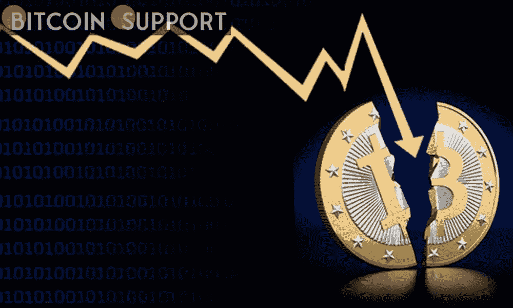
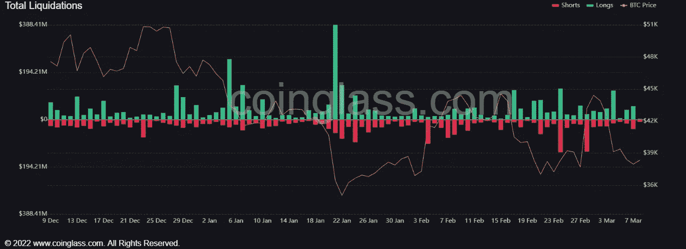

# 由于加密货币在美国和欧洲面临许多监管决定，仅在 24 小时内就有 2.2 亿美元的头寸被抹去

> 原文：<https://medium.com/coinmonks/as-cryptocurrency-faces-many-regulatory-decisions-in-the-us-and-europe-220-million-in-positions-f185fc009297?source=collection_archive---------96----------------------->

**Visit our website:-** [**https://bitcoinsupports.com/**](https://bitcoinsupports.com/)

当市场从最近的损失中脱离出来，在过去的 24 小时内抛售了 2.3 亿美元的股票时，加密交易员们措手不及。在五天内损失超过 2000 亿美元后，本周市场资本总额似乎在 1.7 万亿美元左右。随着亏损停止，空头们感到失望。根据 coinglass 的数据，预计市场将进一步崩溃的交易员感到失望，因为加密交易持平。在过去的 24 小时内，9600 万美元的空头头寸被清算，Bitfinex 的空头头寸比例最高，接近 86%。在美国本周表示可能对俄罗斯能源行业进行处罚后，市场情绪已经完全转向负面，导致股市暴跌。另一方面，密码市场一直保持良好。在不到一周的时间内下跌 17%后，比特币似乎在 38000 美元找到了支撑，自周日以来一直保持在这一水平。然而，这让投资者措手不及，因为他们曾预计该货币将跌至 34，000 美元，这是 2 月份连跌的低点。

**多头头寸因复苏不足而毁于一旦。价值 1 . 21 亿美元的多头头寸在过去 24 小时内被平仓。数据显示，大多数交易者预计市场将复苏，类似于 2 月底观察到的情况，当时鲸鱼交易的增加将加密市场推高了 4000 亿美元。Okex 拥有 7800 万美元的多头头寸，是最有价值的加密交易所。一笔 300 万美元的 BTC-USDT 掉期交易也是 Okex 最大的单笔清算订单。**

**Visit our website:-** [**https://bitcoinsupports.com/**](https://bitcoinsupports.com/)

尽管市场情绪恶化，机构加密投资看起来仍然强劲。根据最近的数据，尽管俄罗斯的制裁可能导致更大的经济动荡，但机构投资者在上周购买了价值 1.27 亿美元的加密产品。

**过去 10 年，比特币从一小群程序员的领域发展成为机构投资者交易的资产，这说明现在有足够的流动性和市场需求来支持该货币的长期价格上涨。**

现在，焦点转移到美国和欧洲未来的加密监管决策，以及下周的美联储会议。

**访问我们的网站:-**[**https://bitcoinsupports.com/**](https://bitcoinsupports.com/)

**免责声明:以上为作者观点，不应视为投资建议。读者应该自己做研究。**