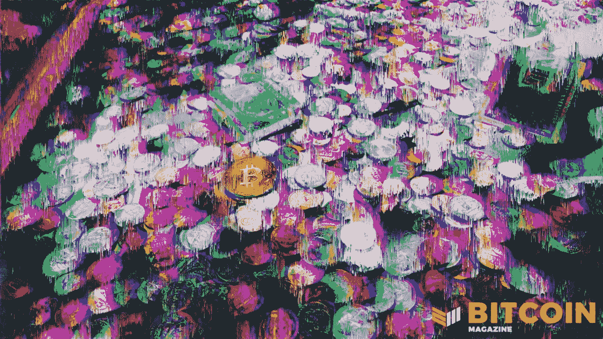

# 随着欧洲风险上升，比特币价格反应积极

> 原文：<https://medium.com/coinmonks/as-european-risks-rise-bitcoin-price-reacts-positively-7ac7c17564b5?source=collection_archive---------28----------------------->

讨论最新的中央银行新闻，欧洲新出现的金融风险，日本通货膨胀等。

[**在 YouTube 上看这一集**](https://youtu.be/-4sZEgqySN0?t=5167)

**听这一集:**

*   苹果
*   [Spotify](https://open.spotify.com/episode/2UzfDA7ZXz0dmXP0bngsSr?si=9ef3c6b7253d4f0d)
*   [谷歌](https://podcasts.google.com/feed/aHR0cHM6Ly9mZWR3YXRjaC5saWJzeW4uY29tL3Jzcw/episode/Yjg1MGY2NTItYTQyOC00NjlkLWE4NTktZmIzNjZjZTAyYTUw?sa=X&ved=0CAUQkfYCahcKEwiAh62az_X1AhUAAAAAHQAAAAAQAQ)
*   [Libsyn](https://fedwatch.libsyn.com/european-risks-rising-fed-81)
*   [阴天](https://overcast.fm/+m2af27MwQ)

在这一集的*比特币杂志*的“美联储观察”中，我们了解了欧洲中央银行(ECB)的最新情况，用一颗糖果让日本银行变得有趣，我们还谈论了最近 BlockFi 和比特币借贷的麻烦。

“美联储观察”是一个播客，面向对央行时事感兴趣的人。比特币总有一天会消耗央行，因此理解并记录这是如何发生的，是这部剧的生命所在。

# 欧洲的通货膨胀

欧洲 2022 年 1 月的通货膨胀数据本周公布，从去年 12 月的 5.0%上升到 5.1%，再创欧元时代的纪录。消费者价格上涨 5.1%必须放在两代人以来最严重的能源和供应链危机的背景下考虑。

在欧洲，天然气和电力价格爆炸式上涨，对经济中的大多数价格产生了涓滴效应。这些价格上涨并不是印钞的直接副作用，而是疫情应对两年来全球经济几近瘫痪的直接影响。

我们试图播放拉加德总统关于通货膨胀的两分钟剪辑，但直播的音频设置不正确。你也可以在这里找到完整的[新闻发布会](https://youtu.be/vQpQ16VRx84)。

# 比较欧洲央行和美联储的政治

我花了一些时间在播客上，比较了欧洲央行和美联储高调的新闻发布会风格。欧洲央行行长克里斯蒂娜·拉加德似乎有一份特殊利益集团的清单，她必须提及并安抚这些集团。我觉得这是一个政治过程，而美联储主席杰罗姆·鲍威尔更关心经济。

从参议院银行委员会前莎拉·布鲁姆·拉斯金的采访中可以看出，保持与政治的高度独立是美联储的核心部分。她的进步观点受到了考验，他们希望确保她不会将自己的政治观点带到美联储的工作中。另一方面，欧洲央行将政治作为其使命的一部分。

# 2022 年欧洲政策指南

在新闻发布会上，拉加德表示，银行将让其量化宽松(QE)计划顺其自然，并在 3 月底至 4 月初完成。这并不奇怪。然而，令市场意外的是，拉加德不会重复她在 12 月新闻发布会上的声明，她在新闻发布会上表示，欧洲央行不会在 2022 年加息。

市场不喜欢这个看似微小的细节是因为它让欧洲央行显得反复无常。与鲍威尔相比，拉加德没有给人一种对她的观点或对经济的评估充满信心的感觉。顺便说一下，我把这归因于过度政治化的欧洲央行。它无法专注于明确的任务，因为它的政策正被拉向政治方向。

# 欧洲信用利差和重新定义风险

这就是我把所有这些东西都绑回比特币的地方。欧洲的信贷息差最近一直在飙升。法国五年期信用违约互换(CDS)的定价为 20 英镑，意大利为 103 英镑，西班牙为 40 英镑，希腊为 127 英镑。随着这些 CDS 合约之间的利差扩大，投资者面临着越来越大的隐含的[重新赎回风险](https://www.zerohedge.com/markets/if-youre-not-scared-here-lagarde-let-europes-genie-out-unintended-consequence-bottle)(有可能退出欧元区)。

过去几周，随着这些 CDS 利差的增加，比特币的价格也在上涨。几个月前，格雷格·福斯(Greg Foss)在《美联储观察》(Fed Watch)节目中谈到了这一点。作为没有交易对手风险的可靠货币，比特币应该与欧洲的 CDS 价格和赎回风险相关联。

未来几个月，我将密切关注这些价格的相关性，但随着本周欧洲的压力增加，比特币表现积极是一个好迹象。

# 日本

过去几十年来，日本银行(BoJ)一直是最稳定的。迄今为止，它是所有央行中做得最多的 QE，但它仍在与低增长、低通胀、低利率作斗争(顺便说一下，这些事情总是形影不离，正如我在这里写的一样)。

在经历了 30 年的超低通胀后，我读到了一篇关于 [Umaibo](https://archive.ph/2WVvZ) 的报道，这是一种日本小吃，40 年来一直以每份 10 日元的价格出售，但现在价格涨到了 12 日元。喘息，恐怖。

一些人认为，这一发展趋势，以及最近 10 年期日本政府债券利率攀升至 21 个基点，是通胀可能也将降临日本的迹象。

我非常怀疑。日本央行在过去 20 年里所做的 QE 让美联储感到羞愧，而不是刺激。实际上，长期 QE 笼罩着经济，对任何增长都是一个大煞风景。只需比较一下三大央行——美联储、欧洲央行和日本央行。它们的 CPI 通胀率与央行资产负债表中 GDP 百分比的排名顺序相反。央行做的 QE 越多，CPI 通胀率就越低。

# 比特币的信贷市场和区块链

本周，我们以谈论新生的比特币信贷市场结束了节目。这个生态系统中的一个核心角色是 BlockFi，它一直处于比特币越来越多的丑闻的中心。

[公司子网站上的一篇帖子](https://www.reddit.com/r/blockfi/comments/skxiei/blockfi_horrible_loan_experience_fortune_lost/)迅速走红。在帖子中，一个人说 BlockFi 收回了他的贷款，因为他使用的比特币有混合历史。对于许多 BlockFi 客户来说，这是一个非常糟糕的迹象，他们可能会将混合硬币作为良好金融卫生的一部分。

本周的另一项进展是提高了 BlockFi 的最低取款限额。再次，[通过公司的子编辑](https://www.reddit.com/r/blockfi/comments/sjnal5/comment/hvfrc7k/?utm_source=share&utm_medium=web2x&context=3):

> *“目前，我们仅支持美国客户电汇 50，000 美元或以上，或国际客户电汇 5，000 美元。由于我们目前不支持国际客户的 ACH 取款，我可能会建议您到另一个可以的平台/交易所取款。这就是我们每月提供 1 笔稳定币(加上 BTC 或 LTC)提款的具体原因。”*
> 
> *-u/Brandon_BlockFi，社区经理*

最后，BlockFi 将其利息条款降至非常低的水平。新的一级(低于 0.1 BTC)利率为 4.5%。然而，如果你有超过最低取款额的 50，000 美元，你将处于第三级(超过 0.35 BTC)，你的比特币只赚 0.1%。

BlockFi 发生的事情非常可疑。比特币生态系统中有替代品。Ledn 是一个，Hodl Hodl 是另一个。比特币借贷要非常小心。

*原载于 2022 年 2 月 11 日*[*【https://bitcoinmagazine.com】*](https://bitcoinmagazine.com/markets/european-risks-rise-bitcoin-price-reacts-positively)*。*

> 加入 Coinmonks [电报频道](https://t.me/coincodecap)和 [Youtube 频道](https://www.youtube.com/c/coinmonks/videos)了解加密交易和投资

# 另外，阅读

*   [OKEx vs KuCoin](https://coincodecap.com/okex-kucoin) | [摄氏替代品](https://coincodecap.com/celsius-alternatives) | [如何购买 VeChain](https://coincodecap.com/buy-vechain)
*   [ProfitFarmers 点评](https://coincodecap.com/profitfarmers-review) | [如何使用 Cornix 交易机器人](https://coincodecap.com/cornix-trading-bot)
*   [如何匿名购买比特币](https://coincodecap.com/buy-bitcoin-anonymously) | [比特币现金钱包](https://coincodecap.com/bitcoin-cash-wallets)
*   [瓦济里克斯 NFT 评论](https://coincodecap.com/wazirx-nft-review)|[Bitsgap vs Pionex](https://coincodecap.com/bitsgap-vs-pionex)|[坦吉姆评论](https://coincodecap.com/tangem-wallet-review)
*   [如何使用 Solidity 在以太坊上创建 DApp？](https://coincodecap.com/create-a-dapp-on-ethereum-using-solidity)