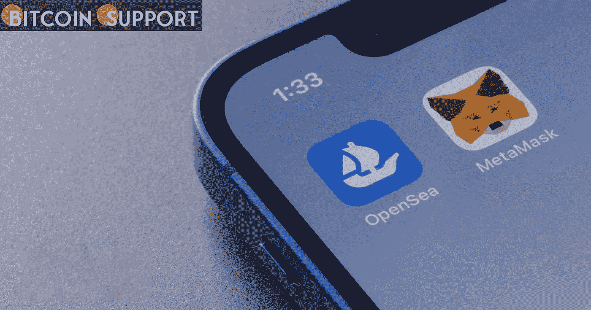

# 由于 MetaMask 和 OpenSea 遵守美国的制裁，俄罗斯的禁令备受关注

> 原文：<https://medium.com/coinmonks/as-metamask-and-opensea-abide-by-us-sanctions-the-russian-ban-is-in-the-spotlight-67611df121f8?source=collection_archive---------18----------------------->

**Visit our website:-** [**https://bitcoinsupports.com/**](https://bitcoinsupports.com/)

据报道，由于东道主 Infura 的限制，世界上最大的 NFT 市场 OpenSea 开始限制伊朗客户，理由是美国对该国的制裁。与此同时，流行的以太坊钱包 MetaMask 在某些被禁国家不可用。这些行为引发了关于 crypto 表面上分散化特征的广泛辩论，以及其他大公司是否会效仿并加入美国对俄罗斯的制裁。迄今为止，大多数大型交易所都表示，俄罗斯用户不会被屏蔽。

制裁对 OpenSea 和 Metamask 都有影响。OpenSea 显然在周四开始屏蔽伊朗用户。尽管总部位于纽约的 NFT 市场对受影响的用户表示遗憾，但它被迫遵守美国的制裁规定。委内瑞拉的 https://twitter.com/opensea/status/1499494790991212555 用户也无法访问以太坊钱包 MetaMask，尽管这一行动似乎是 Infura 更大规模打击行动的一部分，MetaMask 利用 in fura 访问区块链。虽然对委内瑞拉的封锁是无意的，但 Infura 后来证实，它已将许多其他受到美国制裁的国家列入黑名单，包括乌克兰的两个反叛领土。

[https://twitter.com/infura_io/status/1499446959827931175](https://twitter.com/infura_io/status/1499446959827931175)

目前还不清楚这两项服务当时在俄罗斯是否可用。西方对俄罗斯的制裁于 3 月 1 日生效，这是有史以来最严厉的制裁之一。俄罗斯的秘密制裁是一个热门话题。

虽然全球最大的加密货币交易所币安将遵守美国的制裁，禁止特定的俄罗斯企业，但它不会禁止所有俄罗斯用户。其他国家，如北海巨妖，已经声明公民不会被禁止入境。他们的言论是在乌克兰政府要求将俄罗斯用户列入黑名单后发表的。乌克兰政府还悬赏征集俄罗斯和白俄罗斯银行账户的任何信息。这一行动招致了密码界的谴责，他们声称监管者和政治不应该介入这一领域。然而，由于如此多的加密货币平台依赖于集中式基础设施，它们将受到监管。尽管专家们嘲笑这个想法，但是关于俄罗斯是否会利用密码来规避新的限制的猜测越来越多。美国已将加密货币加入俄罗斯制裁名单，警告交易所不要与黑名单上的企业进行交易。欧盟表示，将努力确保俄罗斯不使用加密技术来逃避制裁。

**访问我们的网站:-**[**https://bitcoinsupports.com/**](https://bitcoinsupports.com/)

**免责声明:以上为作者观点，不应视为投资建议。读者应该自己做研究。**

> 加入 Coinmonks [电报频道](https://t.me/coincodecap)和 [Youtube 频道](https://www.youtube.com/c/coinmonks/videos)了解加密交易和投资

# 另外，阅读

*   [Koinly 点评](https://coincodecap.com/koinly-review) | [Binaryx 点评](https://coincodecap.com/binaryx-review) | [Hodlnaut vs CakeDefi](https://coincodecap.com/hodlnaut-vs-cakedefi-vs-celsius)
*   [MoonXBT vs Bybit vs 币安](https://coincodecap.com/bybit-binance-moonxbt) | [硬件钱包](/coinmonks/hardware-wallets-dfa1211730c6)
*   [火币交易机器人](https://coincodecap.com/huobi-trading-bot) | [如何购买 ADA](https://coincodecap.com/buy-ada-cardano) | [Geco。一次回顾](https://coincodecap.com/geco-one-review)
*   [币安 vs 比特邮票](https://coincodecap.com/binance-vs-bitstamp) | [比特熊猫 vs 比特币基地 vs Coinsbit](https://coincodecap.com/bitpanda-coinbase-coinsbit)
*   [如何购买 Ripple (XRP)](https://coincodecap.com/buy-ripple-india) | [非洲最好的加密交易所](https://coincodecap.com/crypto-exchange-africa)
*   [非洲最佳加密交易所](https://coincodecap.com/crypto-exchange-africa) | [Hoo 交易所评论](https://coincodecap.com/hoo-exchange-review)
*   [eToro vs robin hood](https://coincodecap.com/etoro-robinhood)|[MoonXBT vs by bit vs Bityard](https://coincodecap.com/bybit-bityard-moonxbt)