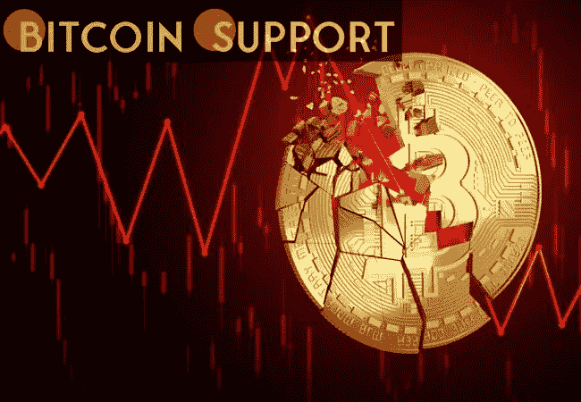

# 随着导弹袭击基辅，机场被占领，比特币下跌 9%

> 原文：<https://medium.com/coinmonks/as-missiles-strike-kyiv-the-airport-is-captured-bitcoin-drops-by-9-18d2931a8efa?source=collection_archive---------57----------------------->

[**https://bitcoinsupports.com/**](https://bitcoinsupports.com/)

在周二超过 39，000 美元后，在撰写本文时，世界上最有价值的加密货币的交易价格约为 34，725 美元。随着战争范围的扩大，亚洲市场也在交易日下跌。随着全球市场对乌克兰日益扩大的战争规模做出焦虑的反应，比特币的价格继续下跌，导弹继续降落在该国首都基辅，其机场已被空降兵占领。在撰写本文时，BTC 股价下跌 9%，至 34555 美元。俄罗斯总统弗拉基米尔·普京俄罗斯总统弗拉基米尔·普京敦促乌克兰军队投降，并警告美国和北约不要干预。普京补充道:“任何试图干扰我们，甚至更糟，给我们的国家和人民制造威胁的人，都必须明白，俄罗斯将立即做出回应，你们将面临历史上从未见过的后果。”。"我们为任何不测做好了准备。"在接下来的几个小时里，美国及其盟友准备对俄罗斯实施一系列制裁。这些处罚预计将针对俄罗斯银行、普京内阁和普京的商业盟友圈子，但不包括俄罗斯进入全球金融体系的渠道。俄罗斯前总理德米特里梅德韦杰夫(Dmitry Medvedev)此前曾表示，切断俄罗斯与 SWIFT 的联系将构成宣战。

欧洲议会在 4 月份批准了一项不具约束力的决议，要求在俄罗斯入侵的情况下将其驱逐出 SWIFT。作为对该决议的回应，俄罗斯总统发言人德米特里·佩斯科夫不再称潜在的中断是“严重的危险”

俄罗斯加快了央行数字货币的建设，表面上是作为失去 SWIFT 访问权后的备用方案。亚洲市场反应谨慎，尽管该大陆的主要股票指数都在下跌。东京日经 225 指数当天下跌 2%，而香港恒生指数下跌 3.3%。台湾的 TAIEX 下跌了 2.5%，而新加坡的海峡时报指数下跌了 3%。在隔夜交易中，道琼斯指数期货下跌了 2%，标准普尔 500 指数期货也下跌了 2%。据美国有线电视新闻网(CNN)报道，莫斯科证券交易所已暂停交易，等待进一步通知。

**访问我们的网站:-**[**https://bitcoinsupports.com/**](https://bitcoinsupports.com/)

**免责声明:以上为作者观点，不应视为投资建议。读者应该自己做研究。**

> 加入 Coinmonks [电报频道](https://t.me/coincodecap)和 [Youtube 频道](https://www.youtube.com/c/coinmonks/videos)了解加密交易和投资

# 另外，阅读

*   [OKEx vs KuCoin](https://coincodecap.com/okex-kucoin) | [摄氏替代品](https://coincodecap.com/celsius-alternatives) | [如何购买 VeChain](https://coincodecap.com/buy-vechain)
*   [币安期货交易](https://coincodecap.com/binance-futures-trading)|[3 comas vs Mudrex vs eToro](https://coincodecap.com/mudrex-3commas-etoro)
*   [如何购买 Monero](https://coincodecap.com/buy-monero) | [IDEX 评论](https://coincodecap.com/idex-review) | [BitKan 交易机器人](https://coincodecap.com/bitkan-trading-bot)
*   [CoinDCX 评论](/coinmonks/coindcx-review-8444db3621a2) | [加密保证金交易交易所](https://coincodecap.com/crypto-margin-trading-exchanges)
*   [红狗赌场评论](https://coincodecap.com/red-dog-casino-review) | [Swyftx 评论](https://coincodecap.com/swyftx-review) | [CoinGate 评论](https://coincodecap.com/coingate-review)
*   [Bookmap 评论](https://coincodecap.com/bookmap-review-2021-best-trading-software) | [美国 5 大最佳加密交易所](https://coincodecap.com/crypto-exchange-usa)
*   [如何在 FTX 交易所交易期货](https://coincodecap.com/ftx-futures-trading) | [OKEx vs 币安](https://coincodecap.com/okex-vs-binance)
*   [CoinLoan 评论](https://coincodecap.com/coinloan-review) | [YouHodler 评论](/coinmonks/youhodler-4-easy-ways-to-make-money-98969b9689f2) | [BlockFi 评论](https://coincodecap.com/blockfi-review)