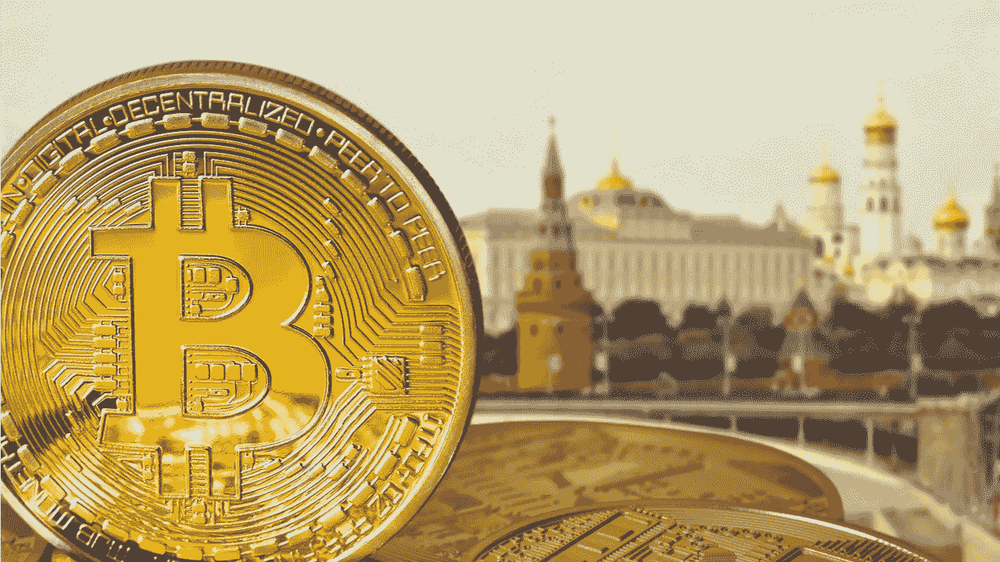

# 按照规定，俄罗斯对本地加密货币的估值为 2000 亿美元。近 12%的全球持股

> 原文：<https://medium.com/coinmonks/as-per-the-rules-russia-values-local-cryptocurrency-at-200-billion-nearly-12-of-global-holdings-39a6f03aef57?source=collection_archive---------43----------------------->

**Visit our website:-** [**https://bitcoinsupports.com/**](https://bitcoinsupports.com/)

据政府估计，政府估计俄罗斯人拥有超过 16.5 万亿卢布(2140 亿美元)的加密货币。克里姆林宫和政府官员正在利用这些统计数据制定一项监管该行业的战略。这一数额相当于全球总持有量的 12%左右，相当于俄罗斯基准股指市值的三分之一，这解释了为什么政府更愿意监管该行业，而不是彻底禁止它。据两名为政府和克里姆林宫工作的人士透露，这一估计是上个月通过分析最大的加密交换用户的 IP 地址以及其他信息得出的。由于这些计划尚未最终确定，他们不愿透露姓名。

由于投资的分散性，对于俄罗斯人拥有多少密码，有各种各样的估计。据塔斯社报道，议会下院金融市场委员会主席阿纳托利·阿克萨科夫(Anatoly Aksakov)去年 12 月援引数据称，俄罗斯人拥有价值约 5 万亿卢布的加密货币。区块链初创公司 TON Labs 的联合创始人兼首席执行官亚历山大菲拉托夫表示，如果官方统计数据是正确的，他不会感到惊讶。“俄罗斯人有大量的加密货币，”他说，“但很难估算真实金额。”“许多人使用现金、衍生品，或者有两本护照，可以用另一个人的名字开一个加密钱包。”随着央行官员敦促全面禁止该行业以及政府采取更温和的做法，这些数字显示出加密投资在全球第三大比特币矿商中变得多么普遍。根据总部位于新加坡的 tripleA 支付网关的数据，超过 1700 万俄罗斯人拥有加密货币，约占总人口的 12%。据参与讨论的人士称，60%的本地加密投资者年龄在 25 至 44 岁之间，该行业雇佣了超过 50 万名本地计算机程序员。负责监管数字经济的副总理 Dmitry Chernyshenko 的发言人表示，政府认为超过 1700 万俄罗斯人拥有加密技术，但拒绝评估他们的总体持有量。在当天早些时候攀升至 1.7%后，世界上最有价值的加密货币比特币在周二下午 6 点 38 分在莫斯科几乎没有变化，为 38436.23 美元。根据消息来源，16.5 万亿卢布的估计可能是保守的，因为一些交易商将他们的活动隐藏在虚拟私人网络之后。根据 CoinMarketCap 的数据，全球加密货币市场在最近下跌后，目前价值超过 1.75 万亿美元。

**借势炒作**

invest bro 播客主持人、2017 年以来的加密投资人斯坦尼斯拉夫·科里茨基(Stanislav Koritsky)表示，

“俄罗斯的加密生态系统正在发展，越来越多的投资者涌入。”“他们中的许多人都是年轻人，对市场知之甚少，在一片喧嚣声中加入了进来。”在政府和俄罗斯银行就俄罗斯加密货币的未来产生分歧后，弗拉基米尔·普京总统呼吁当局建立监管妥协。据俄罗斯中央银行估计，俄罗斯的密码交易每年价值 50 亿美元，该银行希望禁止开采和交易，声称这对该国的整个金融体系构成了威胁。据国有日报《俄罗斯日报》(Rossiyskaya Gazeta)报道，俄罗斯政府正在考虑一系列规定，包括限制与俄罗斯银行的贸易，简化关闭海外密码交易所网站的程序，以及允许非居民进入声誉良好的当地交易所。尽管人们认为俄罗斯安全部门正在游说央行全面禁止加密货币，因为它们可能被用于资助反对派团体，但知情人士表示，他们随后转而支持政府的监管方式。

**访问我们的网站:-**[**【https://bitcoinsupports.com/】**](https://bitcoinsupports.com/)

**免责声明:这些是作者的观点，不应被视为投资建议。读者应该自己做研究。**

> 加入 Coinmonks [电报频道](https://t.me/coincodecap)和 [Youtube 频道](https://www.youtube.com/c/coinmonks/videos)了解加密交易和投资

# 另外，阅读

*   [密码本交易平台](/coinmonks/top-10-crypto-copy-trading-platforms-for-beginners-d0c37c7d698c) | [Coinmama 审核](/coinmonks/coinmama-review-ace5641bde6e)
*   [印度的加密交易所](/coinmonks/bitcoin-exchange-in-india-7f1fe79715c9) | [比特币储蓄账户](/coinmonks/bitcoin-savings-account-e65b13f92451)
*   [OKEx vs KuCoin](https://coincodecap.com/okex-kucoin) | [摄氏替代品](https://coincodecap.com/celsius-alternatives) | [如何购买 VeChain](https://coincodecap.com/buy-vechain)
*   [币安期货交易](https://coincodecap.com/binance-futures-trading)|[3 commas vs Mudrex vs eToro](https://coincodecap.com/mudrex-3commas-etoro)
*   [如何购买 Monero](https://coincodecap.com/buy-monero) | [IDEX 评论](https://coincodecap.com/idex-review) | [BitKan 交易机器人](https://coincodecap.com/bitkan-trading-bot)
*   [CoinDCX 评论](/coinmonks/coindcx-review-8444db3621a2) | [加密保证金交易交易所](https://coincodecap.com/crypto-margin-trading-exchanges)
*   [红狗赌场评论](https://coincodecap.com/red-dog-casino-review) | [Swyftx 评论](https://coincodecap.com/swyftx-review) | [CoinGate 评论](https://coincodecap.com/coingate-review)
*   [Bookmap 点评](https://coincodecap.com/bookmap-review-2021-best-trading-software) | [美国 5 大最佳加密交易所](https://coincodecap.com/crypto-exchange-usa)
*   [如何在 FTX 交易所交易期货](https://coincodecap.com/ftx-futures-trading) | [OKEx vs 币安](https://coincodecap.com/okex-vs-binance)
*   [CoinLoan 评论](https://coincodecap.com/coinloan-review) | [YouHodler 评论](/coinmonks/youhodler-4-easy-ways-to-make-money-98969b9689f2) | [BlockFi 评论](https://coincodecap.com/blockfi-review)