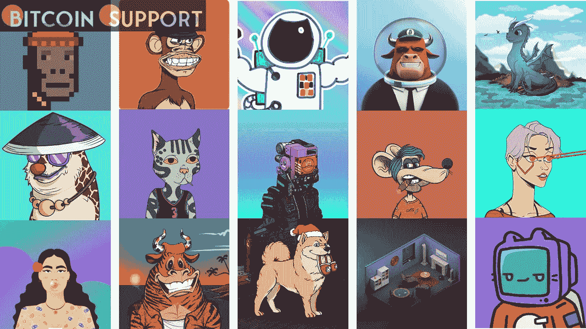
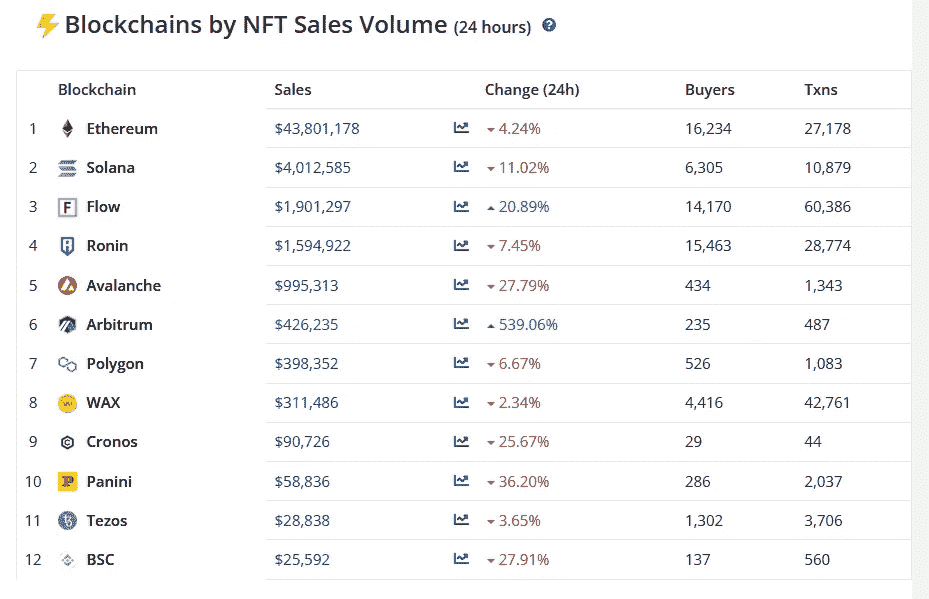

# 随着搜索量“一落千丈”，NFT 的月买家数量降至 80 万美元以下

> 原文：<https://medium.com/coinmonks/as-searches-fall-off-a-cliff-monthly-nft-buyers-drop-below-800k-8d251cf716f?source=collection_archive---------36----------------------->

**Visit our website:-** [**https://bitcoinsupports.com/**](https://bitcoinsupports.com/)

今年 2 月，二级市场上有 796，009 名 NFT 买家，总销售额为 26 亿美元。数据显示，与前一个破纪录的月份相比，降幅相当大。

2 月，NFT 独立买家数量自 10 月以来首次跌破 80 万，不可购买搜索量大幅下降。

根据 CryptoSlam 的数据，2 月份二级市场上有 796，009 名 NFT 买家(比 1 月份下降 12%)，销售额约为 26 亿美元(比上月下降 40%)。

然而，考虑到 1 月份是 NFTs 创纪录的一个月，2 月份的下降可能只是健康撤退的一部分。今年 1 月，共有 904，13 名独立的二级 NFT 买家，OpenSea 的销售额在 1 月份创下了超过 50 亿美元的纪录，上个月降至约 30 亿美元。

然而，根据 Google Trends 的数据，“NFTs”的全球关键词搜索量也大幅减少。与 1 月下旬的高点(1 月 23 日-1 月 29 日)相比，上周利率下降了 60-70%。

尽管当地科技和电信巨头乐天在上个月下旬推出了 NFT 市场，但在撰写本文时，美国对全球非功能性金融服务的兴趣最大。另一方面，在 61 个国家中，日本对非正规金融服务最不感兴趣。

NFT 的支持者、NFT 投资基金 Sfermion 的管理合伙人安德鲁·斯坦沃尔德(Andrew Steinwold)将当前的下跌与 2017/2018 年的牛市和随后的崩盘进行了比较，并质疑人们的兴趣是否会在短期内重新开始。

[https://Twitter . com/AndrewSteinwold/status/1499065345935613955](https://twitter.com/AndrewSteinwold/status/1499065345935613955)

**访问我们的网站:-**[**https://bitcoinsupports.com/**](https://bitcoinsupports.com/)

虽然领先平台 OpenSea 是 2 月份 170 万美元黑客攻击的受害者，但除了其他问题外，还不清楚为什么上个月人们的普遍兴趣下降了这么多。俄罗斯和乌克兰之间的危机可能改变了对加密货币的关注，因为焦点似乎已经转向数字支付、筹款和在不确定时期保值等用例。根据 CryptoSlam 的数据，在过去的 24 小时内，支持 NFT 的 12 个区块链中，有 10 个销量下降。排名前两位的以太坊和索拉纳分别下跌了 4.24%和 11%，而雪崩和帕尼尼分别下跌了 27.79%和 36.20%。排名第三的 Flow 和排名第六的 Arbitrum 是唯一取得进展的网络，分别增长了 20.89%和 539%。

**访问我们的网站:-**[**【https://bitcoinsupports.com/】**](https://bitcoinsupports.com/)

**免责声明:这些是作者的观点，不应被视为投资建议。读者应该自己做研究。**

> *加入 Coinmonks* [*电报频道*](https://t.me/coincodecap) *和* [*Youtube 频道*](https://www.youtube.com/c/coinmonks/videos) *了解加密交易和投资*

# 另外，阅读

*   [Bookmap 评论](https://coincodecap.com/bookmap-review-2021-best-trading-software) | [美国 5 大最佳加密交易所](https://coincodecap.com/crypto-exchange-usa)
*   最佳加密[硬件钱包](/coinmonks/hardware-wallets-dfa1211730c6) | [Bitbns 评论](/coinmonks/bitbns-review-38256a07e161)
*   [新加坡十大最佳加密交易所](https://coincodecap.com/crypto-exchange-in-singapore) | [购买 AXS](https://coincodecap.com/buy-axs-token)
*   [红狗赌场评论](https://coincodecap.com/red-dog-casino-review) | [Swyftx 评论](https://coincodecap.com/swyftx-review) | [CoinGate 评论](https://coincodecap.com/coingate-review)
*   [投资印度的最佳密码](https://coincodecap.com/best-crypto-to-invest-in-india-in-2021)|[WazirX P2P](https://coincodecap.com/wazirx-p2p)|[Hi Dollar Review](https://coincodecap.com/hi-dollar-review)
*   [加拿大最佳加密交易机器人](https://coincodecap.com/5-best-crypto-trading-bots-in-canada) | [库币评论](https://coincodecap.com/kucoin-review)
*   [用于 Huobi 的加密交易信号](https://coincodecap.com/huobi-crypto-trading-signals) | [HitBTC 审查](/coinmonks/hitbtc-review-c5143c5d53c2)
*   [如何在 FTX 交易所交易期货](https://coincodecap.com/ftx-futures-trading) | [OKEx vs 币安](https://coincodecap.com/okex-vs-binance)