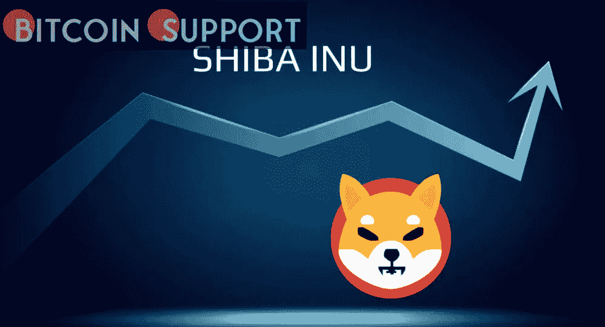

# 当 SHIB 点燃一支巨大的绿色蜡烛时，1.9 亿只柴犬在 24 小时内被烧毁

> 原文：<https://medium.com/coinmonks/as-shib-prints-a-massive-green-candle-190-million-shiba-inu-are-burned-within-24-hours-da536afdb564?source=collection_archive---------36----------------------->

**Visit our website:-** [**https://bitcoinsupports.com/**](https://bitcoinsupports.com/)

代表同名 burn 交易跟踪服务的@shibburn 帐户宣布，在过去 24+小时内，约有 1.9 亿枚柴犬代币被从流通中移除。

与此同时，在 CoinMarketCap 上排名第 14 的第二大犬类加密货币今天上涨了 5%，在小时图上印出了一根大绿蜡烛。

**焚化 1.897 亿 SHIB**

据@shibburn 账号背后的人透露，SHIB 社区在最近的二十四小时内完成了七笔交易，共向各个无法使用的地址转移了 1.897 亿代币。

在前述时间段内，转移最多的 meme 令牌为 176，035，016 只柴犬。

[https://twitter.com/shibburn/status/1505031316991094797](https://twitter.com/shibburn/status/1505031316991094797)

几个小时后，又发生了 8，946，544 枚 SHIB 的转移，使 SHIB 军队烧毁的犬币总数达到 1.897 亿枚。

**SHIB 可能在这家中东交易所开始交易**

据此前报道，中东的 Rain 加密货币交易所正在考虑将 meme 加密货币上市。该交易所的推特账户最近在一条推文中向 SHIB 军队提出了这个问题。https://twitter.com/shibainuart/status/1504475377883779077

该平台刚刚在由旧金山专注于加密的投资公司 Paradigm 牵头的一轮投资中筹集了惊人的 1.1 亿美元。Rain 将利用这笔资金发展其在土耳其和巴基斯坦的业务。

**访问我们的网站:-**[**https://bitcoinsupports.com/**](https://bitcoinsupports.com/)

**免责声明:这些是作者的观点，不应被视为投资建议。读者应该自己做研究。**

> 加入 Coinmonks [电报频道](https://t.me/coincodecap)和 [Youtube 频道](https://www.youtube.com/c/coinmonks/videos)了解加密交易和投资

# 另外，阅读

*   [最佳网上赌场](https://coincodecap.com/best-online-casinos) | [币安评论](/coinmonks/binance-review-ee10d3bf3b6e) | [BitMEX 评论](https://coincodecap.com/bitmex-review)
*   [麻雀交换评论](https://coincodecap.com/sparrow-exchange-review) | [纳什交换评论](https://coincodecap.com/nash-exchange-review)
*   [美国最佳加密交易机器人](https://coincodecap.com/crypto-trading-bots-in-the-us) | [经常性回顾](https://coincodecap.com/changelly-review)
*   [在印度利用加密套利赚取被动收入](https://coincodecap.com/crypto-arbitrage-in-india)
*   [Godex.io 审核](/coinmonks/godex-io-review-7366086519fb) | [邀请审核](/coinmonks/invity-review-70f3030c0502) | [BitForex 审核](https://coincodecap.com/bitforex-review)
*   [最佳比特币保证金交易](/coinmonks/bitcoin-margin-trading-exchange-bcbfcbf7b8e3) | [萝莉点评](/coinmonks/lolli-review-e6ddc7895ad8) | [比特币保证金交易](https://coincodecap.com/bityard-margin-trading)