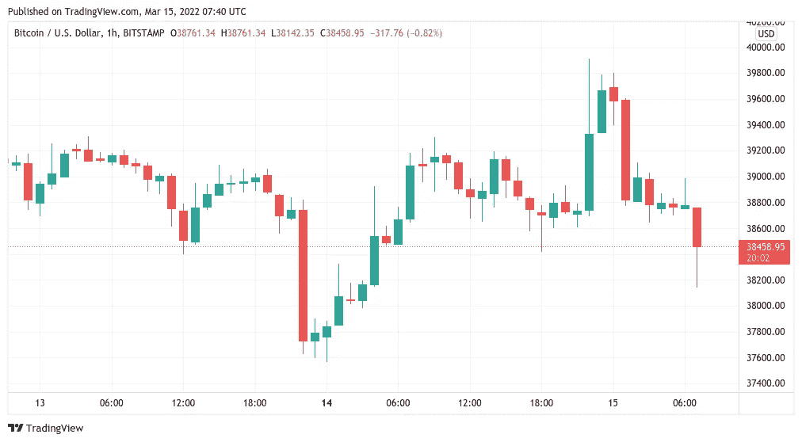
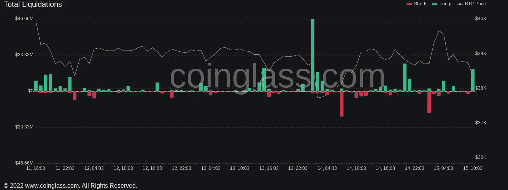

# 随着 4 万美元的 BTC 价格挤压失败，比特币经历了“所有整合之母”

> 原文：<https://medium.com/coinmonks/as-the-40k-btc-price-squeeze-fails-bitcoin-experiences-themother-of-all-consolidations-c7a8ba08bfa1?source=collection_archive---------90----------------------->

**Visit our website:-** [**https://bitcoinsupports.com/**](https://bitcoinsupports.com/)

比特币的价格紧贴着一个区域，这个区域见证了比加密货币历史上任何其他区域都多的链上交易量。

比特币(BTC)3 月 15 日隔夜再次短暂做空，多头目标突破 40000 美元阻力位。

**Visit our website:-** [**https://bitcoinsupports.com/**](https://bitcoinsupports.com/)

**根据 TradingView 的数据，没有受到市场结构**

鼓舞的交易员周二触及略低于心理关口的高点，随后又回到之前的水平。继欧盟否决了禁止工作证明算法加密货币的立法机制的消息后，现在人们熟悉的“Bart”结构出现了。虽然这一举措力度很大，但并没有给 BTC 价格运动带来多大的缓解。

“在 BTC 对中，替代币再一次展现出很多弱点，因为它们正在减少。比特币继续盘整。老实说，这些并不是市场的最佳指标。从每日的时间尺度来看，比特币几乎保持不变，这让一个已经在一个交易区间内徘徊了几个月的市场非常恼火。根据连锁监测平台 Coinglass 的数据，上一次的冲高导致了小规模的震荡，BTC 在 24 小时内的清算总额为 4700 万美元。

**Visit our website:-** [**https://bitcoinsupports.com/**](https://bitcoinsupports.com/)

基于每日收盘价的价格变动，也终结了更乐观结果的前景。

**【3.9 万美元是环比成交量之王**

然而，当谈到环比指标时，莫斯科夫斯基资本(Moskovski Capital)的首席执行官莱克斯·莫斯科夫斯基(Lex Moskovski)指出了当前现货价格水平的历史相关性。根据他的说法，上个月在大约 39000 美元的价格上交易的 BTC 比任何其他价格点都多，这使得 3 月份的行为成为“所有整合之母”。

[https://twitter.com/mskvsk/status/1503521359091146753](https://twitter.com/mskvsk/status/1503521359091146753)

累积趋势正在继续支撑 38000 美元-39000 美元区间的力量，这在最近一周变得特别受鲸鱼欢迎。

**访问我们的网站:-**[**https://bitcoinsupports.com/**](https://bitcoinsupports.com/)

**免责声明:以上为作者观点，不应视为投资建议。读者应该自己做研究。**

> *加入 Coinmonks* [*电报频道*](https://t.me/coincodecap) *和* [*Youtube 频道*](https://www.youtube.com/c/coinmonks/videos) *了解加密交易和投资*

# 另外，阅读

*   [有哪些交易信号？](https://coincodecap.com/trading-signal) | [Bitstamp vs 比特币基地](https://coincodecap.com/bitstamp-coinbase) | [买索拉纳](https://coincodecap.com/buy-solana)
*   [ProfitFarmers 点评](https://coincodecap.com/profitfarmers-review) | [如何使用 Cornix 交易机器人](https://coincodecap.com/cornix-trading-bot)
*   [十大最佳加密货币博客](https://coincodecap.com/best-cryptocurrency-blogs) | [YouHodler 评论](https://coincodecap.com/youhodler-review)
*   [my constant Review](https://coincodecap.com/myconstant-review)|[8 款最佳摇摆交易机器人](https://coincodecap.com/best-swing-trading-bots)
*   [MXC 交易所评论](/coinmonks/mxc-exchange-review-3af0ec1cba8c) | [Pionex vs 币安](https://coincodecap.com/pionex-vs-binance) | [Pionex 套利机器人](https://coincodecap.com/pionex-arbitrage-bot)