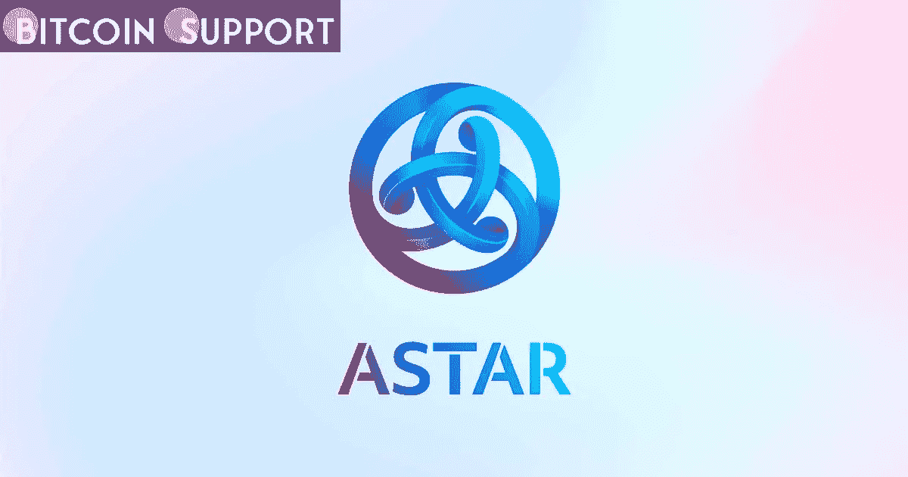
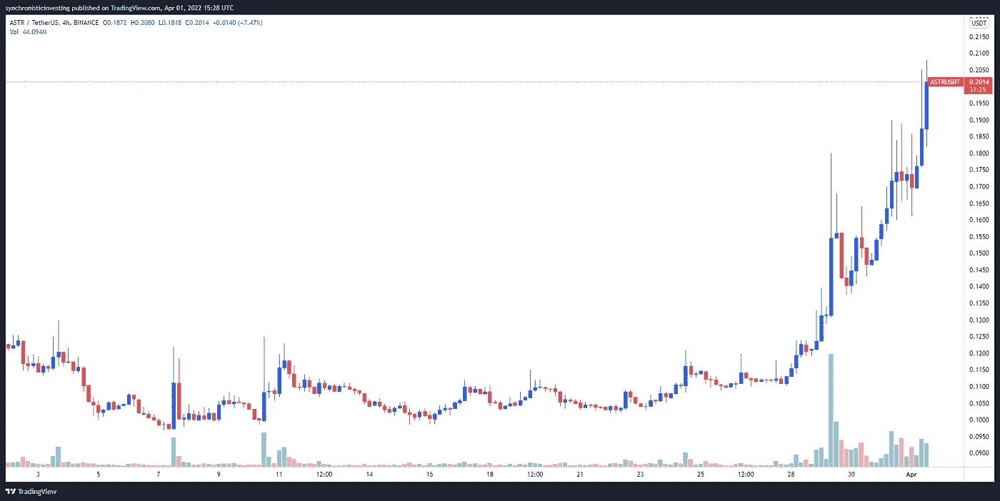
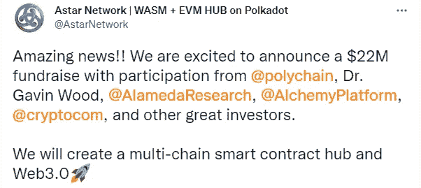
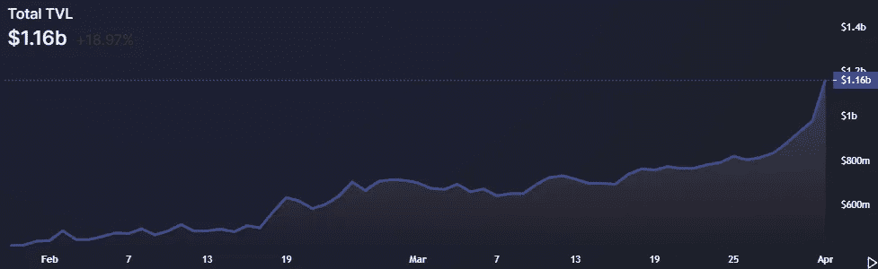

# 由于该网络准备在 4 月份增加 15 个额外项目，Astar (ASTR)的价格翻了一番

> 原文：<https://medium.com/coinmonks/as-the-network-prepares-to-add-15-additional-projects-in-april-the-price-of-astar-astr-doubles-25b53cb46312?source=collection_archive---------64----------------------->

**Visit our website:-** [**https://bitcoinsupports.com/**](https://bitcoinsupports.com/)

继 2200 万美元的融资和 4 月份宣布启动 15 个项目的计划后，ASTR 的股票飙升了 100%。随着第一批连锁店在成功完成其首届 parachain auctions (ETH)后上线并与以太坊对接，Polkadot (DOT)生态系统开始在加密货币世界中获得牵引力。

Astar (ASTR)就是这样一家基于 Polkadot 的初创公司，在多链智能合约平台吸引了散户和机构加密投资者的兴趣后，该公司于 3 月份高调结束。

根据 TradingView 的数据，由于对代币的需求飙升了 20 倍，ASTR 的价格从 3 月 22 日的 0.107 美元的低点上涨了 104%，达到 4 月 1 日的每日 0.208 美元的高点。

**Visit our website:-** [**https://bitcoinsupports.com/**](https://bitcoinsupports.com/)

一轮 2200 万美元投资的完成，Astar 生态系统通过协议发布和合作的扩张，以及 Astar 网络用户和总价值的增加，都为反弹做出了贡献。机构投资者正在向该项目注入资金 1 月 28 日成功完成的 2200 万美元融资是帮助 Astar 在 2022 年发展的关键一步。

**Visit our website:-** [**https://bitcoinsupports.com/**](https://bitcoinsupports.com/)

Polychain、Alameda Research、Alchemy Ventures、Capital 和 Digital Finance Group 是此次筹款活动的参与者，其他天使投资人包括 Gavin Wood 博士、Richard Ma 和等。在 1 月 17 日 Astar 的 mainnet 发布之后，这笔资金将用于帮助扩展 Astar 生态系统，以支持以太坊虚拟机(EVM)和 WebAssembly，允许开发人员部署现有的 Solidity 合同以及 Polkadot 原生智能合同。

**Astar 生态正在成长**

Astar 自从建立其 mainnet 以来的几个月里，已经看到许多项目出现在它的网络上，并期望在四月份看到更多。https://Twitter . com/PolkadotNation/status/1509734617443868675

该倡议将 4 月份称为“Astar 季”，该倡议预计将在网络上推出至少 15 个新项目，作为吸引新成员的努力的一部分。

去中心化金融(DeFi)协议，如 Avault 和 Alnari Finance，游戏协议 Astar Farms，以及去中心化自治组织 AstridDAO 和 ADAO 都将在不久的将来出现(DAOs)。Astar 还宣布了与 Oasys 的新合作关系，Oasys 是专为游戏开发商设计的一级区块链。

**TVL 网络正在崛起**

新用户流入生态系统，已经拥有超过 10 万个唯一的钱包地址，是推动 Astar 前进的第三股力量。

[https://twitter.com/AstarNetwork/status/1508808354889711617](https://twitter.com/AstarNetwork/status/1508808354889711617)

根据 Defi Llama 的数据，由于新用户的涌入和网络上几个项目的启动，Astar 的总价值在 4 月 1 日达到了 11.6 亿美元的历史新高。

**Visit our website:-** [**https://bitcoinsupports.com/**](https://bitcoinsupports.com/)

Astar 现在拥有所有 Polkadot parachains 中最高的 TVL，在 EVM 兼容链中排名第八，仅次于 TVL。

**访问我们的网站:-**[**https://bitcoinsupports.com/**](https://bitcoinsupports.com/)

**免责声明:以上为作者观点，不应视为投资建议。读者应该自己做研究。**

> 加入 Coinmonks [电报频道](https://t.me/coincodecap)和 [Youtube 频道](https://www.youtube.com/c/coinmonks/videos)了解加密交易和投资

# 另外，阅读

*   [Bookmap 点评](https://coincodecap.com/bookmap-review-2021-best-trading-software) | [美国 5 大最佳加密交易所](https://coincodecap.com/crypto-exchange-usa)
*   最佳加密[硬件钱包](/coinmonks/hardware-wallets-dfa1211730c6) | [Bitbns 评论](/coinmonks/bitbns-review-38256a07e161)
*   [新加坡十大最佳加密交易所](https://coincodecap.com/crypto-exchange-in-singapore) | [购买 AXS](https://coincodecap.com/buy-axs-token)
*   [红狗赌场评论](https://coincodecap.com/red-dog-casino-review) | [Swyftx 评论](https://coincodecap.com/swyftx-review) | [CoinGate 评论](https://coincodecap.com/coingate-review)
*   [投资印度的最佳密码](https://coincodecap.com/best-crypto-to-invest-in-india-in-2021)|[WazirX P2P](https://coincodecap.com/wazirx-p2p)|[Hi Dollar Review](https://coincodecap.com/hi-dollar-review)