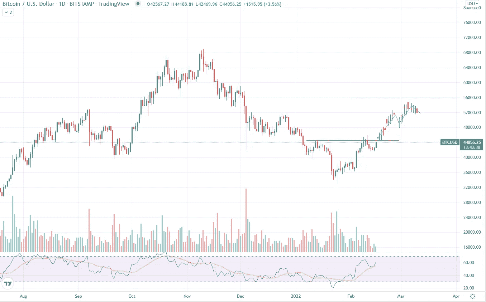

# 随着这一图表模式的出现，比特币可能达到 53000 美元:彭博分析

> 原文：<https://medium.com/coinmonks/as-this-chart-pattern-appearance-bitcoin-could-reach-53-000-bloomberg-analysis-9e2cab1a9e39?source=collection_archive---------36----------------------->

Source photo TradingView

比特币在加密货币的日线图上建立了一种有点不寻常的技术模式，这可能是全球市场反转的一个点。通常情况下,“头肩反转”形态出现在熊市反弹的底部附近。

## 这种模式会如何改变市场形态？