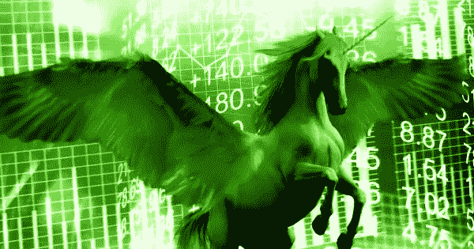
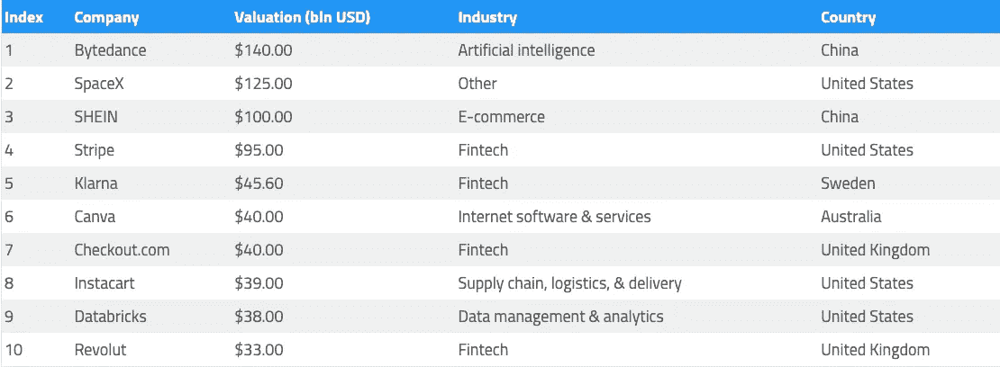

# 随着 2022 年独角兽创业公司达到 1000 家，加密货币独角兽将会增加。

> 原文：<https://medium.com/coinmonks/as-unicorn-startups-reach-1-000-in-2022-cryptocurrency-unicorns-will-increase-29686265421?source=collection_archive---------36----------------------->

# 目前有超过 1100 家价值超过 10 亿美元的私营企业，其中从未有过如此多的加密货币企业。

当一家私有企业的估值达到 10 亿美元时，它就进入了独角兽的神秘领域。根据 CB Insights 的统计数据，尽管看起来像一个小团体，但世界上确实有 1146 家独角兽，总价值超过 3.8 万亿美元。

但并不是一直都是这样。2021 年，519 家新独角兽进入市场，仅在前一年，独角兽总数就翻了一番多。

# 独角兽不断扩张的家园

根据 TradingPedia 的分析，自 2020 年疫情开始以来，市场见证了社会规范、运营程序和行业的重大变化。疫情的混乱暴露了许多行业对概念上新颖的解决方案的巨大需求，而不仅仅是技术。

在 2020 年和 2021 年，只要新的解决方案进入任何特定的市场，它们就会吸引大量投资，从而导致盈利企业的数量急剧增加。

事实上，独角兽数量如此之多，以至于我们开始听说各种各样的独角兽品种，这有助于说明实际上有多少层。除了之前提到的估值为 10 亿美元的独角兽公司，还有估值为 100 亿美元的十玉米公司。有 54 家 decacorns，尽管存在更少的 hectocorns，或超级独角兽，即价值超过 1000 亿美元的企业。

根据 CB Insights 的统计，目前市场上只有三家公司:中国 B2C 电子商务平台 SHEIN、SpaceX 和视频应用 Tik Tok 的母公司 Bytedance。价值 1400 亿美元的 Bytedance 排名第一，其次是价值 1250 亿美元的 SpaceX 和价值 1000 亿美元的 SHEIN。

排名第四的最有价值独角兽 Stripe 的估值为 950 亿美元，仅略低于 hectocorn。这几乎是瑞典支付解决方案提供商 Klarna 价值的两倍，Klarna 最近一次融资对该公司的估值为 456 亿美元。

Table showing the top 10 unicorns by valuation (Source: TradingPedia)[/caption]

# 数十个加密独角兽

在整个去年期间，新增的相当大一部分独角兽来自加密货币领域。FTX 是一个典型的例子，它是榜单上的第一家加密货币企业，也是全球第 12 大最有价值的私有企业。仅截至 2021 年，加密货币交易所就筹集了 15 亿美元的私人资本，估值为 320 亿美元。由于融资，其估值从 12 亿美元增加到 250 亿美元，由于 2022 年 1 月融资 5 亿美元，其估值将达到目前的 320 亿美元。

以 150 亿美元的估值，Ripple 是第二大最有价值的加密独角兽，而 Blockchain.com 以 140 亿美元的估值排名第三。

去年牛市的顶级恩人之一 OpenSea 排名第四。由于席卷全球的 NFT 热，OpenSea 的价值增加到 133 亿美元。

以 120 亿美元的估值，比特大陆技术公司，最大的采矿硬件生产商，是世界上第 33 个最有价值的独角兽。

Alchemy 的开发者套件帮助开发了几乎所有重要的 NFT 平台，包括 OpenSea，去年其估值从 5.05 亿美元增加到 102 亿美元。此外，分析巨头 Chainalysis 的 86 亿美元估值有所增加，CryptoKitties 和其他一些知名区块链游戏的背后公司 Dapper Labs 的估值为 76 亿美元。

泰勒和卡梅隆·文克莱沃斯推出了价值 71 亿美元的加密货币交易所 Gemini，击败了价值 70 亿美元的 ConsenSys。

拥有 40 亿美元资产的宇迦实验室也榜上有名，该实验室制作了包括 BAYC 在内的一些全球最知名的 NFT 藏品。加密货币支付初创公司 MoonPay 的价值为 34 亿美元，全球最大的加密贷款和借款平台 Celsius 的价值为 35 亿美元。

Axie Infinity 的 developers Circle、BlockFi 和 Sky Mavis 的估值均为 30 亿美元，而加密基础设施提供商 Blockstream 的估值为 32 亿美元。

估值从 10 亿美元到略低于 30 亿美元，以下公司被列入名单:北海巨妖、Paxos、CoinDCX、Coinlist、Boba Network、CoinTracker、Phantom、0x、Bitfury、Matrixport、Worldcoin 和 Mobilecoin。

# 独角兽的复杂世界

独角兽的绝对数量并不意味着业务在全球的平均分布。根据 TradingPedia 的数据，虽然在 47 个国家至少有一只独角兽，但其中 612 只在美国。

中国和印度分别拥有 174 只和 65 只独角兽，这两个国家都有大量的独角兽。英国、德国和法国在欧洲分别拥有 43 个、29 个和 24 个。

当独角兽数据集按城市分组时，旧金山成为全球独角兽之都。162 家独角兽公司的总部设在硅谷的首都，而 109 家总部设在纽约。

金融科技独角兽的总估值为 9260 亿美元，而互联网软件和服务公司的估值略高于 6180 亿美元。

TradingPedia 的金融分析师布莱恩·麦科尔认为，这场流行病让人们注意到了数字支付的好处，并导致许多金融科技初创公司获得了数十亿美元的资金。

根据德勤最近的一项研究，2021 年金融科技投资同比增长 144%。“数字金融是第四次工业革命的重要基石，社会正处于第四次工业革命的风口浪尖。2022 年，我预计金融科技投资将同比再增长两位数或三位数。

 [## 随着 2022 年独角兽创业公司达到 1000 家，加密货币独角兽将会增加。-今天的密码

### 当一家私有企业的估值达到 10 亿美元时，它就进入了独角兽的神秘领域。尽管事实上…

thisdaycrypto.com](https://thisdaycrypto.com/as-unicorn-startups-reach-1000-in-2022-cryptocurrency-unicorns-will-increase/) 

> 加入 Coinmonks [电报频道](https://t.me/coincodecap)和 [Youtube 频道](https://www.youtube.com/c/coinmonks/videos)了解加密交易和投资

# 另外，阅读

*   [Bookmap 点评](https://coincodecap.com/bookmap-review-2021-best-trading-software) | [美国 5 大最佳加密交易所](https://coincodecap.com/crypto-exchange-usa)
*   [加密交易机器人](/coinmonks/crypto-trading-bot-c2ffce8acb2a) | [硬币门评论](https://coincodecap.com/coingate-review)
*   最佳加密[硬件钱包](/coinmonks/hardware-wallets-dfa1211730c6) | [Bitbns 评论](/coinmonks/bitbns-review-38256a07e161)
*   [新加坡十大最佳加密交易所](https://coincodecap.com/crypto-exchange-in-singapore) | [购买 AXS](https://coincodecap.com/buy-axs-token)
*   [红狗赌场评论](https://coincodecap.com/red-dog-casino-review) | [Swyftx 评论](https://coincodecap.com/swyftx-review)
*   [投资印度的最佳密码](https://coincodecap.com/best-crypto-to-invest-in-india-in-2021)|[WazirX P2P](https://coincodecap.com/wazirx-p2p)|[Hi Dollar Review](https://coincodecap.com/hi-dollar-review)