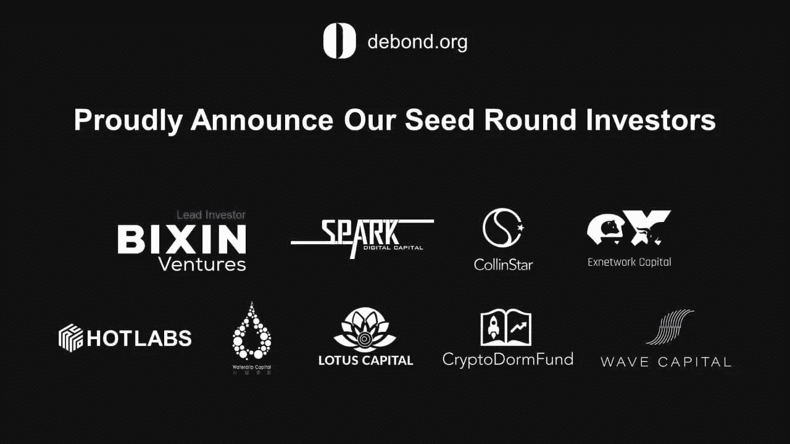

# 随着 Web 3.0 的发展，德邦利用 ERC-3475 令牌进行衍生品交易

> 原文：<https://medium.com/coinmonks/as-web-3-0-grows-debond-takes-derivatives-to-defi-with-erc-3475-token-18e88461ae6c?source=collection_archive---------12----------------------->

Debond Protocol is the Web 3.0 infrastructure pioneering the ERC 3475 token standard for decentralised bonds

德邦协议的 [ERC-3475](https://hackernoon.com/what-is-erc-3475-exploring-bonds-on-ethereum-blockchain-a-new-token-standard) 作为**令牌**标准出现，这将有助于将债券和[衍生品](https://www.google.com/search?q=derivatives&oq=derivatives&aqs=chrome..69i57j69i59.1336j0j7&sourceid=chrome&ie=UTF-8) 二级市场带入[分散化](https://www.investopedia.com/terms/d/decentralizedmarket.asp)金融( **DeFi** )空间——在那里它目前并不存在。**令牌**对**衍生品**的适用性使得 EIP-3475 颇具创新性。它也比早期版本的 ERC-20 流动性提供者(LP) **令牌**高出一个档次，主要用作贷款的数学证明和使用 [**智能合约**](https://ethereum.org/en/developers/docs/smart-contracts/) 交易的资产的可替代表示。

> 随着去中心化互联网的 Web 3.0 时代变得更加真实，并伴随着 DeFi 不断增长的生态系统，**项目的及时进入意义重大。**

**基于其去年年底的推动甚至超越了[**crypto**](https://twitter.com/crypto?lang=en)**市场，一些业内人士预计零售市场将在 2022 年开放，为参与 [**DeFi**](https://www.investopedia.com/decentralized-finance-defi-5113835) 的新方式铺平道路。随着**加密货币**的使用日益成为任何一个经济体生活的一部分，有理由质疑法定货币的稳定性，一些可行的方法也在考虑之中。或者，现有金融体系仍面临巨大挑战，即打破潜在用户获得旨在改善他们生活方式的银行产品的障碍。****

****谈到新兴市场的通货膨胀和地缘政治问题带来的不稳定，如正在进行的 [**俄乌**](https://apnews.com/hub/russia-ukraine) 战争及其对石油价格的影响，这反过来影响了全球股市等，对替代金融工具如**加密货币**和 **DeFi** 的需求从未如此之高。****

****因此，一些风险资本家希望参与解决传统衍生品市场缺乏透明度和散户投资者无法进入的问题是有道理的。考虑到目前在 **DeFi** 中不存在衍生工具，这一点特别有趣，因为没有能够支持如此复杂的数据结构的令牌标准和基础设施。****

****然而，随着 EIP-3475 的多重可赎回债券标准，以及风投的支持——如 Bixin Ventures、CSPDAO、Connectico Capital、Exnetwork、Wave Capital、Crypto Dorm Fund、F12 Capital、Collinstar Capital 等——以及更多的努力使他们的利益与德邦的利益保持一致(通过电子邮件向 info@debond.org 了解更多信息),有限合伙人将能够在二级市场上出售之前与**衍生品**发行人就还款条件和利率达成合同协议。随着新的金融衍生品**引入 **DeFi** ，token**standard**的**智能合约**将允许有限合伙人和借款人就贷款/债务达成可定制的协议，以管理赎回条件和价格范围。******

****

**Some VCs are already part of solving the problem of lack of transparency in TradFi**

**随着 ERC-3475 **令牌**标准的出现，Debond 协议正处于范式转换之旅的起点。目前的估值为 1250 万美元，其首次公开募股(IDO)定于 6 月进行，随着 ERC-3475 **令牌**投入现实世界使用，还会有更多。**

**“我们认为这个项目令人兴奋的是，对当前产量农业系统的更新将为 **DeFi** 系统带来更多的变化、可能性和信徒，将 **DeFi** 推向下一个阶段，在那里可以使用 ERC-3475 债券标准设计更复杂的经济系统，” [Debond Protocol 首席执行官](http://shorturl.at/ozBT1)刘玉说。“我们期待它超越我们想象的界限:围绕分散期权、**衍生品**和任何其他形式的金融产品的新协议，以及许多现有或不存在的此类概念。它具有大幅提高 **DeFi** 的效率和计算复杂性所需的所有潜力。根据设计，DeBond 是一个开放式平台。我们期待看到一系列基于 ERC-3475 基础设施的应用和用例。”**

**使用 ERC-3475 接口，一个 **DeFi** 项目可以通过 DeBond 协议的 [**Web 3.0**](https://www.google.com/search?q=Web+3.0&oq=Web+3.0&aqs=chrome..69i57j69i60.1776j0j7&sourceid=chrome&ie=UTF-8) 组件与**智能合约**进行交互。解绑协议和**令牌**标准的成功将意味着当前发行和交易**衍生产品**过程中涉及的中介机构将会更少，过程将会更快、更便宜。**

**推特: [@DebondProtocol](https://mobile.twitter.com/debondprotocol)**

**网址:[https://debond.net/](https://debond.net/)**

**球场甲板:[shorturl.at/ozBT1](https://github.com/DeBond-Protocol/DOC/blob/main/DEBOND_PITCH_DECK_v2.01.pdf)**

**白皮书:[shorturl.at/yWZ03](https://github.com/DeBond-Protocol/DOC/blob/main/DEBOND_Whitepaper_v1.pdf)**

**在这里查看 Debond 协议前端的演示[https://debond-protocol.github.io/](https://debond-protocol.github.io/)(在 HECO 链中使用测试以太进行一些操作)。**

> **加入 Coinmonks [电报频道](https://t.me/coincodecap)和 [Youtube 频道](https://www.youtube.com/c/coinmonks/videos)了解加密交易和投资**

# **另外，阅读**

*   **[加密货币储蓄账户](/coinmonks/cryptocurrency-savings-accounts-be3bc0feffbf) | [YoBit 审核](/coinmonks/yobit-review-175464162c62)**
*   **[Botsfolio vs nap bots vs Mudrex](/coinmonks/botsfolio-vs-napbots-vs-mudrex-c81344970c02)|[gate . io 交流回顾](/coinmonks/gate-io-exchange-review-61bf87b7078f)**
*   **[CoinFLEX 评论](https://coincodecap.com/coinflex-review) | [AEX 交易所评论](https://coincodecap.com/aex-exchange-review) | [UPbit 评论](https://coincodecap.com/upbit-review)**
*   **[AscendEx 保证金交易](https://coincodecap.com/ascendex-margin-trading) | [Bitfinex 赌注](https://coincodecap.com/bitfinex-staking) | [bitFlyer 审核](https://coincodecap.com/bitflyer-review)**
*   **[Bitget 评论](https://coincodecap.com/bitget-review) | [双子星 vs BlockFi](https://coincodecap.com/gemini-vs-blockfi) cmd| [OKEx 期货交易](https://coincodecap.com/okex-futures-trading)**