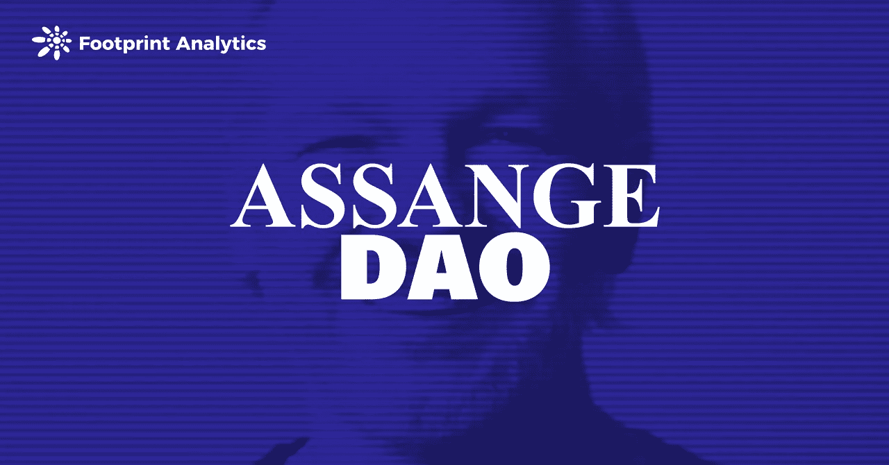
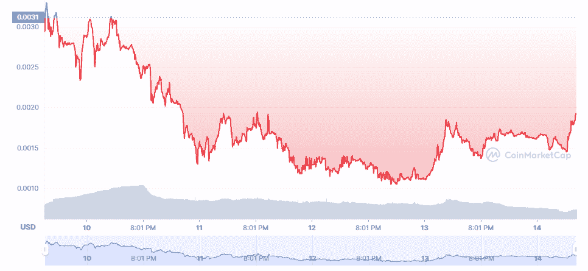
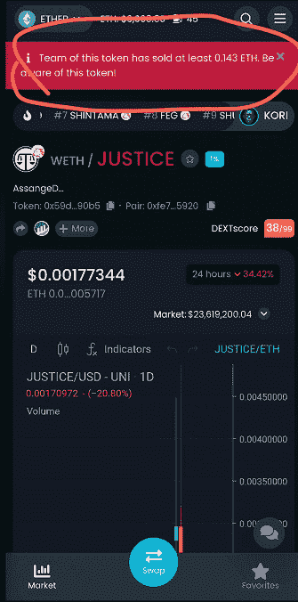

# 阿桑奇道的指控凸显了将激进主义和投资混为一谈的危险

> 原文：<https://medium.com/coinmonks/assangedao-accusations-highlight-danger-of-mixing-activism-investing-9e5e7e44b6c8?source=collection_archive---------60----------------------->

作为一项投资，该项目显然没有成功，这凸显出将维权人士道与盈利性投资混为一谈的问题。

数据来源:[足迹分析](https://www.footprint.network/)

2 月 9 日，阿桑奇道以 17,442 ETH 的成绩超越[宪法道](https://cryptoslate.com/constitutiondao-the-failed-project-that-shook-the-crypto-world/)，成为史上最大的[道](https://www.footprint.network/article/what-is-a-dao-a-quick-review-of-dao-fp-619f369b-bdee2700-11f56c72)。

阿桑奇道于 12 月 10 日启动，据称是由一群匿名的密码朋克发起的，目的是帮助维基解密创始人朱利安·阿桑奇进行法律辩护。为了筹集资金，朱利安·阿桑奇(Julian Assange)与一位加密艺术家帕克(Pak)合作，在 2 月 7 日至 9 日的一次在线拍卖中出售了一套非加密技术。

所有的捐赠者都会收到一个象征性的$JUSTICE，根据捐赠的 ETH 数量给予他们投票权，包括如何使用 AssangeDAO 的资源。

然而，虽然 AssangeDAO 声称要追随 ConstitutionDAO 的脚步，但创始团队最近的行动已经分裂了社区，并带来了对该项目是一个骗局的指控。

# 阿桑奇道是如何运作的

阿桑奇岛拍卖会的核心是一件 NFT 艺术品，*时钟*，它以黑色背景的白色文字显示了阿桑奇被监禁的天数。

这类似于宪法道如何围绕竞标美国宪法的 13 个副本之一。但它的不同之处在于，宪法具有真正的市场价值，而且(显然)事实上不是由道的创始团队创造的。

**钱去了哪里**

创始团队负责阿桑奇道地段的分配和筹款。无论是谁，只要对这件 NFT 出价，就会得到相应的 1000 美元的资金.

**拍卖结果**

与 ConstitutionDAO 在拍卖失败后返还所有筹集的资金不同，AssangeDAO 完成了所有的筹款，并以 5300 万美元的价格成功拍卖了他们的 NFT。

虽然只是最近才推出， [$JUSTICE](https://www.footprint.network/guest/chart/justice-token-performance-fp-00f0306d-e488-49a7-bf33-b35269f6bfe2?channel=u-apcVFj) 的价格在发布 24 小时内减半。

# 关于阿桑奇岛的争议

阿桑奇岛有超过 10，000 名用户捐款。不像 ConstitutionDAO 大多是草根激进主义，许多参与者购买$正义代币作为投机，希望价格会像 ConstitutionDAO 的代币一样上涨，人。

价格的大幅下降在社区里引发了很多议论。许多捐助者对该项目及其创始团队产生了怀疑。

一些成员甚至向阿桑奇道社区提交了一份提案，对创始团队提起法律诉讼。

他们指责阿桑奇道的创始成员和共识单位，一个由詹·罗宾逊(朱利安·阿桑奇的律师)、加布里埃尔·希普顿(朱利安·阿桑奇的兄弟)、斯特拉·莫里斯(朱利安·阿桑奇的未婚妻)和社区版主组成的团体，违反了他们自己提出的最初治理模式 AIP 0001。

根据 AIP 0001，对于阿桑奇道做出的每一个决定，都应该首先与论坛成员分享一个建议。然后，将由共识股审查。如果被接受，它将被添加到 Snapshot，一个分散的投票系统，$JUSTICE 持有者将能够投票决定接受或拒绝该提案。

然而，AIP 0001 在第一次执行 AssangeDAO 期间并未适用。

该项目的团队在阿桑奇岛的官方不和谐上宣布将只有一轮捐赠。然而，在第一轮筹款后，他们立即开始了第二轮。

阿桑奇的兄弟(也是创始成员)提议对社区的*钟* NFT (16，593 ETH)进行整个财政部的最高出价，遭到大多数成员的反对(因为投标人很少)。但社区根本无视反对意见，阿桑奇道的多签名者将价格推至最高。

拍卖结束后，项目运营方也正式宣布创始团队退出阿桑奇道。

根据专注于分散交易的交易助理 Dextools 的说法，项目运营商正在出售他们的$JUSTICE 令牌，这激起了社区的愤怒。

向阿桑格道社区提出了几项建议。

*   对社区提案使用快照。
*   阿桑奇道和维基解密共同管理阿桑奇基金会，共同出资拯救阿桑奇。
*   要求 Juicebox 退钱，并返还 5%的加工费给道。

在阿桑奇道社区，有人提议从法律上制裁创始团队。然而，意见和投票是有分歧的——45.53%的人投票赞成，54.47%的人反对。一些社区成员认为，不管创始团队的目的是什么，正义令牌作为正义的代表，有其象征性的正义共识。社区仍然期待着它的价格回升。

# 摘要

阿桑奇道为一些人提供了为正义事业捐款的前景。该项目甚至看到 Vitalik Buterin 捐款，这导致许多人潜水只是为了跟随一个 KOL，导致近 5,000 ETH 的捐款在他发布在 Twitter 上后流入。作为一项投资，该项目显然没有成功，这凸显出将维权人士道与盈利性投资混为一谈的问题。

**什么是足迹**

足迹分析是一个一体化的分析平台，用于可视化区块链数据和发现见解。它清理和集成链上数据，因此任何经验水平的用户都可以快速开始研究令牌、项目和协议。凭借一千多个仪表板模板和一个拖放界面，任何人都可以在几分钟内构建自己的定制图表。发掘区块链数据，利用足迹进行更明智的投资。

*足迹网址:*[*https://www . Footprint . network*](https://www.footprint.network/)

*不和:*[*https://discord.gg/3HYaR6USM7*](https://discord.gg/3HYaR6USM7)

*推特:*[*https://twitter.com/Footprint_DeFi*](https://twitter.com/Footprint_DeFi)

*电报:*[*https://t.me/joinchat/4-ocuURAr2thODFh*](https://t.me/joinchat/4-ocuURAr2thODFh)

*Youtube:*[*https://www.youtube.com/channel/UCKwZbKyuhWveetGhZcNtSTg*](https://www.youtube.com/channel/UCKwZbKyuhWveetGhZcNtSTg)

> 加入 Coinmonks [电报频道](https://t.me/coincodecap)和 [Youtube 频道](https://www.youtube.com/c/coinmonks/videos)了解加密交易和投资

## 也阅读

 [## 杠杆代币[多头代币]终极指南

### 杠杆化令牌是具有杠杆化风险敞口的 ERC20 令牌，不考虑保证金、要求、管理…

medium.com](/coinmonks/leveraged-token-3f5257808b22)  [## 最佳加密交易所| 2022 年十大加密货币交易所| CoinCodeCap

### 哪一个是最好的加密交换？在本文中，我们将根据多种加密货币列出 10 大加密货币交易所

coincodecap.com](https://coincodecap.com/crypto-exchange)  [## 2022 年最佳加密交换平台| CoinCodeCap

### 随着时间的推移，我们大多数人将转向 dex 以获得更好的安全性和隐私。因此。在这里，我们将讨论…

coincodecap.com](https://coincodecap.com/best-swap-platforms)  [## 2022 年最佳加密和比特币赌场(美国批准，存款奖励)

### 接收、支付和赚取加密货币| |有各种各样的最佳在线赌场可供选择，有可能…

coincodecap.com](https://coincodecap.com/best-online-casinos)  [## 2021 年最佳加密借贷平台| 6 大比特币借贷平台

### 获得比特币和其他加密货币的最佳贷款利率

medium.com](/coinmonks/top-5-crypto-lending-platforms-in-2020-that-you-need-to-know-a1b675cec3fa)  [## 2021 年 6 大最佳硬件钱包|顶级加密硬件钱包[更新]

### 最好的加密货币硬件钱包是绝对必要的。我们将在 NGRAVE、Ledger Nano X 和…

medium.com](/coinmonks/the-best-cryptocurrency-hardware-wallets-of-2020-e28b1c124069)  [## 加密交易机器人——19 款最佳免费加密交易机器人

### 2022 年币安、比特币基地、库币和其他密码交易所的最佳密码交易机器人。四进制，位间隙…

medium.com](/coinmonks/crypto-trading-bot-c2ffce8acb2a)  [## 最佳 4 个加密交易信号电报通道

### 这是乏味的找到正确的加密交易信号提供商。因此，在本文中，我们将讨论最好的…

medium.com](/coinmonks/best-crypto-signals-telegram-5785cdbc4b2b)