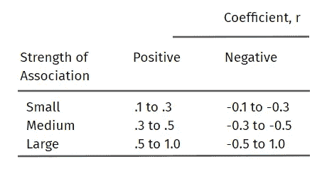
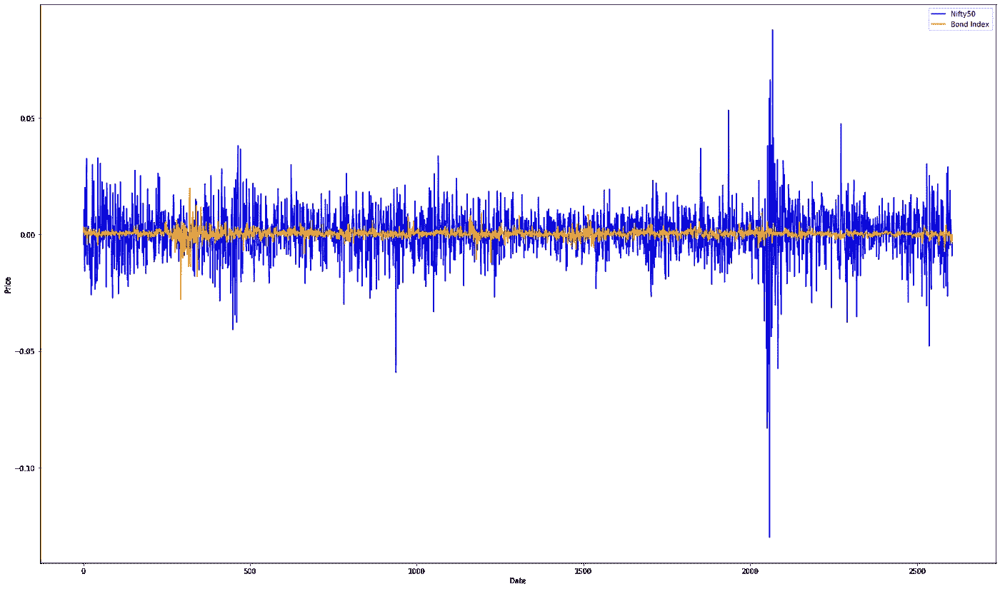

# 投资组合多样化的资产类别分析

> 原文：<https://medium.com/coinmonks/asset-classes-analysis-for-portfolio-diversification-7d75a0cdf888?source=collection_archive---------66----------------------->

## 不要把所有的鸡蛋放在一个篮子里。

多元化投资组合是各种投资的集合，这些投资组合在一起可以降低投资者的整体风险。分散投资包括持有几个不同行业、国家、风险状况的股票，以及股票、债券、黄金、加密货币和房地产等其他投资。这些不同的资产共同降低了投资者资本永久损失的风险以及投资组合的整体波动性。作为交换，多元化投资组合的回报往往低于投资者如果能够挑选一只获胜股票所能获得的回报。

让我们根据印度市场的波动性、相关性和 CAGR(复合年增长率)来比较不同的资产类别。我们将把 Nifty 50 指数作为不同资产类别之间比较的通用基准。对于相关性，我们将使用**皮尔逊相关系数**。

Nifty 50 是印度股市的基准指数，代表了在国家证券交易所上市的 50 家最大的印度公司的加权平均指数。

**加密货币(比特币)v/s Nifty 50 指数** 比特币是世界上第一种去中心化的加密货币——一种使用[公钥加密](https://www.coindesk.com/how-public-key-infrastructure-will-revolutionize-custody-and-fund-management/)来记录、签署和发送比特币[区块链](https://www.coindesk.com/learn/what-is-blockchain-technology/)上的交易的数字资产——所有这些都是在没有中央机构监督的情况下完成的。
让我们比较一下 Nifty 50 指数和比特币从 2014 年 9 月 17 日到 2022 年 6 月 8 日的波动性(价格变化百分比)。可以清楚地看到，比特币比 Nifty 50 指数的噪音更大，因此比特币的波动性比 Nifty 50 指数大得多。

Noise comparison between Nifty 50 Index and Bitcoin

但是风险越大，回报越大。在上述指定区间内，比特币的 CAGR 为 **77.50%** ，而 Nifty 50 指数为 **10.1%** 。
Nifty 50 和比特币的相关性为 **0.918** ，这意味着股票市场和比特币波动(涨跌趋势)有很强的联系。

**黄金指数 v/s Nifty 50 指数** 黄金是所有贵金属中最受欢迎的，因其美丽、流动性、投资品质和工业属性而在世界范围内被收购。黄金通常被视为一种金融资产，作为一种投资工具，可以在通胀时期保持其价值和购买力。
让我们比较一下 Nifty 50 指数和黄金从 2000 年 1 月 3 日到 2022 年 3 月 18 日的波动性(价格变化百分比)。下图显示，Nifty 50 比黄金指数的噪音略大，因此 Nifty 50 比黄金指数的波动性更大。

Noise comparison between Nifty 50 and Gold Index

黄金指数在上述指定区间内的 CAGR 为 **12.159%** ，而 Nifty 50 指数为 **12.244%** 。虽然实际储存黄金可能会有问题，但也有替代方案。
Nifty 50 和黄金指数之间的相关性为 **0.915** ，这意味着股票市场和黄金指数波动(上涨和下跌趋势)有很强的联系。

**国债指数 v/s Nifty 50 指数** 政府债券或主权债券是一国政府为支持政府支出而发行的债务凭证。它通常包括支付定期利息的承诺，称为息票支付，并在到期日偿还面值。
让我们比较一下 Nifty 50 指数和政府债券指数从 2012 年 5 月 31 日到 2022 年 7 月 6 日的波动性(价格变化百分比)。下图显示，Nifty 50 比债券指数噪音更大，因此 Nifty 50 比债券指数波动更大。

Noise Comparison between Nifty 50 and Govt Bond Index

债券指数在上述区间的 CAGR 为 **11.754%** ，而 Nifty 50 指数为 **19.801%** 。
Nifty 50 和债券指数之间的相关性为 **0.927** ，这意味着股票市场和债券指数波动(上涨和下跌趋势)紧密相关。

**结论** 从讨论的结果来看，很明显，这些资产类别之间有着紧密的联系。这意味着一个资产类别的任何上涨或下跌趋势都会反映在不同的资产类别中，只是变化的幅度不同。政府。与黄金、股票或比特币相比，更稳定(波动性更小)的债券下跌幅度更小。资产可以通过投资者投资组合中的风险/回报比率或风险偏好来加权。

波动性的顺序可能是:比特币>黄金≈ Nifty 50 >政府债券。

CAGR 的顺序可能是:比特币> Nifty 50 >黄金>政府债券。

> 加入 coin monks[Telegram group](https://t.me/joinchat/Trz8jaxd6xEsBI4p)学习加密交易和投资