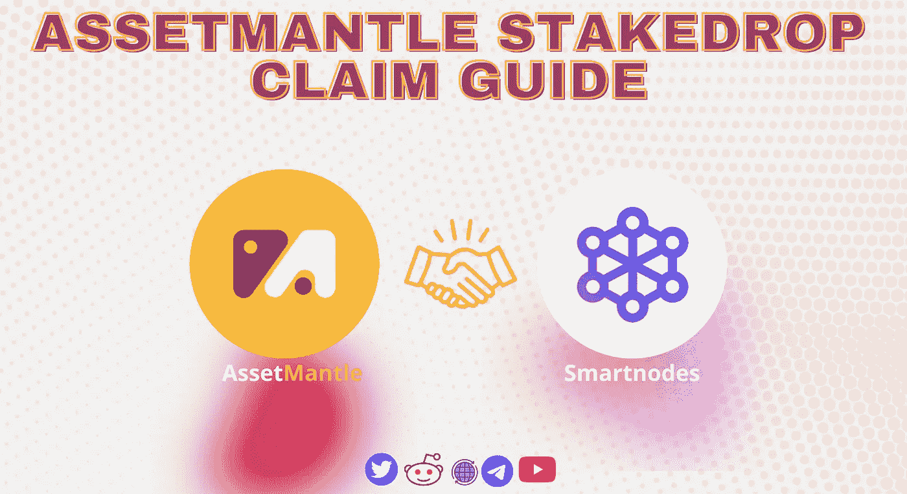
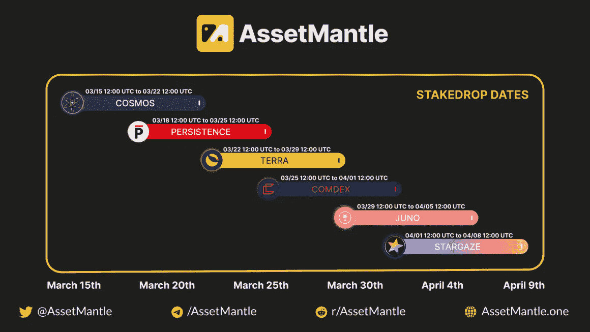
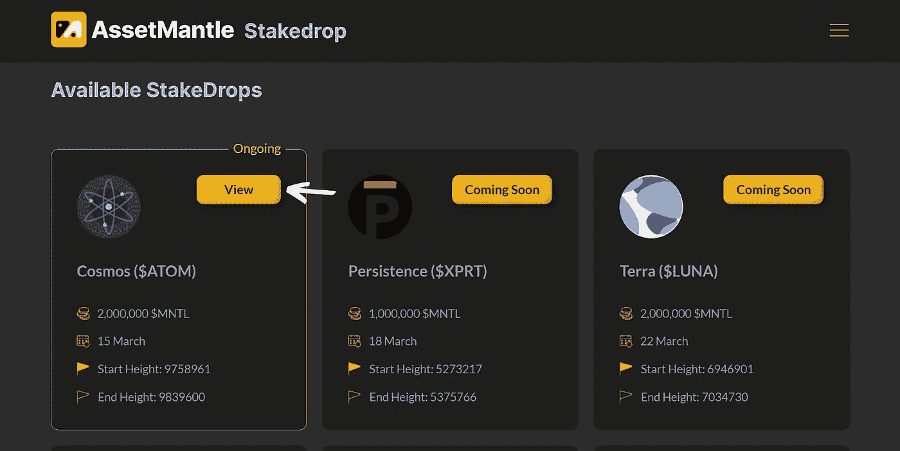
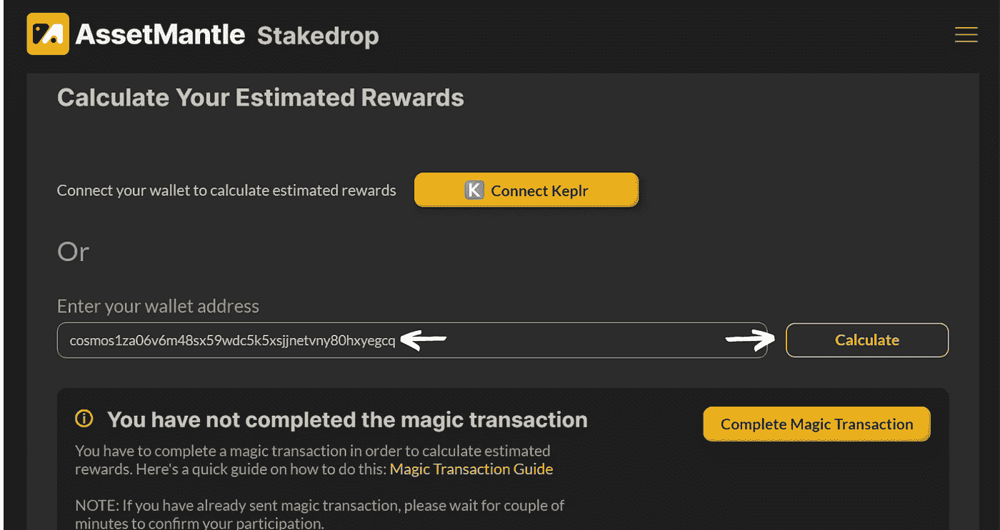
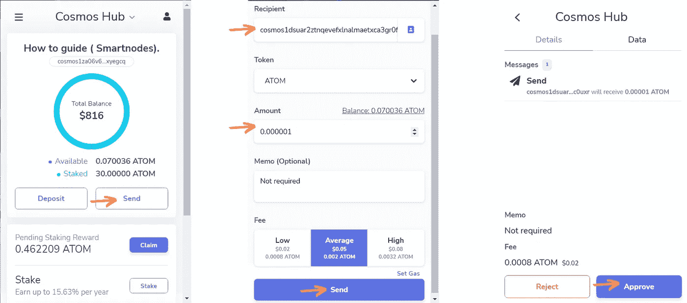
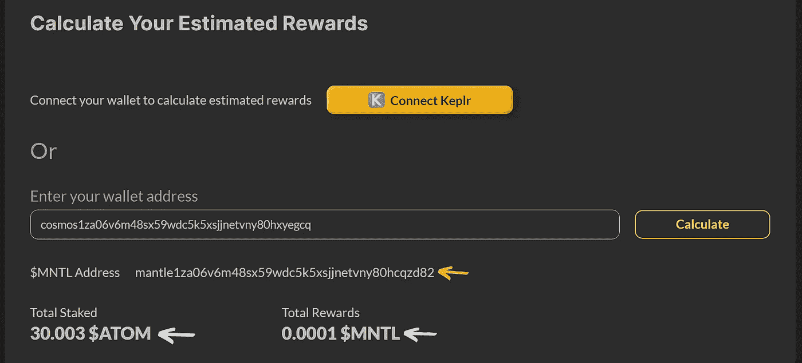

# Atom 的资产管理赌注-索赔指南

> 原文：<https://medium.com/coinmonks/assetmantle-stakedrop-for-atom-claim-guide-b5f134ece66a?source=collection_archive---------4----------------------->

[AssetMantle StakeDrop](https://airdrop.assetmantle.one/) by [Smartnodes Validator](https://smartnodes.one/)

# 关于资产范围

[Asset Mantle](https://assetmantle.one/) 是一个完整的、可互操作的不可替代的生态系统和市场结构，它提供的价值远远超过不可替代领域的一般价值。如果实施链间 NFT 标准，NFT 投资者(及其资产)将能够在几个区块链生态系统之间转移，并以低铸造费享受伟大的创造者工具。

音乐、游戏、收藏品和其他行业已经接受了不可替代令牌(NFT)。尽管近年来非功能性测试获得了很大的关注，AssetMantle 认为我们只是触及了可能的表面。AssetMantle 的团队决心成为创作者、他们各自的作品以及出售作品的市场的创新中心，这要归功于一系列独特的 NFT 聚焦解决方案。

一些[资产外壳](https://assetmantle.one/)的附加功能包括:

*   **所有权细分**
*   **NFT 分散交易所**
*   **多钱包支持**
*   **可定制店面**
*   **多链 NFT 传输**
*   **可定制的 NFT 元数据**
*   **交易效率**

# 什么是$MNTL

$MNTL 是资产管理公司的治理标志，在它的赌注经济中起着不可或缺的作用。除了保护 MantleChain 之外，$MNTL 还可以在 MantlePlace (NFT 资产交易市场)中进行各种交易，如造币、贸易、版税分配和平台费。

# 什么是 Stakedrop？

StakeDrop 是一种令牌分发机制，它允许一些最著名的利益相关网络的赌注者获得$MNTL 令牌(资产挑战令牌)。

[AssetMantle stakedrop](https://airdrop.assetmantle.one/stakedrop)

**详情**

*   9，000，000 美元 MNTL 代币将分发给所有六个不同连锁店的 Stakedrop 参与者。(ATOM、XPRT、LUNA、CMDX、JUNO、STAR)
*   为了参与这项活动，用户需要将他们的 tokes 与任何活动的验证器绑定，并向指定的钱包地址发送一个神奇的交易。
*   所有链上赌注钱包都有资格。

**步骤 1-** 转到[https://airdrop.assetmantle.one/stakedrop](https://airdrop.assetmantle.one/stakedrop)并向下滚动到**可用赌注**部分，点击**原子视图。**

[ATOM Stakedrop](https://airdrop.assetmantle.one/stakedrop)

**第 2 步** -现在您将看到两个选项，我们将推荐您选择第二个选项，手动输入您的钱包地址并点击计算。(*你会收到下面这条消息，完成神奇的交易。*)

Calculating $MNTL allocation

**第三步** -完成魔术交易(要开始参与 StakeDrop 活动，请将 **0.000001 美元 ATOM** 发送到以下地址:**cosmos 1d suar 2 ztnqevefxlnalmaetxca 3 gr 0 FP 4c 0 uxr)(***请注意，从您的 ATOM 地址发送此交易，发送的金额也将退还给原始地址。* **)**

[Approving magic transaction](https://test-mantle-1.explorer.assetmantle.one/validators)

**第 4 步-** 完成魔术交易后，您将能够看到您的**总赌注$ATOM，$MNTL 地址，总奖励$MNTL。**

[MNTL rewards](https://test-mantle-1.explorer.assetmantle.one/validators)

> 奖励发放开始日期**2022 年 3 月 16 日块高:9770481** 结束日期**2022 年 3 月 22 日块高:9839600。**您还有 6 天的时间来完成申请流程。

**重要**

> $MNTL 代币的分配将在 6 个月的锁定期后开始，并将在接下来的 6 个月内线性分配(6 个月内每个区块发行的代币相等)

# **关于智能节点**

1.  [Smartnodes](http://smartnodes.one) Validator 提供 100%全额退款的斜线和双符号保护。
2.  我们在宇宙中非常活跃，尽我们所能给予支持。我们是社区驱动的。验证器积极地对提案进行投票，以帮助确保适当的治理。
3.  [Smartnodes](https://smartnodes.one/#choose) 使用的基础设施是最好的，有 10 层安全措施来保护您的资产。
4.  我们目前正在验证 28 桩链和增长的证据，检查我们的验证节点我们的网站。 [Smartnodes.one](https://smartnodes.one/#faq)

socials |[*Reddit*](https://www.reddit.com/r/smart_nodes/)|[|*Twitter*|](https://twitter.com/nodes_smart)[|*网站*](http://smartnodes.one/)|[|*电报*|](https://t.me/smartnodesvalidators)|[|*insta gram*](https://www.instagram.com/smartnodes_validator/)|[不和](https://discord.gg/TA3UVPwn6D)

> 加入 Coinmonks [电报频道](https://t.me/coincodecap)和 [Youtube 频道](https://www.youtube.com/c/coinmonks/videos)了解加密交易和投资

# 另外，阅读

*   [CoinDCX 点评](/coinmonks/coindcx-review-8444db3621a2) | [加密保证金交易交易所](https://coincodecap.com/crypto-margin-trading-exchanges)
*   [红狗赌场评论](https://coincodecap.com/red-dog-casino-review) | [Swyftx 评论](https://coincodecap.com/swyftx-review) | [CoinGate 评论](https://coincodecap.com/coingate-review)
*   [Bookmap 评论](https://coincodecap.com/bookmap-review-2021-best-trading-software) | [美国 5 大最佳加密交易所](https://coincodecap.com/crypto-exchange-usa)
*   [如何在 FTX 交易所交易期货](https://coincodecap.com/ftx-futures-trading) | [OKEx vs 币安](https://coincodecap.com/okex-vs-binance)
*   [CoinLoan 审查](https://coincodecap.com/coinloan-review) | [YouHodler 审查](/coinmonks/youhodler-4-easy-ways-to-make-money-98969b9689f2) | [BlockFi 审查](https://coincodecap.com/blockfi-review)
*   《XT.COM 评论》的|