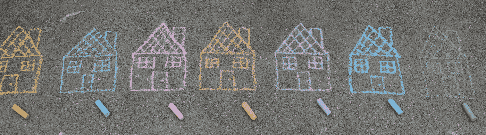

# 资产与负债

> 原文：<https://medium.com/coinmonks/assets-vs-liabilities-acfa79fc1986?source=collection_archive---------11----------------------->

在这篇文章中，你会发现什么是资产，什么是负债。它们之间的主要区别是什么，它们如何影响你的生活和你的财务状况。

一个常见的问题是，人们混淆了资产和负债，最终由于错误的决策而陷入财务困境。

如果你正处于或者曾经处于财务困境，那么这篇文章就是为你准备的。读到最后！

资产最简单的定义如下:资产是能把钱放进你口袋的东西。另一方面，我们可以把负债定义为任何从你口袋里掏钱的东西。

现在稍微发展一下主题，资产和负债不限于实物或事物，也可以是服务、订阅、版权等。

同样的东西可以分为资产和负债。区别是由使用目的和钱的去向造成的:他们来找你了吗？还是离开你？

它也可以被认为是一项资产或负债一项资产随着时间的推移会升值，甚至反之亦然，随着时间的推移会贬值，即使它不会定期产生收入或费用。

在继续具体举例之前，我想具体说明，购买资产会让你富裕，财务独立，购买负债会让你陷入贫困。

现在请仔细阅读！

你的房子，不是资产！你没看错。你的房子是个负担。

现在我们在谈论你住的房子。你住的房子需要从你的口袋里掏钱来进行维护、纳税和发生故障时的维修。

正如我们前面提到的，任何从你口袋里掏钱的东西都是负债。相反，如果你买了一栋房子并按月收取租金，那栋房子就自动成为一项资产。

因为它遵循的规则是:任何能把钱放进你口袋的东西都是资产。汽车也是如此。

**许多人认为他们自己的汽车是一种资产。**

你用来购物和度假的私家车是一种负担，因为它每个月都要从你的口袋里掏出钱来支付保险、汽油、清洗和维修费用。

相反，如果汽车能帮你赚钱，比如你用它做出租车或优步、租车、送包裹或任何其他能让你赚得比花出去的钱还多的活动，那么你的汽车就成了一项有价值的资产。

我们经常听到的另一个短语是这样说的:我需要投资一部新手机。这句话本质上是错的。

如果你的工作必须用那部手机来完成，买一部更贵的手机你可以更快地完成工作或者你可以赚更多的钱，那么你有资格这么说。

对于地球上的其他人来说，手机是一种负担。

而且不要告诉我们:但是嘿，我需要打电话给我的父母，或者我需要拍照！你可以用你已经有的手机来做这件事。

如果你现在的手机能满足你的需求，那么买一部更贵的手机就不是投资，而是一项支出。你的手机，即使它似乎没有捆绑一些费用。

现在越来越多的手机都是不带配件卖的，所以除了新手机，你还得买个屏幕保护套，外壳，充电器等。

因此，我们一致认为，手机也是一种负债，会从你的口袋里掏钱。

如果你用笔记本电脑或平板电脑做的只是在社交网络上玩游戏或滚动，那么它们也属于同一类别。

除了这样的事实，这些收购给你的房子带来了负债，这将使你变穷，每次你更换手机或笔记本电脑，旧的最终被扔进垃圾桶，这也给我们的星球带来了很多污染。

因此，我们建议你避免改变它们，比你真正需要的更频繁，不要试图给别人留下深刻印象。

这是你的钱，你用生命中的时间作为回报，而这些时间你永远也不会回来。

底线是，如果你进行购买，最好能知道它是资产还是负债。我们并不是说我们不需要负债。我们是人，我们喜欢物质。

我们喜欢看起来漂亮，受人欣赏。我只是说我们应该意识到我们带回家的是什么。

如果我们要买的东西会给我们带来口袋里的钱或者从我们口袋里拿出钱。

只有这样，我们才能做出正确的选择，这将引领我们走向更美好的未来。

你的每一个决定都会影响你的未来。

而你的现在是你过去选择的结果。我们不想告诉任何人买什么或不买什么。

我们只是想帮助你做出明智的，受过教育的，经过深思熟虑的决定。我们想让你明白，资产使你富有，负债使你贫困。

这并不意味着你没有负债！不是！

但你可以认为，每当你想购买一项负债时，你首先购买的是支付该项负债的资产。

你可以买一套公寓，用每套公寓的租金来支付汽车的分期付款，而不是买一辆新车。

通过这种方式，你得到了汽车，但价值仍然在你的口袋里！如果你想要健身订阅，第一次买一些股票，这将支付你每月几十美元的股息，所以你的资产将支付终身订阅。

管好你的钱！

> 加入 Coinmonks [电报频道](https://t.me/coincodecap)和 [Youtube 频道](https://www.youtube.com/c/coinmonks/videos)了解加密交易和投资

# 另外，阅读

*   [CBET 点评](https://coincodecap.com/cbet-casino-review) | [库币 vs 比特币基地](https://coincodecap.com/kucoin-vs-coinbase)
*   [折叠 App 审核](https://coincodecap.com/fold-app-review) | [Kucoin 交易机器人](/coinmonks/kucoin-trading-bot-automate-your-trades-8cf0ca2138e0) | [Probit 审核](https://coincodecap.com/probit-review)
*   [如何匿名购买比特币](https://coincodecap.com/buy-bitcoin-anonymously) | [比特币现金钱包](https://coincodecap.com/bitcoin-cash-wallets)
*   [币安 vs FTX](https://coincodecap.com/binance-vs-ftx) | [最佳(SOL)索拉纳钱包](https://coincodecap.com/solana-wallets)
*   [比诺莫评论](https://coincodecap.com/binomo-review) | [斯多葛派 vs 3Commas vs TradeSanta](https://coincodecap.com/stoic-vs-3commas-vs-tradesanta)
*   [Capital.com 评论](https://coincodecap.com/capital-com-review) | [香港的加密借贷平台](https://coincodecap.com/crypto-lending-hong-kong)
*   [如何在 Uniswap 上交换加密？](https://coincodecap.com/swap-crypto-on-uniswap) | [A-Ads 评论](https://coincodecap.com/a-ads-review)
*   [WazirX vs CoinDCX vs bit bns](/coinmonks/wazirx-vs-coindcx-vs-bitbns-149f4f19a2f1)|[block fi vs coin loan vs Nexo](/coinmonks/blockfi-vs-coinloan-vs-nexo-cb624635230d)
*   [本地比特币审核](/coinmonks/localbitcoins-review-6cc001c6ed56) | [加密货币储蓄账户](https://coincodecap.com/cryptocurrency-savings-accounts)
*   什么是融资融券交易