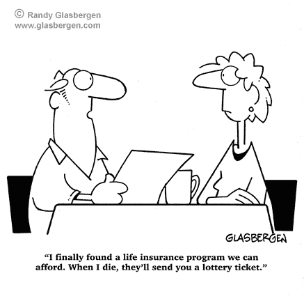
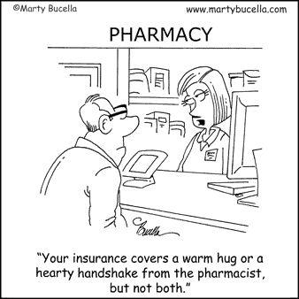

# 保险保证——我需要吗？——(一本入门书)

> 原文：<https://medium.com/coinmonks/assurance-of-insurance-do-i-need-it-a-primer-8d9a2c22b185?source=collection_archive---------11----------------------->

嘿伙计们…再次，很高兴回到你们身边。真心希望你们都好。不幸的是，在这个混乱和恐怖的时代，没有人能确定他们的计划。正如我在逃避 Covid 近 2 年后第一手发现的那样，它终于赶上了我，让我别无选择，只能忍受它，让我告诉你，这肯定不是任何人想要的体验。幸运的是，我已经接种了疫苗，因此，症状是轻微的，但它几乎一笔勾销了整个星期。因此，从个人经验来看，我会说，如果你没有任何严重的医疗问题，没有必要害怕 Covid。不过，同时，如果你能设法远离它，那就更好了。所以，打疫苗相信我，那些麻烦的预防措施真的很值得。

好吧…让我们进入下一个话题——“保险”。我们在之前的共同基金系列中已经简单讨论过。不过，我认为它值得更详细的讨论，在目前不确定的情况下，它看起来确实是一个非常相关的话题。

**什么是保险？**

这是金融机构(保险公司)与个人或组织之间的一份具有法律约束力的合同，公司承诺在保险对象发生损失时支付一定的预定金额。最常见的保险对象可能是“人寿”导致人寿保险，“健康”导致健康/医疗保险，“机动车辆”导致“车辆保险”，房屋导致房屋保险，甚至“旅行相关损失”导致“旅行保险”。根据寻求保险的人和提供保险的公司之间的协议，保险总是在支付一定金额(称为保险费)的有限时期内提供。在旅行的情况下，期限可能短至一天，在人寿保险的情况下，期限可能超过 50 年。

保险的基本原则是，如果一群人寻求保险并支付保险费，只有一小部分人会因为满足条件而实际要求向他们支付保险金额。让我们举个例子来更好地理解它。想象一下，如果一个 100 人的团体投保了保额为 1000 卢比/-的人寿保险，并支付了 100 卢比/-(仅为实际保额的 10%)的保费，保险公司就已经收取了 10000 卢比/-。然而，假设少于 9 个人实际上失去了生命。在这种情况下，保险公司将获得利润，同时也向死者家属提供赔付，从而确保他们的经济需求得到满足。这对所有人来说都是一个双赢的局面，最终每个人都很高兴。

但是如果这 100 个人的群体有 10 个人以上死亡的概率呢？很简单，保险公司会以同样的 1000 卢比/-的金额向所有人寻求更多的保费回报。为了便于计算，让我们假设这 100 人中，只有 80 人在保险期限内存活…..那么保险公司当然应该向每个会员收取 200 卢比，这样在履行承诺的同时保持盈利。这是对保险哲学的一种总结，其基础主要是某一事件发生的概率与为该事件投保所收取的保险费。

为什么我需要它…或者不需要它？

答案很简单，如果你有任何你害怕失去的东西，无论是因为它的金钱价值还是情感价值，以及它可能会扰乱你和你家人的生活，你应该考虑给它投保。例子可能从人寿保险到房屋或汽车保险，通过为企业、商店甚至昂贵的工艺工具投保来保护生计，或者可能是自阿克巴时代以来就在你家中的古董画。人们为最奇怪的东西投保，包括身体部位，甚至记忆。但是，如果你有需求，请放心，有人会提供符合你需求的产品。对美国消费者来说幸运的是，在 2000 年保险业去监管化后，现在有 12 家公共或私人公司可以选择寿险或普通险。由于缺乏对情感和动机的深入理解，我将这篇关于保险的文章限制在纯金融的角度。

专业建议:——I**如果一项资产的损失，包括你的生命，可能会影响你或你家庭的财务状况，你必须考虑投保**。

**无收入家庭成员的人寿保险？**

按照上面的逻辑，虽然为养家糊口的人寻求人寿保险可能是有意义的，因为他的不在会使家庭失去收入，但是未成年的孩子或不打算为钱而工作的人(老人、家庭主妇等)怎么办？)?然后，通过纯粹的数学计算，它不保证人寿保险。是的，我知道这是有争议的，但伙计们，我限制自己在这里纯粹的金融，没有别的。我完全同意，他们的生活与养家糊口的人一样重要，甚至可能更重要，因为他们支持养家糊口的人出去赚钱，但是，从财务上来说，将这笔钱投资于报酬更高的投资选择而不是保险可能是谨慎的。

**什么要保险，什么不要保险？**

永远不会有放之四海而皆准的答案。像许多其他与个人理财相关的问题一样，这也必须由你自己来回答。也许有广泛的指导方针可以帮助你，但最后，你必须决定投保什么和费用是多少？让我们以健康保险为例，我建议这是所有人的必需品，不管是年轻人还是老年人，富人还是穷人，甚至是有工作的人还是失业者。假设你没有任何由你的雇主提供或由你的朋友和家人赠予的计划，以确保你和你的直系亲属的医疗保险。在这种情况下，尽早购买一份医疗/健康保险至关重要。但这里的问题是，值多少钱？现在，理性地想一想，健康有没有价值，医疗费用有没有上限……因此，这个问题的答案在于你的支付能力，而不是那些你想保护你和你家人的想象中的可怕疾病。

同样，虽然汽车或摩托车保险非常普遍，但你是否也想为你的自行车投保，因为你可能会在日常上班时使用它？可能不会，因为虽然一辆汽车，如果被盗或遇到事故，在不久的将来很难更换，但自行车被盗的可能性要小得多，而且如果在事故中损坏，修理成本可能不会太高。但是，如果我补充说你的周期是一个高端赛车周期成本 lakhs，会改变你的决定吗？当然可以……..可以理解，这也是正确的。同样的原则适用于任何事物，无论是家庭用品还是企业/商店的财产。保险的唯一基本原则是，它是一种产品——让你免受突如其来的重大损失。您定期支付一小部分费用，并为获得这种保证而发生支出。因此，你的贵重物品受到威胁的可能性越高，你的保险金额就应该越高，同时要记住，这会增加你的支出。

这个帖子到此为止，伙计们…..其目的仅仅是为了激励你理性地思考这个非常重要的问题，这个问题很少被全面理解，通常只停留在保险公司和他们华丽的广告向我们抛出的行话中。显然，毫无疑问，我们都需要某种形式的保险，无论是人寿保险、交通保险、旅游保险、健康保险还是一些昂贵项目的一般保险，但多少保险是好的，以及如何明智地选择保险工具，对我们大多数人来说仍然是一个谜。因此，仔细思考这篇文章中讨论的一般概念，并以此为基础，我们将在接下来的几篇文章中把这些概念构建成可操作的要点。

购买到那时……我真诚地希望你也会喜欢这个系列，类似于以前的共同基金系列。**我指望你们支持我在大众中传播金融意识的使命**，对于那些家伙，如果你喜欢这个帖子，**请与尽可能多的人分享**。请不要忘记**按下鼓掌按钮**以示感谢。对于新读者，请做**跟随**继续接收帖子。

下周见…快乐阅读，快乐投资。

> 加入 Coinmonks [电报频道](https://t.me/coincodecap)和 [Youtube 频道](https://www.youtube.com/c/coinmonks/videos)了解加密交易和投资

## 另外，阅读

*   [比斯勒评论](https://blog.coincodecap.com/bitsler-review)|[WazirX vs coin switch vs coin dcx](https://blog.coincodecap.com/wazirx-vs-coinswitch-vs-coindcx)
*   [赢取注册奖金——10 大最佳加密平台](https://blog.coincodecap.com/earn-sign-up-bonus)
*   [最佳加密交易信号电报](/coinmonks/best-crypto-signals-telegram-5785cdbc4b2b) | [MoonXBT 评论](/coinmonks/moonxbt-review-6e4ab26d037)
*   [Coinswitch 俱吠罗评论](/coinmonks/coinswitch-kuber-review-1a8dc5c7a739) | [电网交易机器人](https://blog.coincodecap.com/grid-trading) | [比特币基地收费](/coinmonks/coinbase-fees-831e77d4f2c5)
*   [Bitget 回顾](https://blog.coincodecap.com/bitget-review)|[Gemini vs block fi](https://blog.coincodecap.com/gemini-vs-blockfi)|[OKEx 期货交易](https://blog.coincodecap.com/okex-futures-trading)
*   [OKEx vs KuCoin](https://blog.coincodecap.com/okex-kucoin) | [摄氏替代品](https://blog.coincodecap.com/celsius-alternatives) | [如何购买 VeChain](https://blog.coincodecap.com/buy-vechain)
*   [币安期货交易](https://blog.coincodecap.com/binance-futures-trading)|[3 commas vs Mudrex vs eToro](https://blog.coincodecap.com/mudrex-3commas-etoro)
*   [在印度利用加密套利赚取被动收入](https://blog.coincodecap.com/crypto-arbitrage-in-india)
*   [德国最佳加密交易所](https://blog.coincodecap.com/crypto-exchanges-in-germany) | [WazirX P2P](https://blog.coincodecap.com/wazirx-p2p)