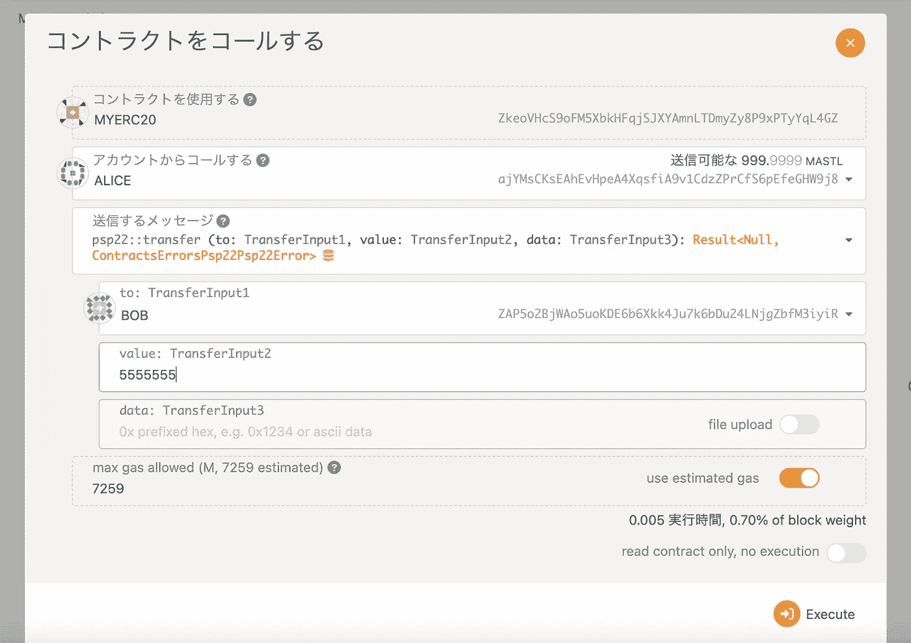

# 使用 OpenBrush 实现 erc20

> 原文：<https://medium.com/coinmonks/astar-implement-erc20-using-openbrush-d20761007f13?source=collection_archive---------19----------------------->


# Summry

在一段时间以来第一次检查 Astar hub 时，我注意到了一篇关于 OpenBrush 的文章。我最近重新关注了 wasm 的智能合约。然后，我找到了“metis”并尝试实现，但它似乎不支持最新版本的 ink！，所以我很难过，因为我不能很好地实现它。

所以见到 OpenBrush 非常激动。在本文中，我想使用 OpenBrush 实现 erc20 契约。目录如下。

 [## 概述| OpenBrush

### 这个文档描述了如何导入和使用 OpenBrush 库。

docs.openbrush.io](https://docs.openbrush.io/smart-contracts/overview/) 

*   检查生锈环境
*   创建基础油墨！项目
*   使用 OpenBrush 实现基本的 erc20
*   在本地 Astar 节点上测试合同

# 检查生锈环境

为了实现一个智能合同使用墨水！，你需要一个生锈的环境。我就在这里检查一下生锈的环境。如果你想知道如何设置生锈环境，请参考基板的官方页面。

[](https://docs.substrate.io/tutorials/v3/ink-workshop/pt1/) [## 基底 _

### 分散式应用程序通常被编写为智能契约。虽然基板主要是一个框架和…

docs.substrate.io](https://docs.substrate.io/tutorials/v3/ink-workshop/pt1/) 

下面介绍如何检查 rust 的版本。

```
% rustup show
Default host: x86_64-apple-darwin
rustup home:  /Users/shin.takahashi/.rustupinstalled toolchains
--------------------stable-x86_64-apple-darwin (default)
nightly-2020-04-06-x86_64-apple-darwin
nightly-2022-03-14-x86_64-apple-darwin
nightly-x86_64-apple-darwin
1.51.0-x86_64-apple-darwininstalled targets for active toolchain
--------------------------------------wasm32-unknown-unknown
x86_64-apple-darwinactive toolchain
----------------stable-x86_64-apple-darwin (default)
rustc 1.60.0 (7737e0b5c 2022-04-04)
```

货物合同的版本如下。

```
% cargo contract --version
cargo-contract 1.3.0-unknown-x86_64-apple-darwin
```

# 创建基础油墨！项目

使用“cargo contract”命令创建一个基本项目。

```
cargo contract new myErc20
cd myErc20
```

完成后编译它。在此之前，将库更新到最新版本，然后编译。
更新“Cargo.toml”如下。

```
[dependencies]
ink_primitives = { tag = "v3.0.1", git = "[https://github.com/paritytech/ink](https://github.com/paritytech/ink)", default-features = false }
ink_metadata = { tag = "v3.0.1", git = "[https://github.com/paritytech/ink](https://github.com/paritytech/ink)", default-features = false, features = ["derive"], optional = true }
ink_env = { tag = "v3.0.1", git = "[https://github.com/paritytech/ink](https://github.com/paritytech/ink)", default-features = false }
ink_storage = { tag = "v3.0.1", git = "[https://github.com/paritytech/ink](https://github.com/paritytech/ink)", default-features = false }
ink_lang = { tag = "v3.0.1", git = "[https://github.com/paritytech/ink](https://github.com/paritytech/ink)", default-features = false }
ink_prelude = { tag = "v3.0.1", git = "[https://github.com/paritytech/ink](https://github.com/paritytech/ink)", default-features = false }scale = { package = "parity-scale-codec", version = "3", default-features = false, features = ["derive"] }
scale-info = { version = "2", default-features = false, features = ["derive"], optional = true }
```

编制此合同。

```
cargo +nightly contract build
```

# 使用 OpenBrush 实现基本的 erc20

根据 OpenBrush 官方页面，最基本的 erc20 是一个在构造函数中只指定“总供应量”的契约。但是，我们平时叫它 erc20 的时候，我觉得有“名”和“符”。因此，在这个示例中，我们将使用“PSP22 元数据”来实现它。

 [## PSP22 元数据| OpenBrush

### impl my PSP 22 { #[ink(constructor)]pub fn new(total _ supply:Balance，name: Option，symbol: Option，decimal: u8) ->…

docs.openbrush.io](https://docs.openbrush.io/smart-contracts/PSP22/Extensions/metadata) 

上面的网站上有一个步骤指南，所以让我们相应地实施它。如果不能很好的实现，请参考上传到我的 github 资源库的样例。

[](https://github.com/realtakahashi/tryOpenBrush/blob/main/myErc20/lib.rs) [## 主 realtakahashi/tryOpenBrush 上的 tryOpenBrush/lib.rs

### 此时您不能执行该操作。您已使用另一个标签页或窗口登录。您已在另一个选项卡中注销，或者…

github.com](https://github.com/realtakahashi/tryOpenBrush/blob/main/myErc20/lib.rs) 

# 在本地 Astar 节点上测试合同

编译已实现的 erc20 合同。然后确保它能正确编译。

```
cargo +nightly contract build
```


然后从官方 github 下载 Astar 节点。

[](https://github.com/AstarNetwork/Astar/releases/tag/v3.25.0) [## Astar 网络/Astar 3 . 25 . 0 版

### 版本 3.25.0 本地运行时版本:astar-14、shiden-50、shibuya-48 升级优先级:低 shiden-50 升级于…

github.com](https://github.com/AstarNetwork/Astar/releases/tag/v3.25.0) 

```
wget [https://github.com/AstarNetwork/Astar/releases/download/v3.25.0/astar-collator-3.25.0-macos-x86_64.tar.gz](https://github.com/AstarNetwork/Astar/releases/download/v3.25.0/astar-collator-3.25.0-macos-x86_64.tar.gz)
tar xvf astar-collator-3.25.0-macos-x86_64.tar.gz
```

启动 Astar 节点，并从 polkadot/基板门户访问本地节点。

```
./astar-collator --dev
```


进入波尔卡多特/基板入口。

 [## 波尔卡多特/基底入口

### 编辑描述

polkadot.js.org](https://polkadot.js.org/apps/?rpc=ws%3A%2F%2F127.0.0.1%3A9944#/explorer) 

从屏幕顶部的菜单中选择“开发商”-“合同”。


让我们部署刚刚编译的契约。这次我将省略详细的程序，但如果你不了解程序，请参考我之前写的以下文章。

[](https://realtakahashi-work.medium.com/run-a-smart-contract-ink-on-plasm-network-dusty-1-7-0-edce54a582de) [## 运行智能合约(墨水！)上等离子网络(Dusty 1.7.0)

### 编译等离子体节点

realtakahashi-work.medium.com](https://realtakahashi-work.medium.com/run-a-smart-contract-ink-on-plasm-network-dusty-1-7-0-edce54a582de) 

部署完成后，作为所有者检查您的余额。您应该能够看到构造函数中指定的“总供应量”的标记。


最后，我想给鲍勃送些代币。



如果你检查鲍勃的余额，你可以看到它是预期的。


# 结论和净步骤

我第一次尝试使用 OpenBrush，并意识到它的实现非常直观，而且压力很小。

这次我实现了 erc20，但是将来我想用 ink 实现 erc721，甚至是具有 21k 字节限制的复杂契约！使用 OpenBrush。

# 关于 Astar

Astar Network 是波尔卡多特上 WASM + EVM 的#1 TVL 智能合同中心。自 2022 年 1 月赢得 Parachain 拍卖以来，Astar Network 已成为 Polkadot 生态系统中总价值锁定和大多数以太坊资产转让的顶级 Parachain。Astar Network 是领先的智能合同中心，将 Polkadot 生态系统连接到以太坊、Cosmos 和所有主要的第 1 层区块链。Astar Network 支持使用多个虚拟机(即 WASM 和 EVM)的 dApps，并通过其 Build2Earn 和 Astar 孵化计划为 Web3 开发者提供最佳技术解决方案和财务激励，以构建安全、可扩展和可互操作的区块链。

[网站](https://astar.network/) | [推特](https://twitter.com/AstarNetwork) | [不和](https://discord.com/invite/Z3nC9U4) | [电报](https://t.me/PlasmOfficial) | [GitHub](https://github.com/AstarNetwork)

> 加入 Coinmonks [电报频道](https://t.me/coincodecap)和 [Youtube 频道](https://www.youtube.com/c/coinmonks/videos)了解加密交易和投资

# 另外，阅读

*   [Bookmap 评论](https://coincodecap.com/bookmap-review-2021-best-trading-software) | [美国 5 大最佳加密交易所](https://coincodecap.com/crypto-exchange-usa)
*   最佳加密[硬件钱包](/coinmonks/hardware-wallets-dfa1211730c6) | [Bitbns 评论](/coinmonks/bitbns-review-38256a07e161)
*   [新加坡十大最佳加密交易所](https://coincodecap.com/crypto-exchange-in-singapore) | [收购 AXS](https://coincodecap.com/buy-axs-token)
*   [红狗赌场评论](https://coincodecap.com/red-dog-casino-review) | [Swyftx 评论](https://coincodecap.com/swyftx-review) | [CoinGate 评论](https://coincodecap.com/coingate-review)
*   [投资印度的最佳加密软件](https://coincodecap.com/best-crypto-to-invest-in-india-in-2021)|[WazirX P2P](https://coincodecap.com/wazirx-p2p)|[Hi Dollar Review](https://coincodecap.com/hi-dollar-review)
*   [加拿大最佳加密交易机器人](https://coincodecap.com/5-best-crypto-trading-bots-in-canada) | [库币评论](https://coincodecap.com/kucoin-review)