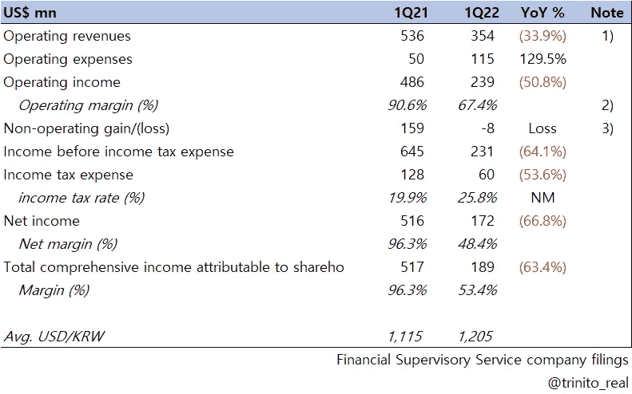
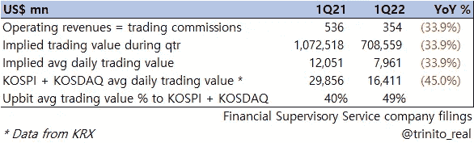

# 概览:看好 Q1 2022

> 原文：<https://medium.com/coinmonks/at-a-glance-upbit-q1-2022-18b1bd8b4717?source=collection_archive---------51----------------------->

[损益表要点]

继[我们之前的文章](https://trinito.medium.com/at-a-glance-upbit-q1-2022-293140213a0f)之后，以下是 Dunamu(Upbit)在 5 月 30 日披露的 2022 年第一季度季度报告中的损益表的一些要点:

[Dunamu (Upbit) Income Statement for 1Q22]

## 1)

假设 Dunamu 的大部分营业收入来自 Upbit 交易费(事实就是如此)，收入同比下降超过 30%。这表明，CEX 的收入与整体加密情绪和宏观环境高度相关。

Upbit 的大部分收入来自韩元市场，在这里，做市商和买家的交易佣金相同，都是 0.05%。如果我们假设没有大幅度的降费促销等。，下面可以推断:

[Total Value Traded Comparison with the Korean Stock Market]

>仅 Upbit 一家公司的加密交易价值就接近上季度韩国股市总额的一半[按日平均计算]

>>与去年同期相比，Upbit 的平均零售加密交易价值缩水幅度小于韩国股市的整体缩水幅度。考虑到以上是来自纯零售(非机构)的数字，这只能说明韩国零售加密干粉有多强。

## 2)

Dunamu 的 OPM (%)在 2011 年第一季度为 90.6%，而在 2012 年第一季度为 67.4%。

值得注意的是，2011 财年韩国上市公司的平均 OPM (%)为 8.1%。显然，这 8.1%包括了许多不同的行业，可能不是一个完美的比较。尽管如此，这只是表明了一个成功的平台业务是多么有利可图…

例如，三星电子(SEC)在 2012 年第一季度财报期间宣布，该公司共售出 7400 万部智能手机(831，461 部智能手机/天)。混合平均销售价格为 278 美元，创下上季度手机收入 205.72 亿美元的记录。三星目前的手机 OPM 通常在 5%左右。这相当于 20，572 百万美元* 5% = 10，290 百万美元(手机)运营成本，这仍然是一个巨大的数字，但想想他们在全球销售了多少手机，涉及多少人，等等。

Dunamu 仅在韩国从零售加密交易佣金中获得 1.7%的收入，占 SEC 手机运营收入的近 1/4。

## 3)

你会注意到，本季度 Dunamu 的非营业收入为负值。
这主要是由于第一季度数字资产净损失 1220 万美元，而上一季度为 8690 万美元。这是非现金损失(因此纯粹是与会计相关的损失),是由整体加密资产价格下跌造成的。

正如我们在以前的帖子中提到的，我们计划在未来几周内推出更多的韩国 CEX 号码，请保持关注！

## 链接

杜纳姆(Upbit)季报
【https://dart.fss.or.kr/dsaf001/main.do?rcpNo=20220530000847 

> 加入 Coinmonks [Telegram group](https://t.me/joinchat/Trz8jaxd6xEsBI4p) 学习加密交易和投资