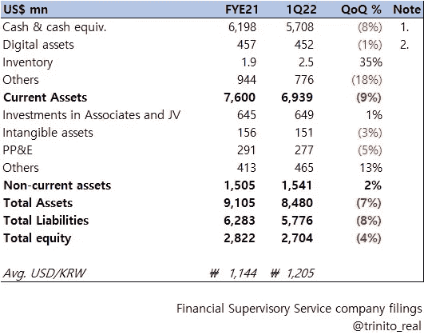
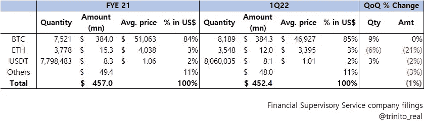

# 概览:看好 Q1 2022

> 原文：<https://medium.com/coinmonks/at-a-glance-upbit-q1-2022-293140213a0f?source=collection_archive---------22----------------------->

[资产负债表摘要]

韩国最大的加密货币交易所 Upbit 的运营商 Dunamu 于 5 月 30 日披露了 2022 年第一季度的季度报告。

以下是其资产负债表的一些亮点:

[Dunamu (Upbit) balance sheet for 1Q22.]

## 1.现金充裕

Dunamu (Upbit)的现金和现金等价物多于 LG 电子(截至 5 月 31 日，KOSPI 市值 139 亿美元，排名第 21 位)
值得注意的是，LG 电子截至 2011 财年和 2012 年第一季度的现金等价物分别为 52.9 亿美元和 46.64 亿美元&。

## 2.数字资产细分

Digital assets (Owned by Dunamu)

上表显示了截至 2011 财年和 2012 年第一季度，Dunamu 拥有的数字资产类型。
在卸载 230# ETH 时，Dunamu 的 BTC 财政部似乎增加了 QoQ(来自 BTC/巴黎的佣金)。
该公司的 USDT 数量增加肯定也来自 USDT 配对市场委员会。
他们大约有 85%的数字资产以 BTC 的形式存在。

我们将提供更多关于 Dunamu (Upbit)和其他 CEX 披露的信息，如果您想获得通知，请继续关注我们。

由 Trinito 联合创始人 Eric Yoo 撰写，Trinito 投资主管 SungPil Huh 供稿。

**链接**

杜纳姆(Upbit)季报
[https://dart.fss.or.kr/dsaf001/main.do?rcpNo=20220530000847](https://dart.fss.or.kr/dsaf001/main.do?rcpNo=20220530000847)

> 加入 Coinmonks [Telegram group](https://t.me/joinchat/Trz8jaxd6xEsBI4p) 学习加密交易和投资