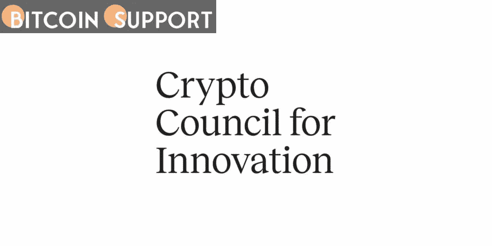

# 在创新加密委员会，双子座加入了比特币基地和布洛克

> 原文：<https://medium.com/coinmonks/at-the-crypto-council-for-innovation-gemini-joins-coinbase-and-block-b21634bfa2f6?source=collection_archive---------68----------------------->

**Visit our website:-** [**https://bitcoinsupports.com/**](https://bitcoinsupports.com/)

在 2021 年的第三和第四季度，crypto exchange 报告在美国的游说行动上花费了 12 万美元。创新加密委员会，或称 CCI，宣布双子星将被加入其加密友好公司名单，旨在协助立法者制定相关法规。

据首席执行官希拉·沃伦(Sheila Warren)称，CCI 周四宣布，自本周起，双子星已加入比特币基地、布洛克、富达数字资产、范式等公司，努力“帮助加快扩张和全球领导力”Gemini 的政策和监管关系负责人 Ji Kim 表示，该交易所将与立法者和当局合作，帮助加快加密货币在全球的接受程度。

CCI 由比特币基地和 Square(现为 Block)于 2021 年 4 月创立，其目标是让政府和监管机构参与关于加密货币好处的讨论。该组织于 2021 年 7 月组织了一场关于比特币(BTC)采用的虚拟活动 Word，演讲者包括特斯拉首席执行官埃隆·马斯克和 Twitter 首席执行官杰克·多西。沃伦曾担任世界经济论坛区块链和分布式账本技术的负责人，今年 2 月被任命为 CCI 的首席执行官。

https://Twitter . com/Sheila _ Warren/status/1496879015579193345

除了与 CCI 的活动之外，比特币基地已经成为美国推动国会加密友好立法的最大支出者之一。据报道，从 2020 年到 2021 年，该交易所的游说支出增加了 460%以上，从 23 万美元增加到近 130 万美元。

双子座在加入 CCI 之前，没有申报 2020 年在美国的任何游说支出。然而，根据从美国参议院获得的公开数据，该交易所宣布在 2021 年第三和第四季度与 Sternhell 集团签订了 12 万美元的合同。总部设在华盛顿的公共关系业务负责人是亚历克斯·斯特内尔，他是参议院银行委员会的前高级政策顾问。

**访问我们的网站:-**[**https://bitcoinsupports.com/**](https://bitcoinsupports.com/)

**免责声明:以上为作者观点，不应视为投资建议。读者应该自己做研究。**

> 加入 Coinmonks [电报频道](https://t.me/coincodecap)和 [Youtube 频道](https://www.youtube.com/c/coinmonks/videos)了解加密交易和投资

# 另外，阅读

*   [印度最佳 P2P 加密交易所](https://coincodecap.com/p2p-crypto-exchanges-in-india) | [柴犬钱包](https://coincodecap.com/baby-shiba-inu-wallets)
*   [8 大加密联盟项目](https://coincodecap.com/crypto-affiliate-programs) | [eToro vs 比特币基地](https://coincodecap.com/etoro-vs-coinbase)
*   [最佳以太坊钱包](https://coincodecap.com/best-ethereum-wallets) | [电报上的加密货币机器人](https://coincodecap.com/telegram-crypto-bots)
*   [交易杠杆代币的最佳交易所](https://coincodecap.com/leveraged-token-exchanges) | [购买 Floki](https://coincodecap.com/buy-floki-inu-token)
*   [3Commas 诉 Pionex 诉 crypto hopper](https://coincodecap.com/3commas-vs-pionex-vs-cryptohopper)|[Bingbon Review](https://coincodecap.com/bingbon-review)
*   [加密复制交易平台](/coinmonks/top-10-crypto-copy-trading-platforms-for-beginners-d0c37c7d698c) | [如何在 WazirX 上购买比特币](/coinmonks/buy-bitcoin-on-wazirx-2d12b7989af1)
*   [硬币评论](https://coincodecap.com/coinloan-review)|[Crypto.com 评论](/coinmonks/crypto-com-review-f143dca1f74c)
*   [如何在加拿大购买加密货币？](https://coincodecap.com/how-to-buy-cryptocurrency-in-canada)