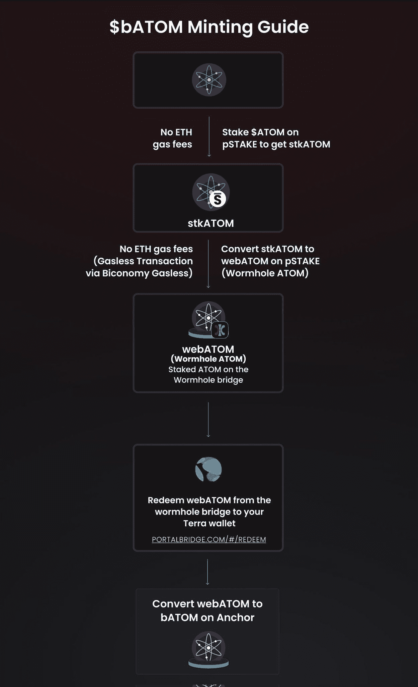

# 原子作为抵押品的$UST，一步一步的指导如何

> 原文：<https://medium.com/coinmonks/atom-as-collateral-for-ust-c777d5ad8163?source=collection_archive---------11----------------------->

执行提案 22 后，Anchor Protocol 刚刚将$ATOM 添加到他们的抵押品列表中，与$ETH、$LUNA 和$AVAX 并列！

## 那么，我可以进入锚协议并直接存入代币吗？

不幸的是没有。

就像提供$sAVAX 一样，用户必须将他们的代币投入[本齐金融](https://benqi.fi/)或者为了过渡到[锚协议](https://www.anchorprotocol.com/)。

查看以下主题，了解如何:

## 那么我该怎么做呢？

为了将$bATOM 作为抵押品，用户必须将$stkATOM(由[p take Finance](https://pstake.finance/)构建)打包到 Terra 生态系统中。

$bATOM 是 pSTAKE 的 ERC-20 $stkATOM 的包装版本，它运行在特拉区块链上。

## 什么是 pSTAKE Finance？

pSTAKE 是一种流动性押记协议，可以释放押记资产的流动性。PoS 代币的下注者现在可以下注他们的资产，同时保持这些资产的流动性。他们目前在 TVL 有 5100 万美元。

$51m in TVL on DeFiLama

## 让我们前往[p take Finance](https://pstake.finance/)，以下是步骤。

1.  在左侧菜单的“赌注”下存款并下注您的$ATOM。

当您使用以下任一方式发送 ATOM 时，将出现一个窗口来复制属性:

*   钱包
*   gaia CLI 方法
*   开普勒
*   分类帐

2.完成后，在“锚协议”选项卡下将您的$stkATOM 转换为$bATOM。

3.将弹出此窗口，确保等待绿色复选标记出现，然后单击下面的蓝色链接继续。

4.该链接将引导您进入虫洞加密门户页面，信息将被预先填充，然后单击“连接”和“恢复”

5.现在，前往“代币”选项卡，点击“连接”Terra Station，兑换您的$webATOM 代币。

6.将 webATOM 转换为$bATOM，并转到锚协议的“bASSETS”选项卡。

7.将$webATOM 转换为$bATOM，然后转到“借款”选项卡，为$UST 提供抵押品！

现在你可以享受你借来的美元 UST 进行更多的投资！但是我希望的不一样…

我希望 pSTAKE Finance 能够解决这个漫长的过程，把它缩短，变得简单，就像把$ATOM 换成$bATOM 一样。我预测我们会看到 Astroport 的出现并解决这个问题。

有点像 Trader Joe 允许将$AVAX 换成$sAVAX。

或者立即允许用户在 pSTAKE Finance 中投入他们的$ATOM

就像本齐金融公司一样。

然而，我很高兴也很兴奋看到更多令牌的实现，以进一步帮助锚协议的可持续性！

Minting guide by pSTAKE Finance

以下是该指南的线程版本:

> 加入 Coinmonks [电报频道](https://t.me/coincodecap)和 [Youtube 频道](https://www.youtube.com/c/coinmonks/videos)了解加密交易和投资

# 另外，阅读

*   [如何在 FTX 交易所交易期货](https://coincodecap.com/ftx-futures-trading) | [OKEx vs 币安](https://coincodecap.com/okex-vs-binance)
*   [CoinLoan 评论](https://coincodecap.com/coinloan-review) | [YouHodler 评论](/coinmonks/youhodler-4-easy-ways-to-make-money-98969b9689f2) | [BlockFi 评论](https://coincodecap.com/blockfi-review)
*   [XT.COM 评论](https://coincodecap.com/profittradingapp-for-binance)币安评论 |
*   [SmithBot 评论](https://coincodecap.com/smithbot-review) | [4 款最佳免费开源交易机器人](https://coincodecap.com/free-open-source-trading-bots)
*   [比特币基地僵尸程序](/coinmonks/coinbase-bots-ac6359e897f3) | [AscendEX 审查](/coinmonks/ascendex-review-53e829cf75fa) | [OKEx 交易僵尸程序](/coinmonks/okex-trading-bots-234920f61e60)