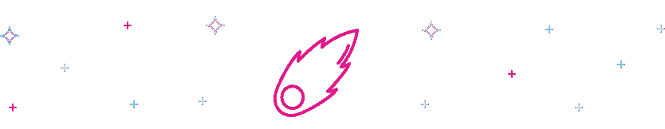
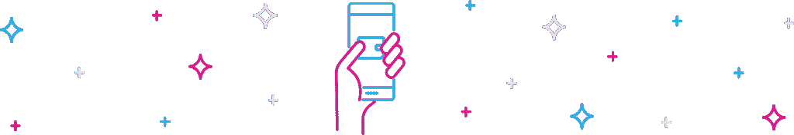

# 原子与原子:宇宙项目概述

> 原文：<https://medium.com/coinmonks/atom-by-atom-cosmos-project-overview-8b5f3d280bbc?source=collection_archive---------27----------------------->

宇宙创始团队将[宇宙生态系统](https://cosmos.network/)描述为“区块链的互联网”。Cosmos 的目标是开发一个由开源工具桥接的加密网络生态系统，从而简化它们之间的交易。

Cosmos (ATOM) token 的独特之处在于它的可定制性和互操作性。与其他优先考虑网络的加密项目不同，Cosmos 培育了一个网络生态系统。通过这种方式，信息、数据和令牌可以在没有中央权威机构控制的情况下以编程方式共享。

# 什么是宇宙？

Cosmos 的目标是成为连接区块链的桥梁，使区块链之间的通信、数据传输和交易变得容易。互操作性特性使各种区块链之间的互操作持续有效。Cosmos 认为，不同的区块链可以共存，并随着其特定的使用案例和优势一起发展。

Cosmos 技术不仅允许不同区块链之间的互操作性，而且使开发人员能够在几周或几个月内构建定制的区块链。在宇宙链上开发的一个新的区块链被称为一个区域，它然后被链接到宇宙中枢。宇宙中心管理每个区域的记录和条件。此外，它的本地令牌“ATOM”为宇宙中枢提供动力，这是一个[利害关系证明区块链](https://maxthake.medium.com/what-is-proof-of-stake-pos-479a04581f3a)。

# 宇宙背后的大脑

为了理解什么是宇宙，我们将看看这个项目的创造者。开发人员 Jae Kwon 和 Ethan Buchman 都创建了由链间基金会(ICF)支持的宇宙网络。ICF 是瑞士的一个非营利组织，主要资助开源区块链项目。他们在 2014 年帮助开发并发射了宇宙原子密码。

2019 年，Jae Kwon 和 Buchman 决定撰写宇宙 [**白皮书**](https://github.com/cosmos/cosmos/blob/master/WHITEPAPER.md#the-hub-and-zones) 并发布其软件。最初，ICF 在 2017 年推出了为期两周的 ATOM tokens 初始硬币发售(ICO)，筹集了约 1700 万美元的销售额。此外，2019 年，Tendermint Inc .通过 A 轮融资筹集了 900 万美元，用于继续该项目。

# 什么是宇宙(原子)？

ATOM 的唯一目标是宇宙中枢网络的安全和维护。您可以将 [ATOM 令牌](https://messari.io/asset/cosmos/profile/token-usage)视为支持所有区域之间互操作性的支柱(宇宙中心下的迷你区块链)。

随着更多的区块链在宇宙中心开发，ATOM 肯定会比大多数区块链更有价值。这些区块链将不得不依靠 Comos 中心来管理他们的交易历史和账户。

目前，ATOM 的供应没有限制。然而，新的原子标记是基于被标记的原子的体积而创建的。截至去年，这个原子制造系统导致了 7%到 20%的年通货膨胀率。

截至 2021 年 11 月 17 日，Cosmos 的定价为 28.38 美元，日交易量为 538，112，217 美元。目前，它在 [CoinMarketCap](https://coinmarketcap.com/currencies/cosmos/) 上排名第 32 位，实时市值为 6，374，819，597 美元。即使它没有最大供应量，宇宙的流通供应量是 224，710，002.54 原子币。

# 关键特征

*   **嫩薄荷。**

[Tendermint 核心](https://tendermint.com/)与[拜占庭容错(BFT)一致性引擎](https://en.wikipedia.org/wiki/Byzantine_fault)一起工作。BFT 具有 1 秒的块时间，理论上能够处理 10，000 TPS 的 250 字节事务。

*   **宇宙 SDK** 。

Cosmos SDK 是一个技术工具集，旨在简化在 Tendermint 上创建安全 dApps 的过程。开发者同意构建区块链应该被简化到所需的[编码不应该超过几个模块](https://blog.cosmos.network/why-application-specific-blockchains-make-sense-32f2073bfb37)的程度。

*   **区块链间通信协议(IBC)** 。

[区块链内部通信协议](https://ibcprotocol.org/) (IBC)与 Tendermint 配对，使各种链能够相互交换价值和数据。如果各种区块链框架运行相同的应用程序和验证器集，区块链一定会获得无限的理论可伸缩性。Cosmos 团队将这种实现描述为水平实现。

# 建立在宇宙之上

构建 Cosmos 只需三个简单的步骤。

**1。写你的定制区块链**

第一步是编写您的自定义区块链。开发人员通过混合预构建和定制的模块来实现这一点。

**2。推出你的全新区块链**

在启动你的公共主网之前，你可以和用户一起测试你的 MVP 来收集反馈，并重做必要的细节来改进。

**3。连接到其他宇宙区块链**

通过 IBC 将区块链与 Cosmos 网络连接起来，可以增加发达区块链的采用率和流动性。

# 宇宙(原子)钱包

需要一个钱包来存放您的 ATOM 令牌吗？烦恼也没有，这里有一些选项可供选择。这些是一些受欢迎的:

*   **原子钱包**

这是最受欢迎的[宇宙原子钱包](https://atomicwallet.io/cosmos-wallet)之一，在这里你可以安全地存放原子。这是一个多货币钱包，这意味着你可以存储 ATOM，BTC，ETH，LTC，BNB 和许多其他加密货币。

*   **Keplr 钱包**

这是另一个钱包,当你从任何一个宇宙交易所购买宇宙原子密码后，你可以把它存放在这里。请注意，这是一个基于网络的钱包，其形式与您的 MetaMask 相同。

*   **信任钱包**

另一个流行的宇宙原子钱包是[信任钱包](https://trustwallet.com/)，你可以在任何一个宇宙原子交易所购买宇宙硬币后进行转账。在这里你可以储存宇宙币、比特币、币安币、以太坊等。

# 如何交换宇宙(原子)？

宇宙令人印象深刻，你可能愿意尝试它是如何工作的，甚至建造一个自己的区块链。嗯，先弄点 ATOM 代币怎么样？你可以在 Swapzone 上轻松做到。以下是帮助你的指南:

1.  在网络浏览器上打开 [Swapzone](https://swapzone.io/) 。
2.  在 ***“选择对”*** 选项卡中，在 ***“发送”*** 部分插入您想要交换的加密类型。
3.  在***“get up to”***部分，输入您希望接收的 ATOM crypto 数量。
4.  在您输入详细信息后，Swapzone 将立即为您提供大量优惠。您可以根据最优惠的价格、最快的交易速度和最好的服务等级进行选择。
5.  如果您不确定某个交换，只需点击它，您将获得关于交换合作伙伴的更多信息，如利弊以及用户评论。
6.  一旦找到喜欢的优惠，只需点击它，点击 ***【兑换】*** 。
7.  完成后，系统会提示您输入接收 NU 的钱包地址和电子邮件地址(可选)。输入这些详细信息后，点击 ***【继续交易】*** 。
8.  收到您的存款后，交换合作伙伴会将您的存款转换为 ATOM。只需等待流程完成。这可能需要一些时间。
9.  一旦该过程结束，您将在您的钱包地址收到您的 ATOM 令牌。花点时间给交换伙伴打分，留下一个诚实的评价。

> 加入 Coinmonks [电报频道](https://t.me/coincodecap)和 [Youtube 频道](https://www.youtube.com/c/coinmonks/videos)了解加密交易和投资

# 另外，阅读

*   [印度加密交易所](/coinmonks/bitcoin-exchange-in-india-7f1fe79715c9) | [比特币储蓄账户](/coinmonks/bitcoin-savings-account-e65b13f92451)
*   [OKEx vs KuCoin](https://coincodecap.com/okex-kucoin) | [摄氏替代品](https://coincodecap.com/celsius-alternatives) | [如何购买 VeChain](https://coincodecap.com/buy-vechain)
*   [币安期货交易](https://coincodecap.com/binance-futures-trading)|[3 comas vs Mudrex vs eToro](https://coincodecap.com/mudrex-3commas-etoro)
*   [如何购买 Monero](https://coincodecap.com/buy-monero) | [IDEX 评论](https://coincodecap.com/idex-review) | [BitKan 交易机器人](https://coincodecap.com/bitkan-trading-bot)
*   [CoinDCX 评论](/coinmonks/coindcx-review-8444db3621a2) | [加密保证金交易交易所](https://coincodecap.com/crypto-margin-trading-exchanges)
*   [红狗赌场评论](https://coincodecap.com/red-dog-casino-review) | [Swyftx 评论](https://coincodecap.com/swyftx-review) | [CoinGate 评论](https://coincodecap.com/coingate-review)
*   [Bookmap 评论](https://coincodecap.com/bookmap-review-2021-best-trading-software) | [美国 5 大最佳加密交易所](https://coincodecap.com/crypto-exchange-usa)