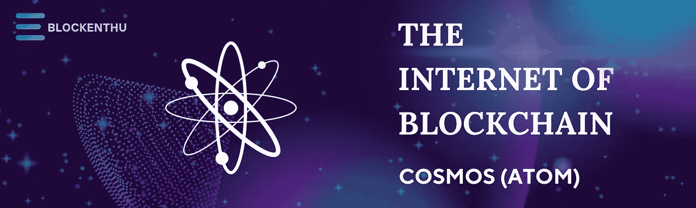
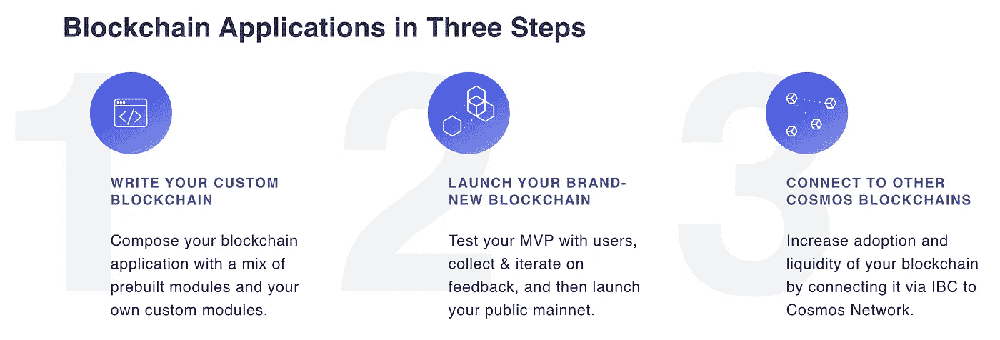
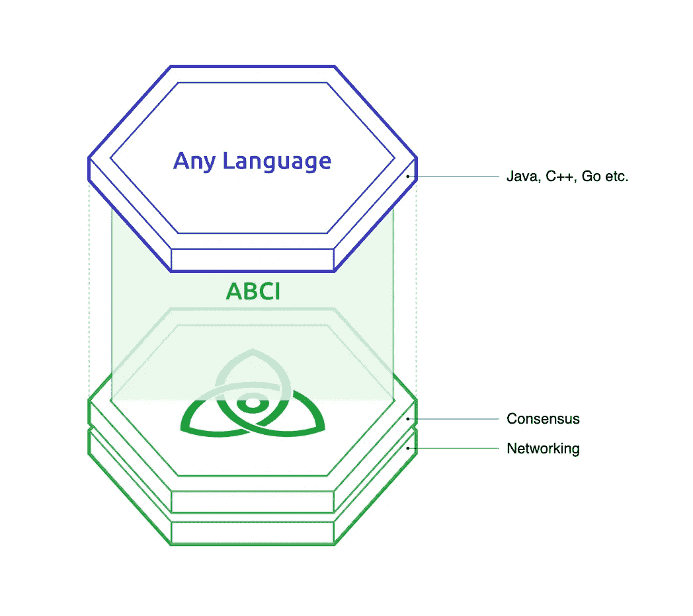
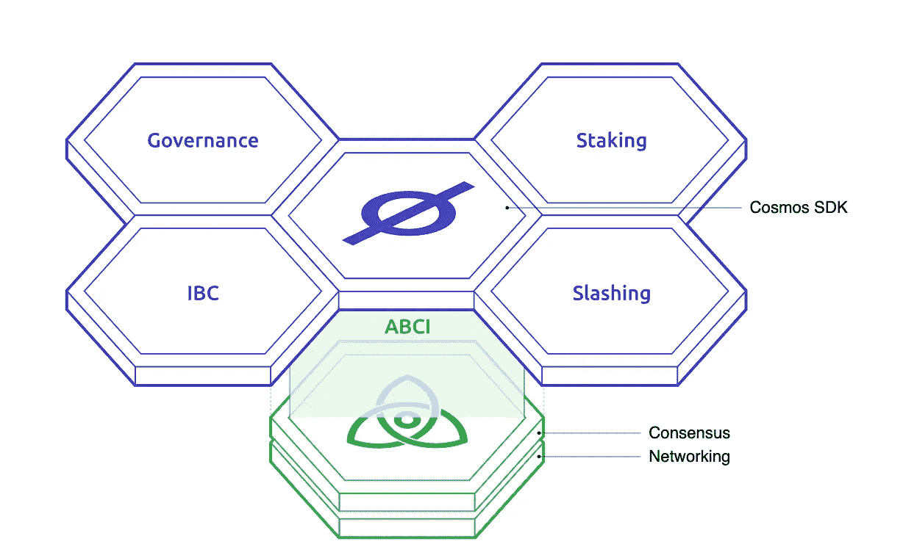
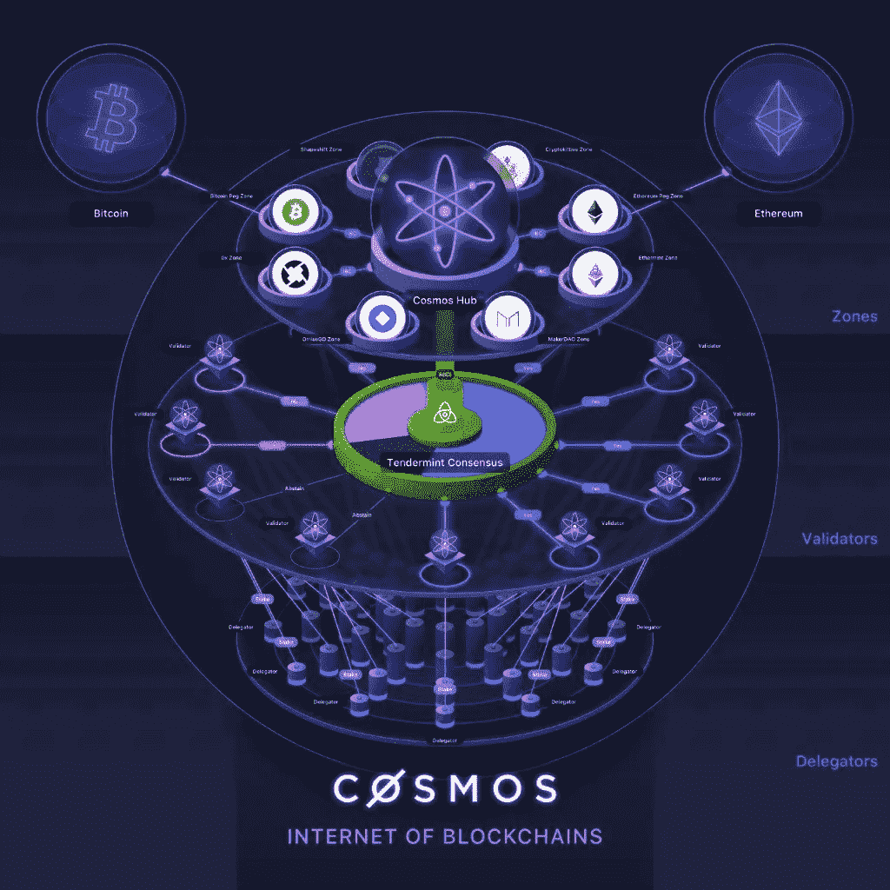

# 原子(宇宙):区块链的互联网。

> 原文：<https://medium.com/coinmonks/atom-cosmos-the-internet-of-blockchains-fd45422d97eb?source=collection_archive---------23----------------------->

## **宇宙是区块链的生态系统**

# 什么是宇宙？

Cosmos 是一个由独立的平行区块链组成的分散网络，每个都由 BFT 共识算法驱动，如 [Tendermint](https://v1.cosmos.network/intro#what-is-tendermint-core-and-the-abci) consensus。

换句话说，Cosmos 是区块链的一个生态系统，可以相互扩展和互操作。在宇宙出现之前，区块链是封闭的，不能互相交流。它们很难构建，每秒只能处理少量的事务。Cosmos 用一种新的技术眼光解决了这些问题。为了理解这一愿景，我们需要回到区块链技术的基础。

# 宇宙的愿景(区块链 3.0)

TCosmos 的愿景是让开发商更容易建立区块链，并通过允许他们相互交易来打破区块链之间的壁垒。最终目标是建立一个区块链互联网，一个能够以分散的方式相互交流的区块链网络。有了 Cosmos，区块链可以维护主权，快速处理交易，并与生态系统中的其他区块链通信，使其成为各种用例的最佳选择。

这一愿景是通过一系列开源工具实现的，如 Tendermint、Cosmos SDK 和 IBC，这些工具旨在让人们快速构建定制、安全、可扩展和可互操作的区块链应用程序。让我们仔细看看生态系统中一些最重要的工具以及宇宙网络的技术架构。请注意，Cosmos 是一个开源社区项目，最初由 Tendermint 团队构建。欢迎每个人构建额外的工具来丰富更大的开发者生态系统。

宇宙号正在解决区块链的三大局限

1.  可量测性

2.可用性

3.主权国家

# Cosmos SDK 和工具

> 什么是嫩薄荷 BFT 和 ABCI

## BTF 嫩薄荷

Tendermint BFT 是一个解决方案，它将区块链的*网络*和*共识*层打包到一个通用引擎中，允许开发人员专注于*应用*开发，而不是复杂的底层协议。

为什么 BTF 是最先进的区块链引擎？

1.  *公共或私有区块链就绪*

2.*高性能*

3.*瞬间终结*

4.*安全*

@ [Cosmos SDK](https://tutorials.cosmos.network/)

# IBC-区块链间通信协议

IBC 允许异构的区块链互相传输令牌和数据，这意味着具有不同应用程序和验证器集的区块链可以互操作。

IBC 利用 Tendermint consensus 的即时终结属性(尽管它可以与任何“快速终结”区块链引擎一起工作)来允许异构链相互传输值(即令牌)或数据。

## 什么是异构链？

分为两个部分:-

**不同的层:**异构链有不同的层，这意味着它们在实现*网络*、*共识*和*应用*部分的方式上可能有所不同。

主权**:每一个区块链都是由一组确认者维护的，他们的工作是同意下一个区块提交给区块链。在工作证明区块链中，这些验证器被称为挖掘器。**

****

# **IBC 是如何运作的**

**IBC 背后的原理相当简单。让我们举一个例子，链 A 上的一个帐户想要向链 b 发送 10 个令牌(让我们称之为 ATOM)。**

> ****跟踪****

**链 B 不断地接收链 A 的报头，反之亦然。这允许每个链跟踪另一个链的验证器集。本质上，每个链都运行另一个链的轻客户端。**

> ****粘合****

**当 IBC 转移开始时，原子被锁在 a 链上**

> ****验证继电器****

**然后，证明 10 个原子是键合的证据从链 A 传递到链 b。**

> ****验证****

**在链 B 上对照链 A 的报头验证该证明，如果该证明有效，则在链 B 上创建 10 个原子凭证**

**注意，已经在链 B 上创建的原子不是真正的原子，因为原子只存在于链 A 上。它们是来自链 A 的原子在 B 上的表示，以及这些原子冻结在链 A 上的证明。**

> **[IGNITE CLI](https://docs.ignite.com/) 让您在几分钟内建立一个链**

****

# **令牌组学**

**目前供应总量为 286，370，297 个原子。
总市值 2，784，369，100.75 美元，根据 ***硬币市值*** 价格为 9.78 美元。
*24 小时低/24 小时高
$9.15 / $10.02***

**Cosmos 使用利害关系证明共识算法。拥有大量 ATOM 令牌的验证节点更有可能被选择来验证交易并获得奖励。被发现行为不诚实的节点会受到惩罚——它们最终可能会失去它们所拥有的令牌。**

# ****编译 COSMOS****

1.  **Cosmos 使区块链功能强大，并且易于使用 Tendermint BFT 和 Cosmos SDK 的模块化进行开发。**
2.  **宇宙使区块链能够通过 IBC 和钉住区相互转移价值，同时让他们保留自己的主权。**
3.  **Cosmos 允许区块链应用程序通过水平和垂直可伸缩性解决方案扩展到数百万用户。**

> **加入我们的社区**

> **WHATSAPP**

** [## BLOCKENTHU

### WhatsApp 群邀请

chat.whatsapp.com](https://chat.whatsapp.com/FTKme4XzkOU73ZDv99Oatj) 

> 电报

 [## ⚡·布洛克登胡·⚡

### 可以马上查看并加入@blockenthu。

t.me](https://t.me/blockenthu) 

> INSTAGRAM

[https://www.instagram.com/blockenthu/](https://www.instagram.com/blockenthu/)

> 商务化人际关系网

 [## Blockenthu | LinkedIn

### LinkedIn 上有 564 名粉丝。“面向大众的 Web 3.0 福利”加密和区块链| BlockEnthu 是社区…

www.linkedin.com](https://www.linkedin.com/company/blockenthu/) 

印度最安全的加密交易所 [CoinDCX](https://medium.com/u/a30fa2b03c2f?source=post_page-----fd45422d97eb--------------------------------) 。

 [## CoinDCX -加密交易所|购买、出售和交易比特币和顶级替代币

### CoinDCX 是印度最大、最安全的加密货币交易所，在这里你可以买卖比特币和其他…

coindcx.com](https://coindcx.com/) 

#区块链# BLOCKENTHU # CRYPTO # coincxpath breaker # coincx # Atom #宇宙#生态系统#互联网#区块链

> 加入 Coinmonks [电报频道](https://t.me/coincodecap)和 [Youtube 频道](https://www.youtube.com/c/coinmonks/videos)了解加密交易和投资

# 另外，阅读

*   [BigONE 交易所评论](/coinmonks/bigone-exchange-review-64705d85a1d4) | [电网交易机器人](https://coincodecap.com/grid-trading)
*   [氹欞侊贸易评论](https://coincodecap.com/anny-trade-review) | [CoinSpot 评论](https://coincodecap.com/coinspot-review)
*   [新加坡十大最佳加密交易所](https://coincodecap.com/crypto-exchange-in-singapore) | [购买 AXS](https://coincodecap.com/buy-axs-token)
*   [投资印度的最佳加密软件](https://coincodecap.com/best-crypto-to-invest-in-india-in-2021) | [WazirX P2P](https://coincodecap.com/wazirx-p2p)
*   [西班牙 5 大最佳文案交易平台](https://coincodecap.com/copy-trading-spain)
*   [Pionex 双投](https://coincodecap.com/pionex-dual-investment) | [AdvCash 审核](https://coincodecap.com/advcash-review) | [支持审核](https://coincodecap.com/uphold-review)**