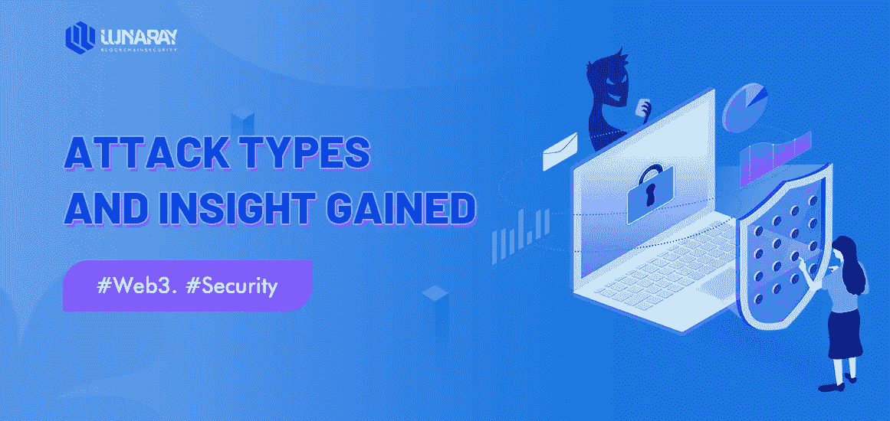
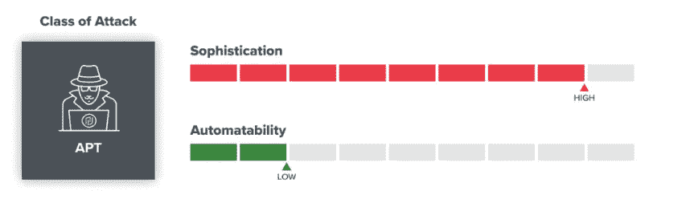
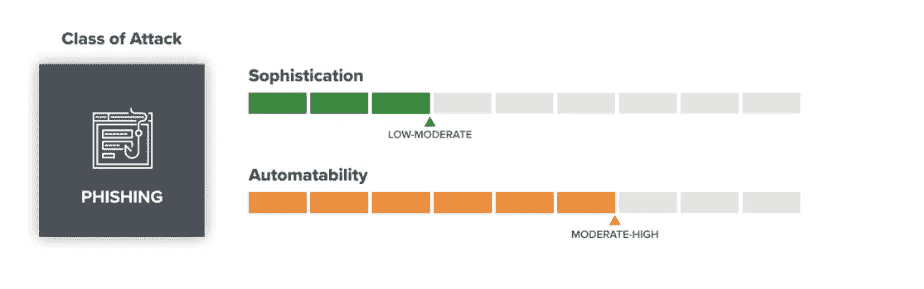
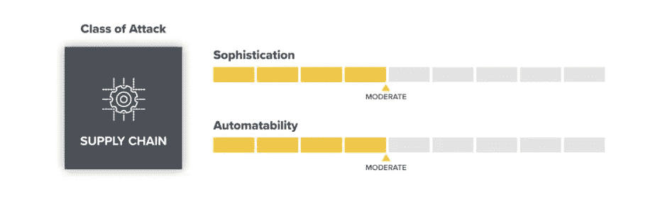
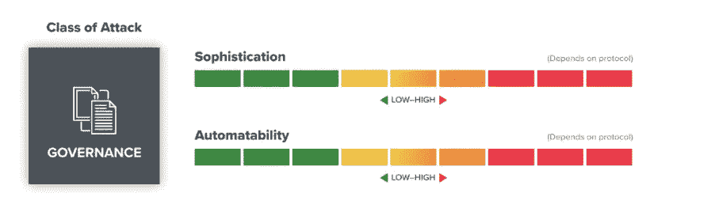
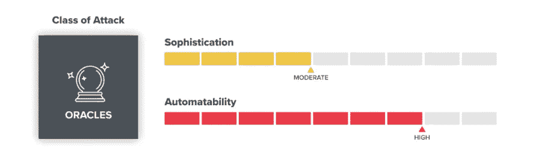
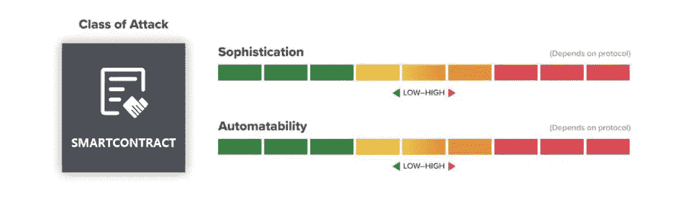
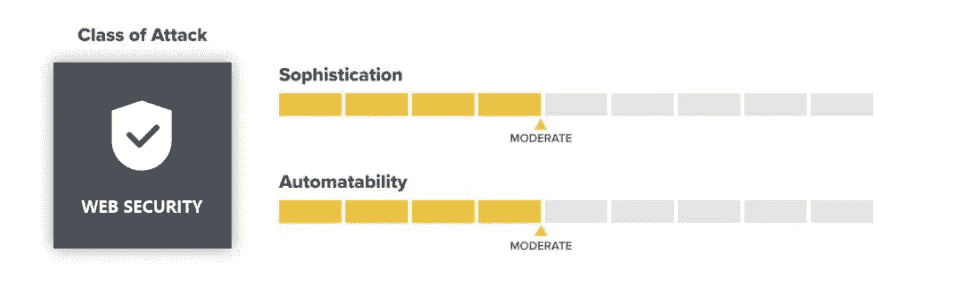

# 攻击类型和获得的洞察力

> 原文：<https://medium.com/coinmonks/attack-types-and-insight-gained-c9247c3b2d3b?source=collection_archive---------16----------------------->

Web3 的挑战取决于如何在安全层面创新，解决不同应用架构带来的新的安全挑战。但是最终性的相关特征——交易通常是不可逆的——使得这些软件控制的网络成为攻击者的诱人目标。事实上，随着区块链——作为 web3 基础的分布式计算机网络——及其伴随的技术和应用不断增值，它们越来越成为攻击者觊觎的目标。
对个人所有权和数据主权的追求也引发了各种安全问题(因为个人对安全知识理解和熟悉程度的差异)，但这些安全问题不应该成为 Web3 发展的障碍。

*   攻击者通常以投资回报最大化为目标。他们可以花费更多的时间和精力来攻击具有更多“总价值锁定”或 TVL 的协议，因为潜在的回报更大。
*   资源最丰富的黑客组织更经常攻击高价值的系统。最有价值的新型战功，更多的是针对这些珍贵的目标。
*   像网络钓鱼这样的低成本攻击永远不会消失，我们预计在可预见的未来它们会变得更加普遍。

**修补漏洞**

*   随着开发人员从屡试不爽的攻击中吸取教训，他们可能会将 web3 软件的状态提高到“默认安全”的程度通常，这包括收紧应用程序编程接口，或 API，以使人们更难错误地引入漏洞。
*   虽然安全性始终是一项进行中的工作——而且可以肯定的是，没有什么是防黑客的——防御者和开发人员可以通过消除攻击者的许多唾手可得的果实来提高攻击的成本。
*   随着安全实践的改进和工具的成熟，以下攻击的成功率可能会大幅下降:治理攻击、价格预测操纵和重入错误。(下面将详细介绍这些内容。)
*   **对攻击进行分类**
*   对不同系统的攻击可以根据它们共有的特征进行分类。定义特征包括完成攻击的复杂程度，攻击的自动化程度，以及可以采取哪些防范措施来抵御攻击。

下面是我们在最大的黑客攻击中反复看到的攻击类型的详尽列表，但它给出了许多正在发生的项目的指示。我们还包括了我们对当今威胁形势的观察，以及我们对未来 web3 安全性的预期。

# APT 操作:顶级掠食者

高级持续威胁(APT)是一种复杂、持续的网络攻击，在这种攻击中，入侵者在网络中建立了一个未被检测到的存在，以便长时间窃取敏感数据。

他们的动机和能力千差万别，但他们往往很有钱，而且如名字所示，很执着；不幸的是，它们可能会一直存在。不同的 apt 运行许多不同类型的操作，但是这些威胁参与者往往最有可能直接攻击公司的网络层来实现他们的目标。

apt 的例子包括**摧毁伊朗核计划的 Stuxnet 和 Hydraq** 。2010 年，美国和以色列网络部队攻击了伊朗核计划，以减缓该国浓缩铀的能力。Stuxnet 不同于之前出现的任何其他病毒或蠕虫。

示例:

*   Ronin 验证程序黑客

概要: **Who** :民族国家，资金雄厚的犯罪组织，以及其他高级有组织团体。例子包括浪人黑客(Lazarus，与朝鲜联系广泛)。

*   **复杂程度**:高(只对资源丰富的团体开放，通常在不会起诉的国家)。
*   自动化程度:低(仍然主要是手工操作，使用一些定制工具)
*   对未来的期望:只要 apt 能够将其活动货币化或实现各种政治目的，它们将继续活跃。

# 针对用户的网络钓鱼:社会工程师

网络钓鱼是一个众所周知且普遍存在的问题。网络钓鱼者试图通过各种渠道发送引诱消息来引诱他们的猎物，这些渠道包括即时消息、电子邮件、Twitter、电报、Discord 和黑客网站。如果您浏览您的垃圾邮件邮箱，您可能会看到数百次试图欺骗您透露信息，如密码，或窃取您的钱。

现在，web3 允许人们直接交易代币或 NFT 等资产，几乎立即结束，钓鱼活动针对用户。对于那些没有多少知识或技术专长的人来说，这些攻击是通过窃取加密货币来赚钱的最简单的方法。即便如此，它们仍然是让有组织的团体追求高价值目标的一种有价值的方式，或者对于高级团体来说，通过网站收购等方式发起广泛的资金密集型攻击。

**例题**

*   [OpenSea](https://twitter.com/opensea/status/1495625768713469954) 直接针对用户的网络钓鱼活动
*   [BadgerDAO](https://badger.com/technical-post-mortem) 最终构成应用程序的网络钓鱼攻击

**总结**

*   谁:从脚本小子到有组织的团体的任何人。
*   **复杂性**:低度-中度(攻击可以是低质量的“喷雾-祈祷”或[高度针对性](https://www.virusbulletin.com/conference/vb2019/abstracts/discretion-apt-recent-apt-attack-crypto-exchange-employees/)，这取决于攻击者投入的精力)。
*   **自动化程度**:中高(大部分工作可以自动化)。
*   **对未来的期望**:网络钓鱼的成本很低，而且网络钓鱼者往往会适应并绕过最新的防御措施，因此我们预计这些攻击的发生率会上升。可以通过增加教育和意识、更好的过滤、改进的警告标语和更强的钱包控制来提高用户防御能力。

# 供应链脆弱性:最薄弱的环节

供应链攻击是软件开发商和供应商面临的新威胁。目标是通过感染合法的应用分发恶意软件来访问源代码、构建流程或更新机制。第三方软件库的引入也会引入很大的攻击面。比如第三方软件库本身的问题，项目本身对第三方软件库的适应性等。，可能会导致当前项目出现重大安全隐患。

**例题**

*   [虫洞](https://twitter.com/wormholecrypto/status/1489001949881978883)桥梁破解
*   [多链](/multichainorg/multichain-contract-vulnerability-post-mortem-d37bfab237c8)漏洞泄露黑客

**简介**

*   **谁**:apt、独唱演员、圈内人等有组织的群体。
*   **复杂度**:中等(需要技术诀窍和一些时间)。
*   可自动化性:中等(可以自动扫描发现有故障的软件组件；但当发现新的漏洞时，需要手动构建漏洞利用)。
*   **对未来的期望**:随着软件系统的相互依赖性和复杂性的增加，供应链的脆弱性可能会增加。在为 web3 安全开发出好的、标准化的漏洞披露方法之前，机会性黑客攻击也可能会增加。

# 治理攻击:选举窃取者

治理攻击主要针对 DAO 项目组织。由于可以根据代币持有者获得的票数来决定一个提案，当攻击者获得足够的票数(攻击者可以通过闪贷获得的票数或者通过代币交换等方式获得的票数。)，可以引入恶意提案并实施恶意资金转移等。目前 web3 中的许多项目都包含一个治理方面，令牌持有者可以对改变网络的提议进行提议和投票。当引入恶意提案时，必然会影响项目的稳定性。

例子

*   [豆茎](https://twitter.com/BeanstalkFarms/status/1516255511565398016?s=20&t=ibkWf6Q7K7KSIqCp9238yQ)资金虹吸

**总结**

*   **谁**:从有组织的团体(apt)到独唱演员的任何人。
*   **复杂度**:低至高，取决于协议。(许多项目都有活跃的论坛，Twitter 和 Discord 上的社区，以及可以轻松暴露更多业余尝试的委托仪表盘。)
*   **自动能力**:从低到高，取决于协议。
*   **对未来的期望**:这些攻击高度依赖于治理工具和标准，尤其是当它们与监控和提案制定过程相关时。

# 甲骨文攻击定价:市场操纵者

oracle 是一种将数据从区块链外部传输到区块链的机制。许多 web3 项目依赖于“Oracle”——提供实时数据的系统，这是一个无法在链上找到的信息源。例如，oracles 通常用于确定两种资产之间的交换定价。当攻击者控制了价格甲骨文的值，就可以通过闪贷交易获得大量资金，直接影响项目的稳定性。

*   例子
*   [忌](https://twitter.com/CreamdotFinance/status/1453455806075006976)操纵市场

**总结**

*   **谁**:有组织的团体(apt)，独唱演员，圈内人。
*   **复杂度**:中等(需要技术知识)。
*   自动化程度:高(大多数攻击可能涉及自动检测可利用的问题)。
*   **对未来的预期**:随着精确定价方法变得更加标准，预期可能会降低。

**智能合约攻击**

智能合同是一种计算机协议，旨在通知、验证或执行合同。智能合同允许没有第三方的可信交易，这些交易是可追踪的和不可逆的。

从之前的 DeFi，NFT，GameFi 到现在的 Web3。在区块链的大部分项目中，智能合约占据了重要的部分，其安全性也是不言而喻的。有了闪贷的加持，哪怕是最小的智能合同漏洞，都可能影响到整个项目的资金。这几年合同攻击很多，损失巨大。

**举例:冰棒攻击**

## 网络安全

网络环境下的互联网应用越来越广泛。在企业信息化过程中，各种应用都是建立在 Web 平台上的。Web 业务的快速发展也引起了黑客的强烈关注。新兴的安全威胁。例如，去年 12 月 **log4j 漏洞**影响了广泛的网络服务器软件。攻击者将扫描互联网上的已知漏洞，以找到他们可以利用的未打补丁的问题。

## “零日”攻击

“零日”漏洞利用——之所以这样命名，是因为它们在出现时已经被公众所知为零日——是信息安全领域的一个热点问题，在 web3 安全中也是如此。因为它们突如其来，所以是最难防御的攻击。

如果说有什么不同的话，web3 使这些昂贵的劳动密集型攻击变得更容易赚钱，因为一旦加密资金被盗，人们很难追回。攻击者可以花大量时间钻研运行链上应用程序的代码，以找到一个 bug 来证明他们所有的努力是正确的。与此同时，一些曾经新奇的漏洞继续困扰着不知情的项目；因[击败早期以太坊冒险](/@MyPaoG/explaining-the-dao-exploit-for-beginners-in-solidity-80ee84f0d470)[而闻名的重新进入错误今天继续在其他地方重新浮现](https://www.coindesk.com/tech/2022/04/01/ola-finance-says-attackers-stole-47m-in-re-entrancy-exploit/)。

目前还不清楚该行业能够多快或多容易地适应这些类型的漏洞，但在审计、监控和工具等安全防御方面的持续投资将增加寻求利用它们的攻击者的成本。

例子

*   [保利](/poly-network/the-root-cause-of-poly-network-being-hacked-e30cf27468f0)的跨链交易漏洞
*   [量子位](https://twitter.com/QubitFin/status/1486870238591594497)的无限铸造 bug

## **总结**

*   **谁**:有组织的团体(apt)、独唱演员(可能性较小)、圈内人。
*   **复杂程度**:中高(需要技术知识，但并不是所有的漏洞都复杂到让人无法理解)。
*   **自动化能力**:低(发现新颖的漏洞需要时间和精力，不太可能自动化；一旦发现，跨其他系统扫描类似问题就更容易了)。
*   **对未来的期望**:更多的关注会吸引更多的白厅官员，并提高发现新漏洞的“门槛”。与此同时，随着 web3 采用率的增长，黑帽寻找新漏洞的动机也在增长。这很可能仍然是一场猫捉老鼠的游戏，就像在许多其他安全领域一样。

ref:[https://a16z . com/2022/04/23/web 3-security-crypto-hack-attack-lessons/](https://a16z.com/2022/04/23/web3-security-crypto-hack-attack-lessons/)

> 加入 Coinmonks [电报频道](https://t.me/coincodecap)和 [Youtube 频道](https://www.youtube.com/c/coinmonks/videos)了解加密交易和投资

# 另外，阅读

*   [币安 vs FTX](https://coincodecap.com/binance-vs-ftx) | [最佳(SOL)索拉纳钱包](https://coincodecap.com/solana-wallets)
*   [比诺莫评论](https://coincodecap.com/binomo-review) | [斯多葛派 vs 3Commas vs TradeSanta](https://coincodecap.com/stoic-vs-3commas-vs-tradesanta)
*   [Capital.com 评论](https://coincodecap.com/capital-com-review) | [香港的加密借贷平台](https://coincodecap.com/crypto-lending-hong-kong)
*   [如何在 Uniswap 上交换加密？](https://coincodecap.com/swap-crypto-on-uniswap) | [A-Ads 评论](https://coincodecap.com/a-ads-review)
*   [WazirX vs CoinDCX vs bit bns](/coinmonks/wazirx-vs-coindcx-vs-bitbns-149f4f19a2f1)|[block fi vs coin loan vs Nexo](/coinmonks/blockfi-vs-coinloan-vs-nexo-cb624635230d)
*   [本地比特币审核](/coinmonks/localbitcoins-review-6cc001c6ed56) | [加密货币储蓄账户](https://coincodecap.com/cryptocurrency-savings-accounts)