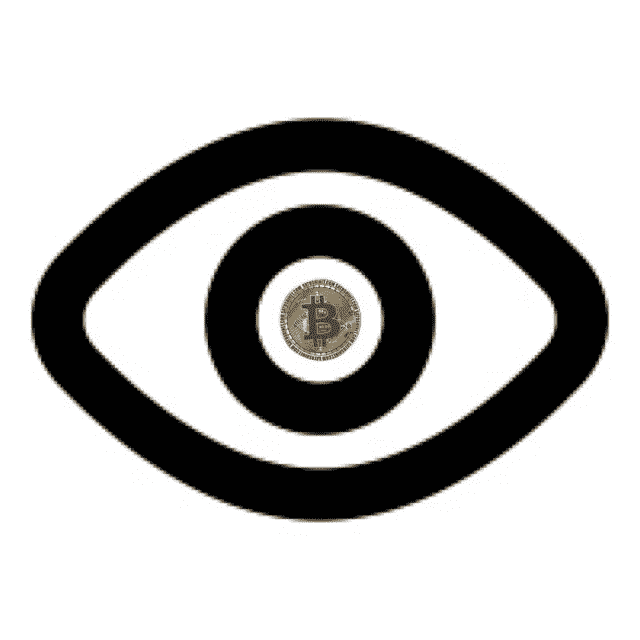

# 非造币者请注意；现在你的机会来了

> 原文：<https://medium.com/coinmonks/attention-no-coiners-nows-your-chance-c3fdba052f5e?source=collection_archive---------30----------------------->

承认吧，尽管你不是一个创造者，但你已经追随加密市场有一段时间了。你已经读过无数关于人们通过向 crypto 分配少量资本而致富的故事，但你仍然对此持怀疑态度。你见证了比特币的崛起，以及它是如何成为所有资产之母的，然后你也看到以太坊登上了月球。你很生气你错过了机会，不是一次，而是两次。现在你正在观看索拉纳，月球和雪崩起飞。你想知道你是否又一次错过了机会。也许你不适合太空旅行。据你所知，你的火箭会在发射台上爆炸。

你害怕了。你应该害怕。

你意识到你陷入了这种可怕的骑墙观望的循环中。你是个观察者。是你诚实承认的时候了。对自己说，“我是一个观察者。”你的一些朋友采取了行动。他们试图让你买密码，但你说，“这不是给我的。”你不知道为什么不适合你，但这就是你继续告诉自己的。“不是给我的。”

或者是？

如果你曾经想离开围栏，从“观察者”变成“创造者”，也许现在就是你的机会。为什么是现在？嗯，因为你是一个观察者，你已经看到 cryptos 下降了很多。我是说，很多很多。

大多数加密货币都比高点低了 50%以上。

到目前为止，你已经注意到比特币左右着加密市场的兴衰。你知道这是真的。许多非观察者不知道加密市场如此依赖比特币的价格波动。所以当它上涨时，所有好的密码都会上涨。当它倒下时，所有的密码都倒下了，所有的-好的，坏的和丑陋的。“好的”cryptos 将是已经存在三年以上的大型市值项目。“坏的”将是更新、更小但有前景的项目，“丑陋的”将是“狗屎硬币”，或者如果你想委婉一点，称它们为“迷因硬币”，但只要快速看一下它们最近下跌了多少。有些价格比高点低了 80-90%，“哦，这就是为什么他们称之为屎币。”

就在几个月前，比特币的价格接近每枚 7 万美元。现在大约是这个价格的一半，确切地说是 38000 美元。

你会尝试等待更便宜的价格吗？这不是你第一次看到廉价加密突然逆转，再次起飞。哦，你在等待“加密冬天”的到来，然后也许你会购买。我明白了…没错，你是个观望者，我差点忘了…你认为如果价格比现在更低，你肯定会买。祝你好运，你可能会看到比特币涨到 10 万澳元，以太坊涨到 2 万澳元

我有一个主意给你，这个主意在加密和股票方面一次又一次地为我所用。DCA。

美元平均成本。

你已经看到 crypto 今年绝对受到重创，一些优质项目比 2021 年 11 月的峰值便宜 65%以上。如果价格下跌更多，为什么不现在买一些 DCA 呢？简单。现在不要用光你所有的现金。市场动荡不安，一场血腥的战争正在进行。通货膨胀失控，利率会上升。但市场知道这一切即将到来，这就是他们抛售的原因。

底部可能就在附近。“加密冬天”可能只是一个将散户投资者拒之门外、让你“观望”的时髦词。

“在别人恐惧的时候贪婪。”

恐惧现在牢牢地控制着市场。也许你可以利用这种恐惧，成为今天的“创造者”。想象一下，你将最终以低廉的价格拥有密码。然而，既然你已经看了这么多年，你知道会发生什么。如果你的投资组合在短短几天内亏损了-30%，不要惊慌失措地抛售。只有 DCA。重复一遍。HODL。也许你会很幸运，crypto 会便宜一段时间。因为经验丰富的加密爱好者最不希望看到的就是价格再次飙升，而又无法填满我们的袋子。

祝你好运，做你自己的研究。我不是金融顾问，但请继续关注我的下一篇文章，在那里我将揭示我对当前市场的最佳选择。当然，既然你是无币者，你已经知道应该先买比特币和以太坊。然后是索拉纳，月神和雪崩。但是你已经知道了。

> *加入 Coinmonks* [*电报频道*](https://t.me/coincodecap) *和* [*Youtube 频道*](https://www.youtube.com/c/coinmonks/videos) *了解加密交易和投资*

# 另外，阅读

*   [3 商业评论](/coinmonks/3commas-review-an-excellent-crypto-trading-bot-2020-1313a58bec92) | [Pionex 评论](https://coincodecap.com/pionex-review-exchange-with-crypto-trading-bot) | [Coinrule 评论](/coinmonks/coinrule-review-2021-a-beginner-friendly-crypto-trading-bot-daf0504848ba)
*   [莱杰 vs n 格拉夫](/coinmonks/ledger-vs-ngrave-zero-7e40f0c1d694) | [莱杰纳诺 s vs x](/coinmonks/ledger-nano-s-vs-x-battery-hardware-price-storage-59a6663fe3b0) | [币安评论](/coinmonks/binance-review-ee10d3bf3b6e)
*   [Bybit 交易所评论](/coinmonks/bybit-exchange-review-dbd570019b71) | [Bityard 评论](https://coincodecap.com/bityard-reivew) | [Jet-Bot 评论](https://coincodecap.com/jet-bot-review)
*   [3 commas vs crypto hopper](/coinmonks/3commas-vs-pionex-vs-cryptohopper-best-crypto-bot-6a98d2baa203)|[赚取加密利息](/coinmonks/earn-crypto-interest-b10b810fdda3)
*   最好的比特币[硬件钱包](/coinmonks/hardware-wallets-dfa1211730c6) | [BitBox02 回顾](/coinmonks/bitbox02-review-your-swiss-bitcoin-hardware-wallet-c36c88fff29)
*   [block fi vs Celsius](/coinmonks/blockfi-vs-celsius-vs-hodlnaut-8a1cc8c26630)|[Hodlnaut 审核](/coinmonks/hodlnaut-review-best-way-to-hodl-is-to-earn-interest-on-your-bitcoin-6658a8c19edf) | [KuCoin 审核](https://coincodecap.com/kucoin-review)
*   [Bitsgap 审查](/coinmonks/bitsgap-review-a-crypto-trading-bot-that-makes-easy-money-a5d88a336df2) | [Quadency 审查](/coinmonks/quadency-review-a-crypto-trading-automation-platform-3068eaa374e1) | [Bitbns 审查](/coinmonks/bitbns-review-38256a07e161)