# Aurory 项目:玩|抓|赚

> 原文：<https://medium.com/coinmonks/aurory-project-play-catch-earn-53dc3dff512b?source=collection_archive---------7----------------------->

## Solana 区块链上的一个游戏平台

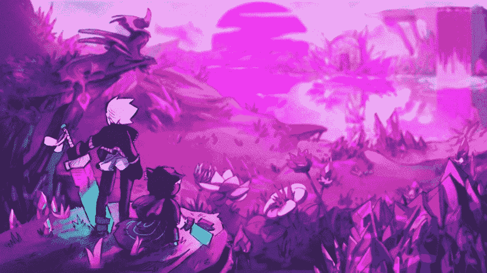

Aurory Project

一想到可以边玩游戏边赚钱，真是令人瞠目结舌。**玩、抓、赚**。太神奇了！在过去的几个月里，全球范围内的**即玩即赚**概念的数量大幅增加，这在很大程度上得益于一些早期**即玩即赚**游戏的流行，比如 Axie Infinity。Aurory 项目就是其中之一。让我们来谈谈 **Solana** 区块链上的这个**玩赚**游戏平台！

# 什么是 Aurory？

Aurory 是一款基于区块链的大型多人在线角色扮演游戏。这是一款基于**索拉纳**的**免费游戏** & **赚取游戏**角色扮演游戏，欢迎玩家探索一个大而多样的环境。它也是**生态系统的一部分。**

**Aurory 是第一个展示精美演示的区块链游戏，在这个演示中，一个角色可以漫游世界。**

**Aurory 主要是一款冒险游戏，设定在**‘Antik’**的世界中，玩家必须寻找**‘Nefties’**，这是一种极其丰富多彩、怪异而强大的土著生物。**

**这款游戏需要赚取财富和奖励，这些财富和奖励通过游戏本身的代币“Aury”汇出。**

**该游戏的灵感来自英雄联盟，神奇宝贝，万智牌和其他游戏。它将提供令人愉快的游戏以及大量的战略自由。**

# **Aurory 项目**

**Aurory Project 是一家**区块链游戏工作室**，也是索拉纳生态系统中最早采用基于区块链的激励式游戏的公司之一。**

**Aurory 通过创造创新和吸引人的**游戏玩法**建立了游戏挣钱的标准，同时也培养了虚拟的游戏经济。**

**该公司的目标是鼓励全球接受加密货币。这是通过激励性的游戏方式将游戏玩家引入区块链，降低 web3 游戏的准入门槛，并努力弥合 web2 和玩即赚游戏之间的差距来实现的。**

**Aurory Gameplay Teaser**

# **背景**

**Aurory 由创意和艺术总监 Yann Penno 联合创立，他作为 2D/3D 动画制作人和艺术/创意总监在独立游戏行业拥有超过 14 年的工作经验。保罗·巴迪略，营销运营&加密爱好者，自 2021 年最后一个季度成立以来见证了巨大的增长，截至本文发布之日，Discord 上的会员人数已超过 37，000 人，Twitter 上的粉丝人数为 184，000 人，Medium 上的粉丝人数为 95000 人，Instagram 上的粉丝人数超过 10，000 人。**

**Aurory 团队由艺术总监 Yann Penno、首席技术官、技术设计师、前端负责人、区块链工程师、游戏程序员、UX 设计师、3D 艺术家和其他重要的团队成员组成。**

# **Aurory 如何工作**

**玩家将穿越**安提克**和**托坎内**的世界，完成任务，发现失落的遗迹，击败敌人，并使用被称为**“邪恶”**的生物与其他玩家竞争。这些魔法生物可以孵化、进化、交易、用于战斗，并被设计成[不可替代的代币(NFTs)](/coinmonks/what-are-nfts-non-fungible-tokens-explained-f3a3d8d18ed7) 。他们将伴随玩家在这个 JRPG 中通过各种沉浸式游戏模式开始他们的冒险。**

**Aurory 使用与 Axie Infinity 相同的**即玩即赚**游戏机制。玩家可以通过玩游戏获得**代币(＄AURY)**和[**NFTs**](/coinmonks/what-are-nfts-non-fungible-tokens-explained-f3a3d8d18ed7)**，这些代币稍后可以用于在市场中购买物品，并提高他们在游戏中的成功几率。****

# ****黄色游戏****

****玩家在 **Aurory** 宇宙中的主要目标是漫游世界寻找新的**利益**并利用他们的**钱包**抓住他们。通过这样做，玩家可以组建最大的 Nefties 团队，让他们为任何可能发生的情况做好准备，并为他们制定最佳策略。****

****在宇宙中，每个物种都有自己的一套技能和品质。在战斗中，邪恶可以承担多种功能，包括防御、破坏、破坏、支援和操纵。《弱点》中的角色分配方法完全由玩家决定；他们可以改变他们的团队以获得最大的结果。****

********

****Aurory Gameplay Snapshot****

# ****邪恶****

******恶魔**是**安提克**世界的原始居民，这个世界充满了遗迹和收藏品。邪恶势力拥有多种多样的能力，从强大的攻击到保护自己或盟友的基本防御技能。****

****安蒂克是各种**邪恶势力**的大本营，每一个都有自己独特的技能和弱点。建立一个伟大的团队，并在战斗和比赛中战略性地使用他们，需要玩家了解他们的个人能力，并在不同的组合中试验他们。****

****因为**利益**在游戏中也是 [**非利益**](/coinmonks/what-are-nfts-non-fungible-tokens-explained-f3a3d8d18ed7) ，它们可能会在**血清指数**或者其他[分散交易所](https://blog.cryptostars.is/what-are-decentralized-exchanges-how-do-dexs-work-4e54fd477e0e)进行交易。****

****Aurory 是一个分成两个平行平面的世界。****

# ****安提克****

******安提克**是**利益**居住的世界。安提克是一个充满神秘事物和神秘生物的世界，被称为**邪恶**。安蒂克处于导致金融危机的大亨们的统治之下。****

# ****托坎内****

****托坎内是一个神奇的世界，充满了被称为“邪恶”的独特生物。安提克的力量已经发现了托坎的存在，并且创造了一个连接两个世界的传送门。安提克的居民正在渗入托坎内，逃离他们的主人，腐蚀邪恶势力，贪婪地攫取他们的权利。而它们的主人也不甘落后…****

****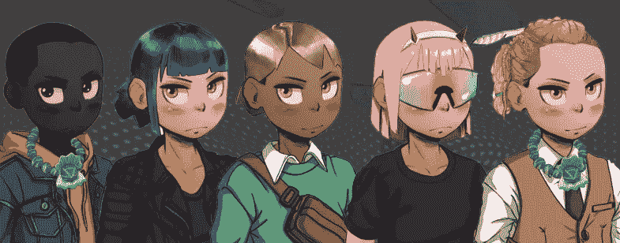****

****Aurory Game Characters****

# ****奥里的土地所有权****

****玩家也可以用他们的金色令牌在 **Antik** 上购买土地。拥有土地将使玩家有资格重生它或者用它传送到安提克的其他偏远地区。****

****拥有土地，玩家也可以获得探索出现在土地上的“地牢”的能力。其他玩家也可以付费探索这些地下城。土地所有者也有权获得其他玩家为探索这些地下城支付的费用的一部分。****

****安蒂奇上的土地有不同的种类。这些类别被分为“普通”、“高级”、“稀有”和“传奇”。每个类别决定了一个地在其上建造地牢的倾向，以及它将产生的奖励类型。****

# ****游戏英雄****

****玩家将跟随山姆和太阳神的冒险。玩家将控制这两个英雄，因为他们会招募**敌人**加入他们的事业，并与操控者和控制者战斗。****

****赫利俄斯(HELIOS)——出生于托坎内，他拥有许多其他恶魔所拥有的魔力。他可能不是最强壮的，但是他非常聪明和敏捷。他可以攀爬，用他锋利的爪子切割树木和其他有机结构。此外，他可以在任何时候传送回山姆，使他成为解决一些谜题的关键人物。****

******山姆**——出生在安提克，身为人类，他的身体比赫利俄斯强壮。他能挥舞大型武器，使用各种工具，基本上干所有的重活。然而，他不能像赫利俄斯一样使用魔法或者传送。****

# ****Aurory 中的玩家模式****

****Aurory 有两种模式可以玩——**玩家对环境**(单人)和**玩家对玩家**(多人)****

## ****玩家与环境模式(PvE)****

****Aurory 的 PvE 是**单人**模式。它让玩家免费获得他们的第一个 Nefty 和 Guardian，并探索 Antik 世界是如何工作的。****

****在单人游戏部分，玩家可以同时扮演**山姆**和**太阳神**。山姆很强壮，能够携带大型武器，而赫利俄斯可以使用魔法，爬树和传送。****

****这种模式允许玩家在玩 PvP 模式之前熟悉游戏，探索它的许多地点并获得信心。****

****关于游戏的 PvE 的另一个伟大的事情是它总是在进化，这意味着玩家可以期待来自开发者的新产品。****

****新的利益、守护者、情节冒险、角色和任务将逐渐出现在 PvE 模式中，给玩家带来持续而刺激的体验。****

## ****玩家对玩家(PvP)****

****PvP 在这个玩法中是一个**多人模式**。一旦玩家组建了他们理想的 Nefties 团队，他们现在就可以与全球各地的其他团队竞争。****

****他们可以参加任何选择的战斗，包括排名赛，友谊赛和游戏模式。训练者也可以参与“特殊模式”，这将由 Aurory 的团队很快公布。****

****战斗从有一个“草案系统”开始，帮助玩家预测敌人的战略，以形成有效的反击。****

****玩家获胜的机会也可以通过改变他们邪恶的顺序来增加，这将给他们一个理想的攻击顺序。****

# ****黄金市场****

****市场允许玩家交换游戏资产和各种商品，如糖果、鸡蛋、金色门票、化妆品等等。玩家将可以用他们辛苦赚来的 **$AURY** 来增强他们的能力，获得更好的物品，收集高价值的**NFT**。****

****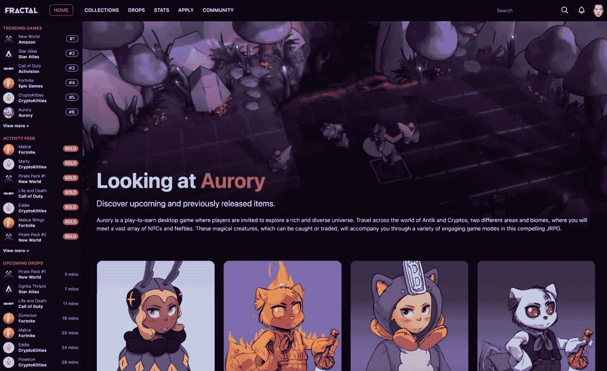****

****Aurory Marketplace****

# ******傲罗人******

****2021 年 8 月 31 日， **10，000 个**生成型 **NFT 头像**在项目早期被铸造在索拉纳区块链上。这些 NFT 中的每一个都被称为**傲罗人**，由随机特征组成，使每个化身都独一无二。****

****这些化身有多种用途，它们通过 3d 皮肤充当玩家的视觉身份。拥有这些早期化身意味着玩家将被视为游戏的早期支持者，这一事实将被认证为认证徽章，以及其他好处，如早期进入未来的游戏模式。****

****拥有这些早期的化身也将使玩家有资格获得频繁的 NFT 掉落，并授予他们在游戏开发过程中的决策权。****

****持有金色 NFT 的人可以在游戏中将其作为角色的视觉标识。他们也将能够在不同的游戏模式公之于众之前提前接触到它们。****

# ******傲罗人做什么？******

****在**安提克**的世界里玩家被称为**‘傲罗人’**。除了是可收集的 NFT，**aurorian**是一个计划好的游戏中的主要角色。****

****游戏仍在开发中，但团队已经发布的游戏性非常令人鼓舞。游戏的第一个版本承诺在 2022 年初发布，所以我们期待游戏随时上线。当然，总有不上线的风险。****

****你击败的每一个怪物或生物都会在你的钱包里赢得一个 **NFT** (不可替换的代币)。****

# ******铸造价格******

****2021 年 8 月 31 日，预计铸造价格为 **5 索尔**。建议用 5.1 索尔来支付潜在的费用。****

# ******如何铸造傲罗人******

****为销售做好准备有以下步骤。****

*   ****创建一个 SPL 钱包，推荐使用 Phantom/Solflare 钱包[https://phantom.app/](https://phantom.app/)；[https://solflare.com/](https://solflare.com/)****
*   ****利用 FTX.com 这样的中央交易所为其提供资金****
*   ****然后你就可以把它连接到 https://app.aurory.io/了****
*   ****铸造你想要数量的傲罗人！****

****另外， **70 名 Aurorians** 将由团队随机预制，以便给每个团队成员、顾问发放一个，而且在不久的将来还会发放几个赠品。****

# ****道里****

****开发者已经设想了他们自己版本的去中心化自治交换(DAO)T1，它已经被命名为 T2 DAO ry T3。该组织将由所有 NFT 持有者组成，旨在将索拉纳置于 NFT 生态系统的前沿。****

******道**最初计划由 Aurory (1000 索尔，索拉纳硬币)的初始销售收入的 **10%** 提供资金，然后进一步由所有 Aurorians 销售额的 **1.75%** 的经常性投资提供资金。开发者设想这个项目是数字艺术(NFTs)收藏家的最大平台。****

# ******NFT 销售结果******

****超过 150，000 人同时参与**拍卖**的**奥兰 NFT** 拍卖会是**索拉纳最受期待的 NFT 拍卖会之一。Aurorians 是早期支持者的化身，拥有一长串的特权和福利。******

# ****持有 NFT 傲罗的好处****

****Aurorian NFTs 的好处是在游戏内外提供**奖励**，远远超出了大多数 NFT 项目的范围。****

*   ****视觉识别你的 **NFT** 将是你独特的人物，非持有者将使用默认皮肤。****
*   ****未来游戏模式的早期访问和他们访问测试 alpha/私人 beta 的优先权。****
*   ****非持有者将获得公开测试版。早期进入对建立持有人和非持有人的玩家基础很重要。庞大的玩家群对游戏的成功至关重要，拥有庞大玩家群的成功游戏会让 NFTs 更令人垂涎，奖励也更有价值。只有 10k 玩家的封闭游戏不会被认为是成功的。****
*   ****提高了游戏模式中的奖励。平衡和公平在任何时候都是优先考虑的，以避免为赢得机制而付出。****
*   ****在游戏开发期间，免费 NFT 空投可收集的和功能性的游戏内物品 NFTs。该小组不会公布快照或空投的内容。****
*   ****这些将作为惊喜分发给 NFT 持有者，他们的傲罗人已经被除名了。空投也将给予那些没有在交易所进行交易的黄金持有者。****
*   ****允许 NFT 所有者在 DAOry 的决策过程中投票。包括对持有者的奖励分配。****
*   ****刀的奖励将来自:****
*   ****团队已经提供了 1000 索尔。****
*   ****NFT 销售额的 1.75%归道国库****
*   ****该团队将在一段时间内向 DAO 分发总令牌供应量的 5%****
*   ****游戏中物品销售额的百分之一将归**道**所有，这个百分比还没有确定。****
*   ****NFT 持有者决定如何处置这些资金。****
*   ****NFT 持有者将提前获得游戏中的土地销售，更多细节将在游戏正式发布后揭晓。****

# ****$AURY Token****

****$AURY 是一个多用途的生态系统令牌， **$AURY** ，是经济的核心，为游戏中的所有操作提供燃料。它代表了游戏中的经济利益，允许通过赌注进入 **PvP** 模式，最终将用于进入地下城。它有固定的 **1 亿**代币供应，可以通过 **PvE** 和 **PvP** 游戏模式以及**下注**赢得。令牌可以在集中和分散的交易所交易，也可以在 Aurory 自己的游戏内市场交易。未来，它还将作为 Aurory 的治理标志，允许持有者对重要的游戏开发决策进行投票。****

****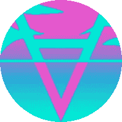****

****$AURY Token****

# ******$AURY 赌注******

******赌注**现在可用于游戏内货币， **$AURY。**因为这是我们的赌注计划的试点版本。****

# ******如何下注$AURY？******

****要开始下注，你首先需要一些 **$AURY** 代币(可以从 FTX 或 Raydium 获得)和一个兼容 SPL 的 **Web 3** 钱包，比如 Phantom 或 Solflare。****

****你还需要在钱包里放一些索拉纳(SOL)来支付交易费用。所需的量非常低，所以没有必要恐慌——推荐的最低量是 0.1 索尔，这将持续你很长一段时间！****

****第一步是去赌注应用:[https://app.aurory.io/staking](https://app.aurory.io/staking)和连接你的钱包。****

****你会在**“余额”**部分看到你钱包里的 **$AURY** 代币余额，现在你可以决定你想下注多少。****

****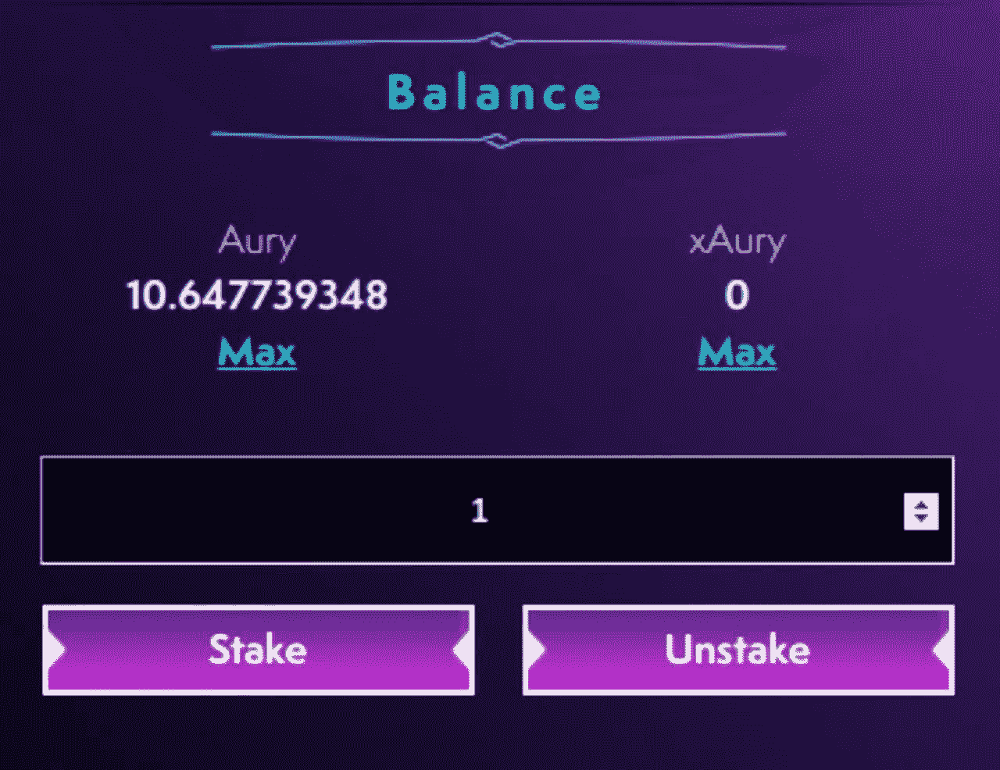****

****$AURY balance section****

****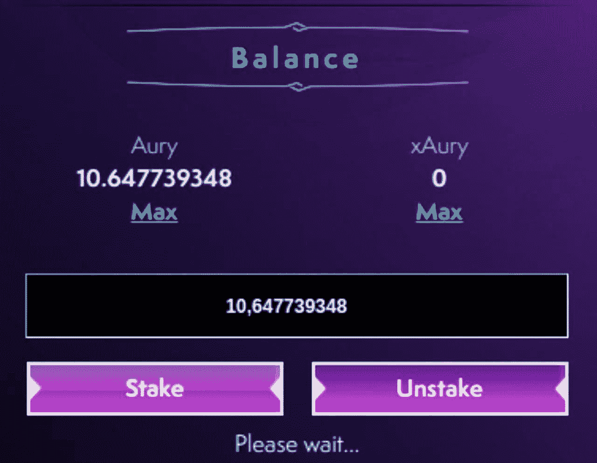****

****Stake/ Unstake Aury****

****一旦您点击**【赌注】**，您将必须确认您钱包中的交易，如下所示。当你**【拆垛】**收你的 **$AURY** 也是同样的过程。****

****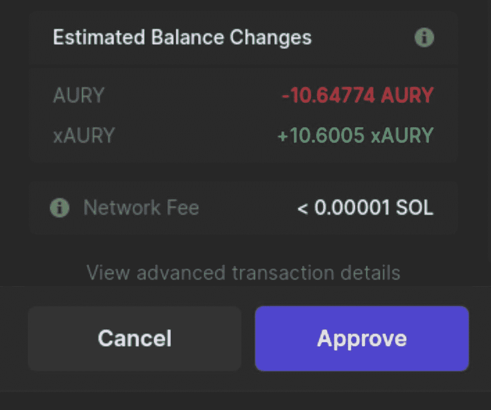****

****Approval of Staking amount****

****批准后，您下注的金额将显示在**“当前金额**”中，并且您还将获得您预计的每日**奖励**。****

****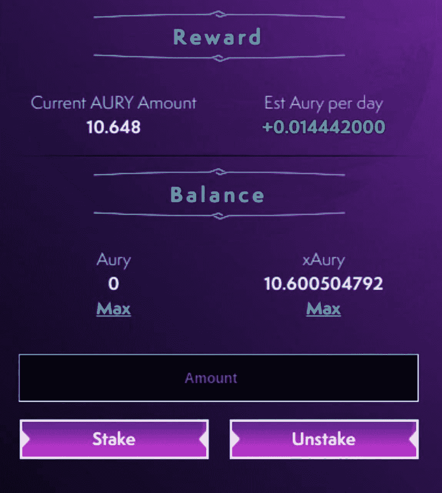****

****Your rewards****

****对于这个试点版本的赌注池，你没有锁定的赌注金额或奖励发放！****

****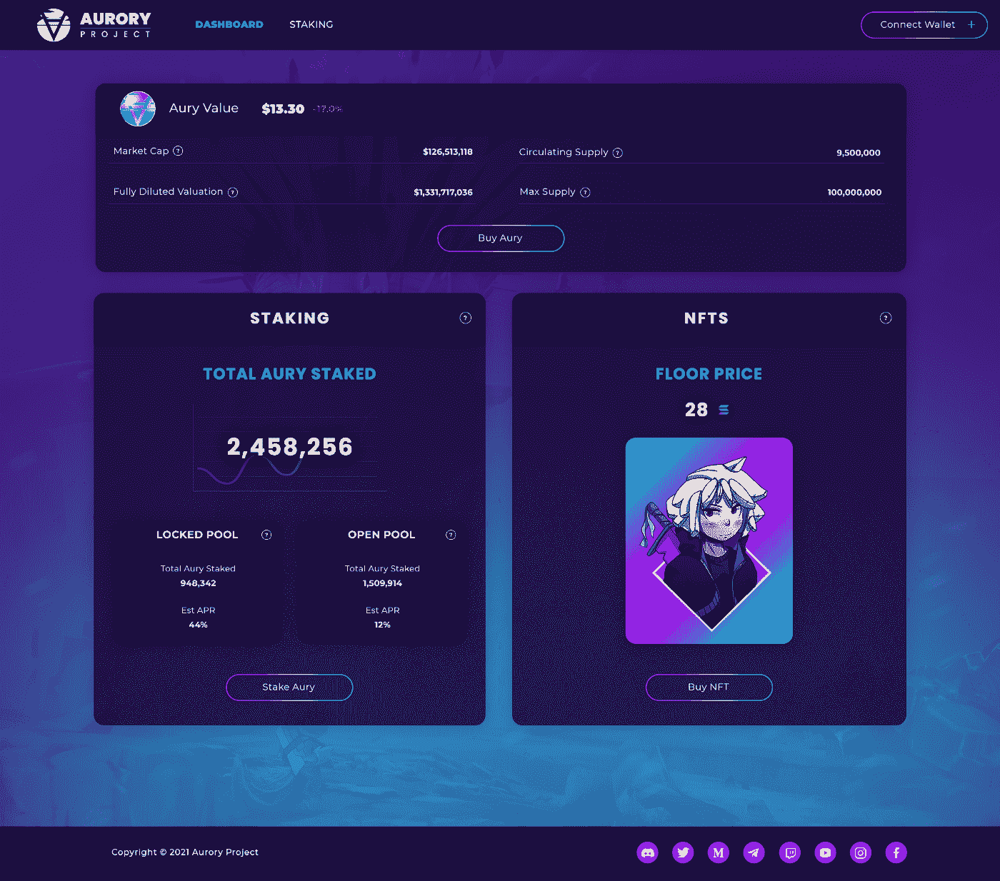****

****Aury Staked Amount****

# ******区别灵活&锁定桩池******

****如果您在**灵活下注池**中下注 **$AURY** 代币，您的钱包中将会收到 **xAury** 代币，代表您下注的$AURY。稍后，您需要使用 **xAury** 代币来取消您的$AURY。灵活的筹码池允许您随时**拆筹码**。****

****当您在**锁定赌注池**中下注 **$AURY** 时，您的钱包中不会收到 **xAur** y 代币，因为它们直接存储在程序中。在这个池中，在 2022 年 5 月 26 日之前，您**将无法**取消您的代币。赌注金额和奖励已锁定！****

# ******x aury 的工作******

****您可以将**赛瑞**视为**共享**令牌。您将根据您提供的流动性获得这些代币。赛瑞的价值只会随着时间的推移而上升。因此，你持有它们的时间越长，当你解散时，你能得到的就越多。****

****如果您对这种机制背后的数学感兴趣，这里有两个公式:****

*   ****当您下注 N $AURY 时，您将获得相当于以下金额的 xAury:****

****n * x Aury _ supply/Aury _ pool _ amount****

*   ****当您解散 xAury 时，您将获得相当于以下金额的$AURY:****

****n *(Aury _ pool _ amount/x Aury _ supply)****

# ******什么是 APR &它如何随时间变化******

******APR** 是一个百分比，计算方法是将当前每天(一年内)分配的奖励除以下注总额。****

****所以基本上，**越多的$AURY** 押在池中，**越低的 APR** 。如果许多人不罢工，APR 可能会再次上升。****

****由于回报是随着时间线性分布的，你越早下注，你赚得越多，并且开始时的 APR 将比后来高。****

# ******$AURY 价格实况数据******

****根据 CoinMarketCap 的数据，今天的黄金现货价格为**8.09 美元**，24 小时交易量为**2016996 美元**。Aurory 在过去 24 小时内下跌了 2.13%。当前 CoinMarketCap 排名第 436 位，实时市值为**76，470，178 美元**。它的流通供应量为 960 万 T42 金币，最高限额为。供应 **1 亿**金币。****

# ******哪里买 Aurory (AURY)？******

****AURY 已经在多家**加密交易所**上市，与其他主要加密货币不同，它不能直接用法定货币购买。然而，你仍然可以很容易地购买这枚硬币，首先从任何法定到加密的交易所购买 USDT，然后转移到提供交易这枚硬币的交易所****

****除了上述交易所之外，还有一些受欢迎的加密交易所，它们拥有可观的日交易量和庞大的用户群。这将确保你能够在任何时候出售你的硬币，费用通常会更低。建议您也在这些交易所注册，因为一旦 AURY 在那里上市，它将从那里的用户那里吸引大量的交易量，这意味着您将有一些很好的交易机会！****

## ******血清指标******

****serum 是一个 [**去中心化交易所(DEX)**](https://blog.cryptostars.is/what-are-decentralized-exchanges-how-do-dexs-work-4e54fd477e0e) 协议和生态系统，为去中心化金融带来了前所未有的速度和**低交易成本**。它是建立在索拉纳，是完全没有许可的。生态系统合作伙伴可以与 Serum 的链上中央限价指令簿结合，为机构和零售用户共享基于流动性和电力市场的功能。****

****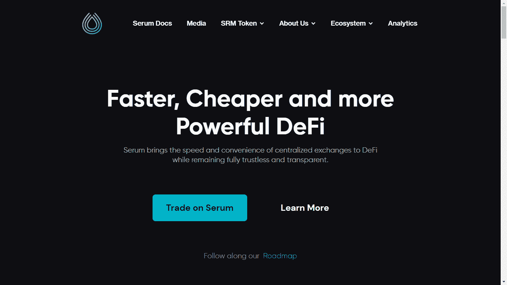****

## ******库币******

****KuCoin 是一家大型加密货币交易所，提供购买、出售和交易加密货币的能力。除了基本的交易选项，该平台还提供保证金、期货和点对点(P2P)交易。用户也可以选择赌注或出借他们的密码来获得奖励。****

****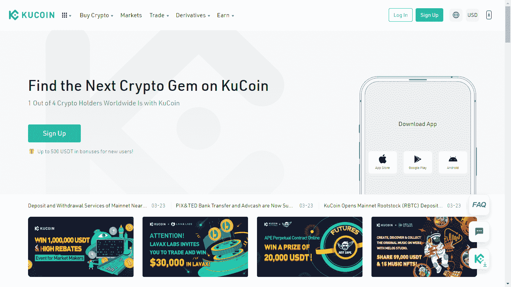****

## ****雷迪姆****

****Raydium 是一个**自动做市商(AMM)** ，它建立在索拉纳区块链之上，使用**分散交易**来实现闪电般的交易、共享流动性和收益。更快更便宜。全生态系统流动性的中央指令簿。****

****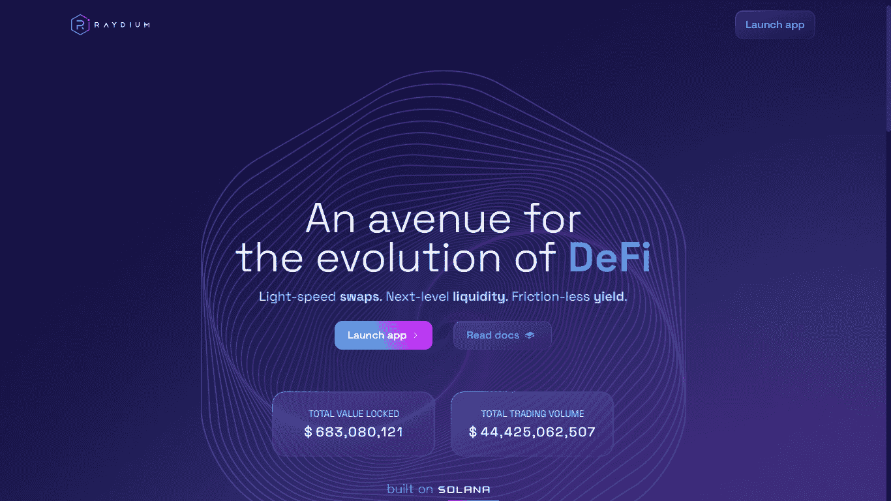****

# ****象征经济学****

****在最近的销售中，7，000，000 枚代币(总供应量的 **7%** )在一个重复使用由芒果市场开发和使用的 IDO 程序的 IDO 中被拍卖。****

****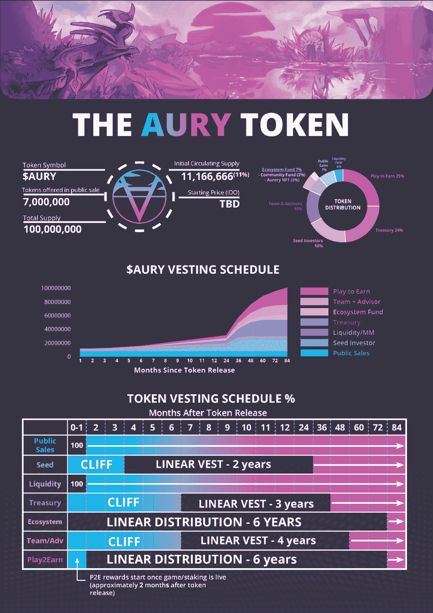****

****AURY Tokenomics****

****股票代码: **AURY******

****令牌类型: **ERC20******

****ICO 代币价格: **1 奥瑞= 8.09 美元******

****筹款目标:**700 万代币******

****市值:76890781 美元****

****循环供应量:**950 万******

****最大供应量: **100，000，000******

****代币销售的可用性: **7%******

****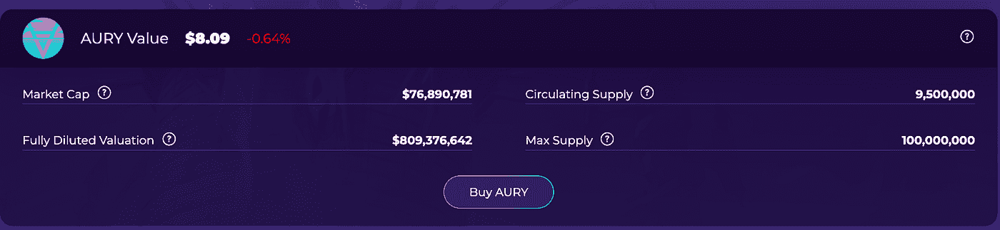****

****AURY Token Distribution****

# ****是什么让 Aurory 独一无二？****

****Aurory 使用了与 T2【play-to-earn】相同的游戏机制，这种机制使得像 Axie Infinity (AXS)这样的游戏大获成功。玩家可以通过玩游戏获得**代币**和 **NFTs** ，这些代币稍后可以用于在市场中购买物品，并增加他们在游戏中成功的机会。****

****Aurory 宇宙中的 NFT 被称为**aurorian**，在游戏中有几种用途。首先，它们是游戏中的视觉标识。换句话说，玩家的傲罗就是他的化身。**傲罗人**让玩家进入未来的游戏**模式**，并作为测试和验证将加入玩家对玩家模式的钥匙。在未来，傲罗人应该扮演游戏中的皮肤角色，在 **3D** 中建模，这将允许玩家在未来的游戏模式中进化。****

****这些**NFT**也可用作抵押品，以**血清指标**为抵押借入流动性。该团队还计划为金色令牌提供耕作和打桩选项。****

# ****Aurory 网络是如何保护的？****

****奥拉诺将被安置在索拉纳·区块链号上。该团队选择 Solana 是因为其快速的交易时间和极低的交易费用。这是即将在 Solana 上推出的区块链游戏(如 Star Atlas)的更大推动的一部分。****

****Solana 是第一层区块链，具有部分拜占庭容错的**利害关系证明**共识机制。它有 200 个节点在世界各地运行，在高峰时每秒可以处理多达 5 万笔交易。Solana 执行一组协调优化来实现如此令人印象深刻的性能，并以一种多线程的方式处理事务，这使它有别于较慢的区块链。****

# ****玩游戏的理由****

****玩这个游戏的原因可能是:****

## ****令人惊叹的艺术品****

****Aurory 游戏中的美术作品简直就是**惊艳**。他们的审美让人想起老迪斯尼和吉卜力动画工作室。令人惊讶的是，在游戏可以玩之前，它已经获得了超过 1 . 08 亿美元的承诺，估值为 15 . 5 亿美元。这是索拉纳区块链有史以来最有价值的一次。****

## ****有趣的游戏****

****Aurory 是一款提供有趣的**游戏玩法**的游戏。游戏将允许玩家在几种不同的**游戏模式中进行选择，**包括单人游戏模式，以及两种不同的多人游戏模式。单人模式将提供一个全手绘的，侧面滚动的 2D 动画游戏。****

****玩家将扮演一个名为 **Helios** 的复古未来主义的类似猫的主角，然后继续与 NPC 交谈，探索游戏世界，完成任务，击败敌人等，所有这些都是为了推进故事的发展。然而，当你打败一个敌人时，你不仅仅会获得成就感——你还会得到敌人本身，以你现在拥有的 [NFTs](/coinmonks/what-are-nfts-non-fungible-tokens-explained-f3a3d8d18ed7) 的形式。****

****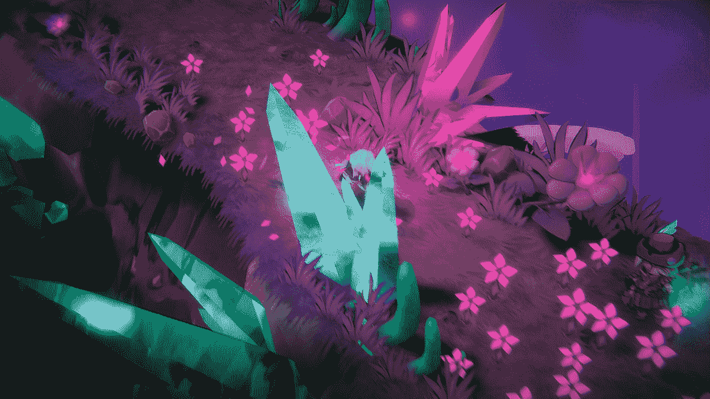****

****Aurory Gameplay****

## ****加密货币的敲门砖****

******Aurory** 将拥有与许多其他元游戏相同的**玩赚**机制，允许用户赚取**NFT**和**加密货币**，同时也将他们引入数字货币的世界。因此，玩家还必须学会如何兑换和转换数字货币，以获取他们在游戏中赚到的钱。在这个过程中，他们会发现处理自己的现金、进行快速的国际转账、支付最低的交易成本等等是多么简单和有益。这就是为什么像 Aurory 这样的游戏可能是全球采用加密货币的关键。****

## ****赚取 NFT****

******NFTs** 将通过击败对手获得。然而，不仅如此，它们不仅仅是收藏品，而是你可以在多人模式中使用的实际资产。而且，仅仅通过玩游戏就能获得新的 NFT，如果玩家选择将这些 NFT 出售给其他人，他们也将获得金钱。或者，他们可以求助于 **NFT 赌注**。****

****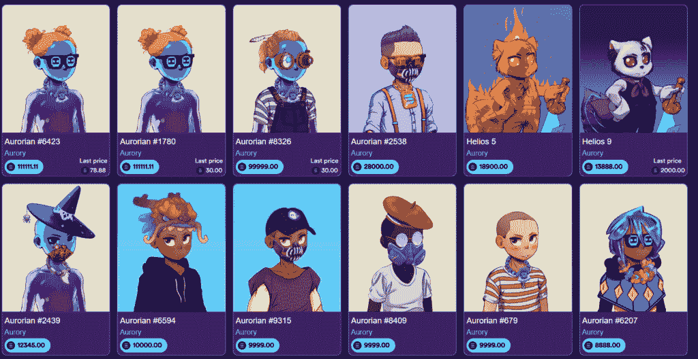****

****Aurory NFTs****

## ****股份 NFT****

****另一个游戏机制是 **NFT 赌注**。玩家可以获得游戏中的皮肤、独特和传奇的卡片、能量和其他物品。****

****以这种方式获得的所有东西随后都可以用来对抗其他参与者，或者在项目的当地市场上进行交易，从而提供更多的潜在利润。****

## ****多人(PvP)游戏****

****故事驱动的单人(PvE)游戏模式将是训练你进入 **PvP** 模式的方式。它可以让你收集资源和学习游戏。从长远来看，这项训练将为你在 **PvP 模式**下的战斗做准备。然而，在 Aurory 的模式中会有不同的游戏模式，包括友谊赛和排名赛。****

## ****玩赚(P2E)机制****

****Aurory 的目标是迎接新的一代。他们将通过提供教育和支持以及独特而愉快的游戏冒险来实现这一目标。玩家将学习钱包创建、定义、赌注和其他主题。将这种教育元素整合到一个针对**游戏玩家**的高要求平台中至关重要。他们的目标是提供“创新的、吸引人的游戏，同时培养虚拟的游戏经济。”****

****玩家将能够在 PvE 和 PvP 游戏模式中收集 **NFTs** 和 **$AURY 代币**。同时，通过积极地玩游戏，用户获得代币和 NFT。这些成为市场上的交易物品，增加你赢得游戏的机会。****

# ****包裹****

******Aurory 项目**是在 **Solana** 区块链上的一个**玩赚游戏平台**。Aurory 离发布还有一段时间，它的许多细节还没有透露。这可能是过程中许多游戏中的一个，但无疑是最**雄心勃勃的**之一。 **Aurory** 拥有一款能够在快速发展的**区块链游戏世界**中成功竞争的全面游戏的所有要素。****

## ****在 LinkedIn 上关注我，保持联系****

****[https://www.linkedin.com/in/ishanshahzad/](https://www.linkedin.com/in/ishanshahzad/)****