# $AURY | Aurory 新白皮书解释。V2 分析。

> 原文：<https://medium.com/coinmonks/aury-aurory-new-whitepaper-explained-v2-analysis-7657603feaec?source=collection_archive---------14----------------------->

# 介绍

这是我们的 V2 分析，它意味着什么？

这意味着你们也有几周前从我们这里发布的版本 1，我们建议你们在阅读这个之前先阅读一下。虽然这并不意味着你不能从当前的报道中理解任何东西，但是 V1 给了你这个傲罗工程的 360°视角。

[**【V1】此处**](/@daolecticresearch/aury-the-next-solana-blockchain-game-studio-ac4e18c3add5)[**简称又名推特帖**](https://twitter.com/daolectic/status/1484624720653807617?s=21)

通读[新白皮书](https://aurory.io/whitepaper.html)或所谓的**“宣言”**(2 月 22 日发布)有关于整体**游戏、**关键核心元素的重要揭示，以及通过令牌经济的准确流入和流出，如何有效地使用和平衡 **$AURY** 。

*在继续阅读之前，请在 Twitter 上关注我们，我们在那里发布对某些我们认为有趣的加密项目的分析和有趣的见解，比如这个。* [*@道辛*](https://twitter.com/daolectic)

# 传说

虽然我不会讨论这个传说本身，但这一节对我理解他们的 **PVE 模式背后的意义是有用的。**

在所谓的“故事模式”中，通过一些精心设计的幻想场景，Aurory 团队将以一种超级有趣的方式教你关于区块链和加密的知识。

多亏了这份宣言，你现在可以尝到谁是**萨姆**或**太阳神、**尼菲特斯和**福兹、**安蒂克发生了什么，或者**托坎世界**是如何被创造出来的。这是来自团队的一个小提示，但足以让我理解他们打算如何教他们的 PvE 玩家加密和区块链。

# PVE

埃利奥斯和山姆将会是故事的主角，主要的焦点将会是招募邪恶势力来打败正在摧毁安提克世界的邪恶势力和操纵者。

山姆是“战士”，因此是身体上更强壮的角色，而赫利俄斯则是聪明敏捷的角色，或者很容易被称为会使用魔法的角色。

Aurory 团队在他们打算发布 PVE 游戏模式内容的方式上说得很清楚，太阳神和山姆的故事将在多个季度发布的内容中播放**，如下所示。**

**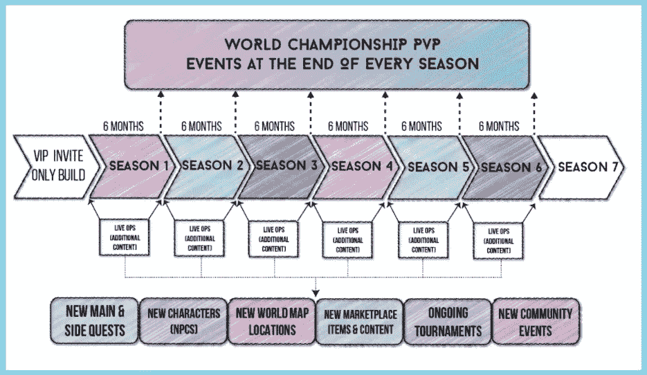**

****新赛季会带来什么？****

**如上所述，**内容！****

**特别是更多的区域可以探索，更多的角色可以遇见，任务和好处等等。想象一下，随着新赛季的引入而做出的每一个改变也可能意味着你需要使用和适应你的游戏风格的新策略。**

**通常，每一季的**开头都会有它的**对手**，所以它会作为每一季的“最终老大”来推进故事情节。****

# **PVP**

**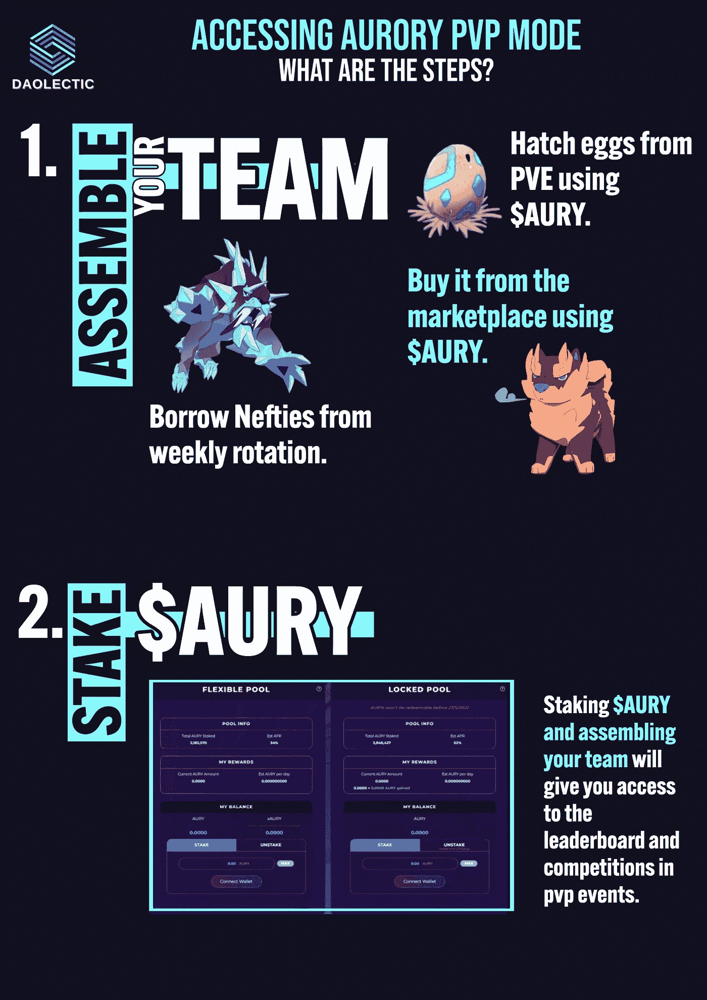**

**如果你担心恶意尝试封杀游戏，Aurory 团队已经声明引入多种反 bot 机制来防止封杀。**

**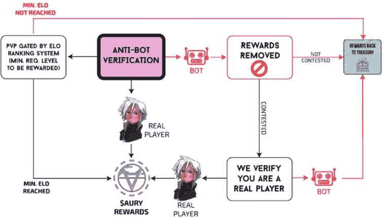**

# **战斗模式**

**Aurory 战斗模式将是一个 3v3 战斗的回合制战斗系统，利益将被放置在一个战场网格中。如你所想，最终目标是击败你对手的所有弱点。**

**战场网格看起来像什么？**

**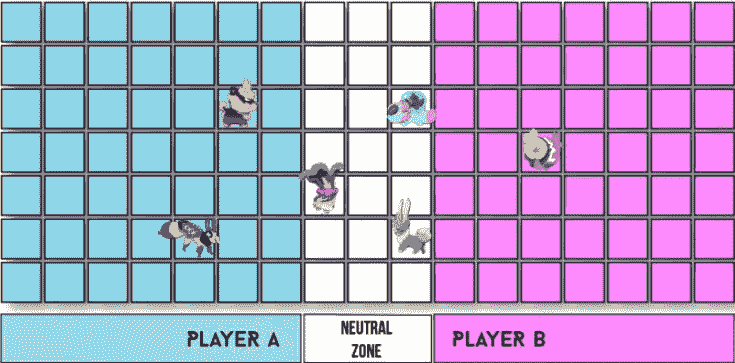**

**地图的中心也被称为**“杀戮之地”**，奈菲之间的大部分决斗都将在这里发生。一段时间后，整个战场将开始缩小，迫使所有的奈菲人在决斗中杀出一条血路。**

**以下**战略决策**必须在战斗开始前做出:**

1.  **你们队中每个人的起始位置。**
2.  **Neftie 的类型和种类，以更好地对抗敌方小队。**
3.  **力量之石。**
4.  **战术家。**

**这些选择中的每一个都可能决定你赢得这场战斗的机会。**

> **每只奈菲都有一个属性叫做**主动性**，理解它们在你回合中的行动顺序是关键:**
> 
> **内夫蒂 A:倡议 81
> 内夫蒂 B:倡议 55
> 内夫蒂 C:倡议 60**
> 
> **按照上面的例子，你的妮菲 A 是第一个行动的，因为他的主动等级等于 81，接着是妮菲 A，然后是妮菲 C，最后是 b。**
> 
> **如果来自同一个团队的两个敌人有相同的“主动”得分，玩家选择谁先走。
> 如果两队中的两个敌人有相同的主动得分，那么具有**更高 HP** 的敌人将首先开始。**

**我不会深入到战斗模式的细节中去，因为它会让更多的“玩家”而不是我们报道的观众感兴趣。我们不得不做一个大概的介绍来帮助理解已经取得的进展和游戏的进一步发展。**

# **世界地图:地区和地标**

**地图分为**个区域**，每个区域都有自己的**地标**(村庄、城堡、名胜、NPC)。
这些地区中的一些可能是敌对的，可能需要一些特殊的药剂来避免某些攻击，甚至更多，你只会在特定的地区发现某些稀有或邪恶的变异。**

**我们觉得宣言的图形非常好，我们无法避免在我们的报告中使用其中的一些，希望 Aurory 团队不会对我们发火，但没有比把他们创造的东西作为地标更好的解释了。**

****地标**分为:**

**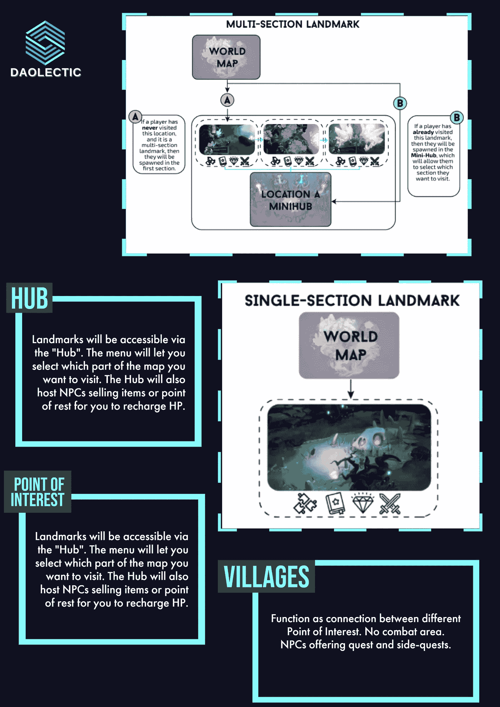**

# **追求与邪恶**

**Aurory 也会通过**任务**来奖励玩家，对于那些不熟悉这个术语的人来说，任务通常由 NPC 分配给一个玩家或一个团队，并且需要你完成特定的任务来获得奖励。**

**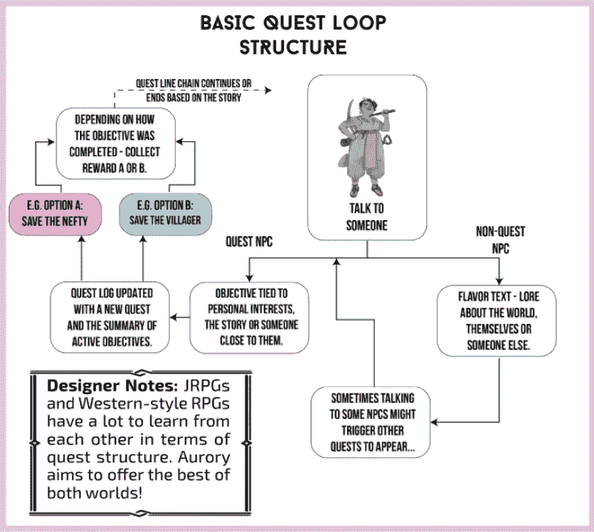**

**在 **PVE** 和 **PVP** ，**利益**可能确实会被赚取。玩家可以在 PVE 收集**蛋**并使用 **$AURY** 孵化它们以获得一个新的 Nefty 同伴！好处也可以通过特殊事件获得或在市场上购买。邪恶的蛋通常是通过赢得战斗获得的。**

**说到邪恶…**

**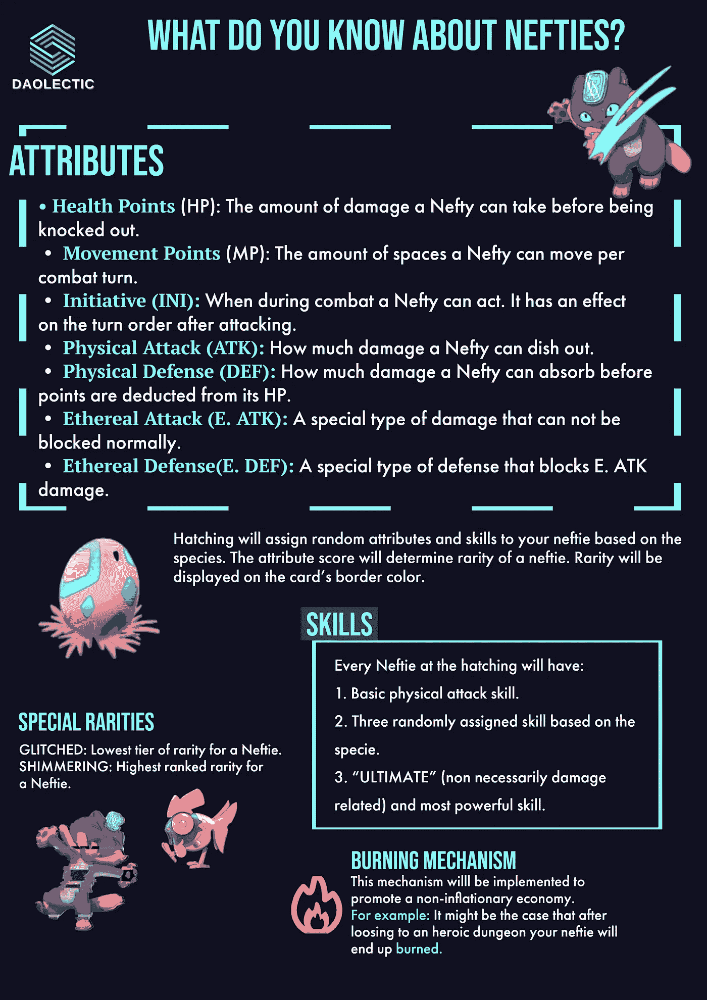**

# **战术家、能量石和土地。**

**随着游戏开发的日复一日的进步，我们正在经历更多的元素被添加到游戏中，在这种情况下，我们将从一个新的条目开始，**战术家。****

**战术家的加入是为了让“技术娴熟的玩家”脱颖而出，展示他们在游戏战斗中真正的战略逆境。
每支队伍将由他的战术家带领，他将决定队伍在格子中的起始位置和一些额外的被动技能，这些技能在战斗中可能对你有利，也可能对你不利。协同作用是关键。**

****异能石**可以定义为游戏更多的“消耗品”，会解锁特殊战术能力。每个玩家在争夺他们想要使用的相关灵能石的战斗中都将携带两个插槽，这再次激发了战术效率和技能的多种可能性。**

**按照 **Lands** 的说法，我们用下面的一个信息图恢复了它:**

**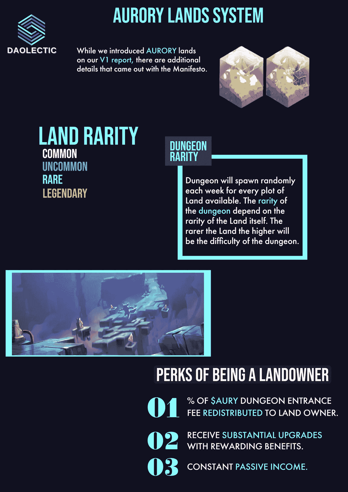**

**当我们谈到土地时，我们不能跳过核心津贴和地下城。对于那些不熟悉“地牢”定义的人:**

> **在 [RPG(角色扮演游戏)](https://www.cyberdefinitions.com/definitions/RPG.html)中，地牢是一个敌对的封闭区域，玩家在里面会遇到敌人。地牢通常在封闭的区域被发现，例如城堡、要塞或洞穴，但不一定局限于那个区域。你击败所谓的“老板”或敌人 NPC 越多，你得到的奖励就越多，最重要的是，地牢越难，得到的奖励质量就越高。**

**明白了什么是地下城之后，奥洛里宣布将会有**五个难度等级:****

*   ****轻松****
*   ****适中****
*   ****努力****
*   ****传说中的****
*   ****英勇****

**让我们关注一下英雄地牢，因为另一个很酷的通货紧缩机制已经到位:**

**为了进入最高难度的地牢，在这种情况下，玩家可能需要做出一些牺牲来获得游戏中最好的战利品。如果勇敢的玩家不能完成英雄地牢，那么他必须选择他们的哪一个 Neftie 将永远失去，对于那些活着出来的人，将给予一份丰厚的奖励。**

# **游戏经济学和参与度**

**现在大多数人都知道，我们确实相信，在“玩和赚”之前，游戏必须有**“保持我的连接”**机制，如何？**

**关键的一点是让游戏成为玩家想让**反复玩**的东西，你可以在游戏中拥有令人敬畏的平衡经济，但如果你玩起来没有乐趣，从长远来看就没用了。**

> **“我们的主要目标是通过高质量的游戏、公平的奖励和深入的经济机制来最大限度地提高玩家的满意度。”**
> 
> ****Aurory 宣言第 04 章****

**除了上述观点，2021 年，**一项针对全球游戏玩家的调查**发现，社交方面是网络游戏越来越受欢迎的驱动因素。**

**总体而言，84%的受访者表示，在玩在线游戏时，找到适合自己的玩家对他们来说很重要。此外，76%的游戏玩家表示，在过去的一年中，在线游戏已经成为他们整体游戏体验的一个更大的组成部分。**

**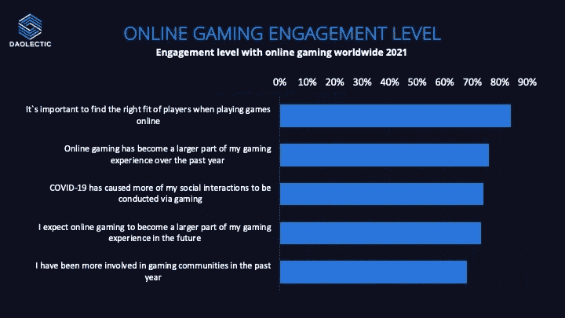**

**假设游戏将是一流的，另一个需要游戏和收入精确平衡的关键方面是游戏的**经济**，这是我最好奇的一个方面。**

**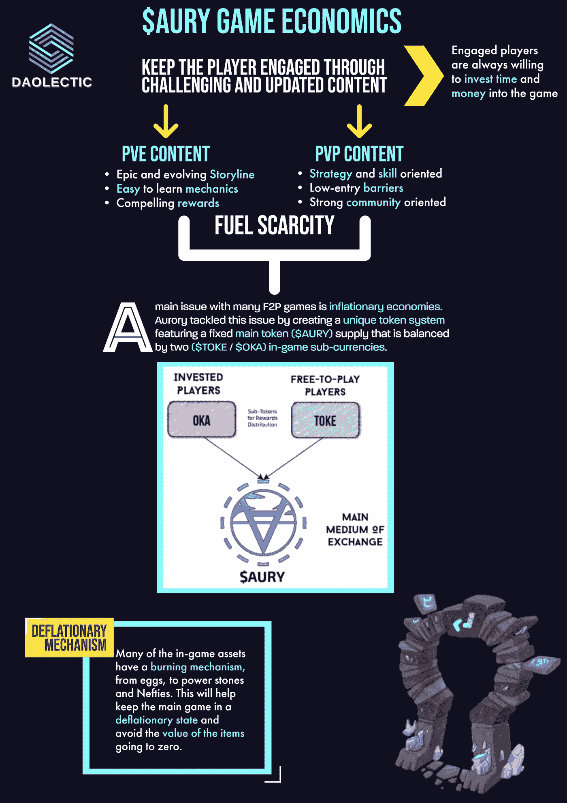**

**关于 **$AURY token** 的整体**流入**和**流出**，Aurory 团队提供了一些额外的细节和很棒的信息图表，这更加决定了游戏中构建的一般经济学的质量。**

**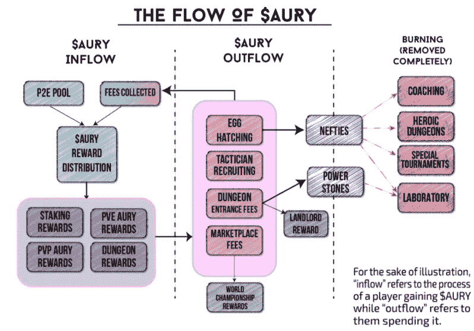**

# **结论**

**我们从未怀疑过项目的**质量，这份大规模的宣言/白皮书更新向我们证明了我们对团队和他们交付质量细节的方式是正确的。****

**如果你认为我们遗漏了关于游戏性的信息，那是故意的，因为我们严格地关注那些从投资者的角度来看 Aurory 的人可能感兴趣的方面。**

**为了透明起见，我们也投资了$AURY，我们的分析并不针对先令项目，而是避免噪音。**

# **放弃**

**在任何情况下，这都不是财务建议，我研究的目标将永远是深入项目并从不同角度研究它们，我确实包括了基于我最近研究的类似项目的经验的个人意见。**

**我现在和将来都愿意接受讨论。**

****在 Twitter 上关注我们:****

****@ Dao Xin****

****在投资任何东西之前，请务必做好调查**。**

> **加入 Coinmonks [电报频道](https://t.me/coincodecap)和 [Youtube 频道](https://www.youtube.com/c/coinmonks/videos)了解加密交易和投资**

# **另外，阅读**

*   **[Bitsgap 审查](/coinmonks/bitsgap-review-a-crypto-trading-bot-that-makes-easy-money-a5d88a336df2) | [Quadency 审查](/coinmonks/quadency-review-a-crypto-trading-automation-platform-3068eaa374e1) | [Bitbns 审查](/coinmonks/bitbns-review-38256a07e161)**
*   **[加密复制交易平台](/coinmonks/top-10-crypto-copy-trading-platforms-for-beginners-d0c37c7d698c) | [Coinmama 评论](/coinmonks/coinmama-review-ace5641bde6e)**
*   **[印度的加密交易所](/coinmonks/bitcoin-exchange-in-india-7f1fe79715c9) | [比特币储蓄账户](/coinmonks/bitcoin-savings-account-e65b13f92451)**
*   **[OKEx vs KuCoin](https://coincodecap.com/okex-kucoin) | [摄氏替代品](https://coincodecap.com/celsius-alternatives) | [如何购买 VeChain](https://coincodecap.com/buy-vechain)**
*   **[币安期货交易](https://coincodecap.com/binance-futures-trading)|[3 commas vs Mudrex vs eToro](https://coincodecap.com/mudrex-3commas-etoro)**
*   **[如何购买 Monero](https://coincodecap.com/buy-monero) | [IDEX 评论](https://coincodecap.com/idex-review) | [BitKan 交易机器人](https://coincodecap.com/bitkan-trading-bot)**