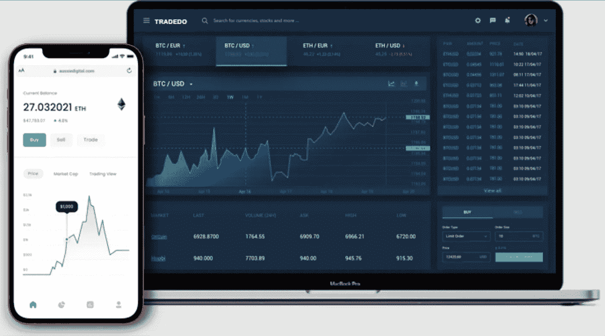
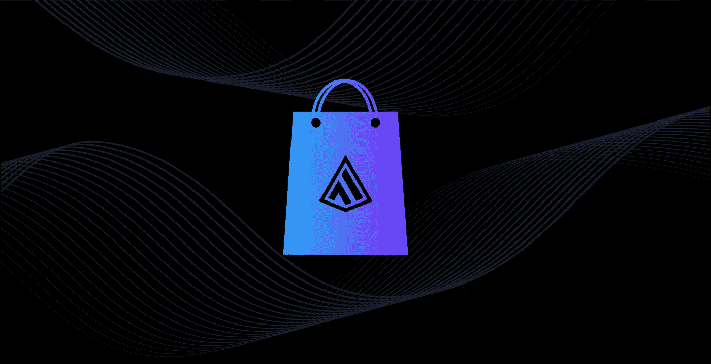
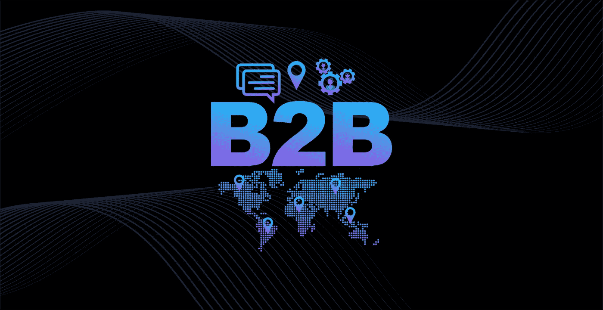
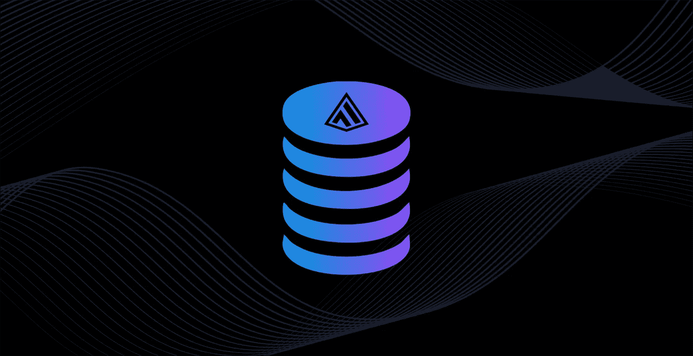

# AUSSIE DIGITAL —交易所、电子商务、社交媒体、B2B、赌注、附属机构

> 原文：<https://medium.com/coinmonks/aussie-digital-exchange-ecommerce-social-media-b2b-staking-affiliate-14c5aa2a2ceb?source=collection_archive---------39----------------------->

**新数据驱动的股权区块链**

我们向您展示 Aussie Digital——一个由数字令牌 AUDcoin 驱动的改变游戏规则的电子商务生态系统。这个生态系统包含了你建立和维护在线业务所需的所有工具。我们的电子商务平台“Tradezy”与我们的交易所“Tradedo”相连。这简化了那些希望接受加密的过程。从内置的搜索引擎优化功能到我们的综合社交媒体平台“Chatezy ”, tradezy 提供了丰富的功能来帮助推广和建立在线业务。

# **一个生态系统**

tradedo.tech

# TRADEDO 贸易交易所

## 将您的加密硬币付诸行动

Tradedo 是 Aussie Digital 的交易交易所，帮助购物者和零售商使用领先的加密硬币，只需点击几下鼠标即可买卖产品和服务。

tradezy.io

# 贸易电子商务

## 快速而经济地建立电子商店

TRADEZY 使小企业主能够上网接受法定货币和加密硬币。此外，这个平台配备了多种工具，将推动在线业务增长。

Rewards Program

# **奖励计划**

## **前所未有地索取免费赠品**

TRADEZY 奖励网上开店的小企业主。这个电子商务门户网站为电子零售商带来了令人兴奋的奖励计划，并为购物者提供了惊人的激励。

Chatezy (Social Media)

# **CHATEZY 社交媒体**

## **社交的新方式**

Chatezy 有一个社交媒体平台，买家和卖家可以在这里联系、合作和发展。这个社交渠道帮助用户找到新的业务，与朋友联系，并获得乐趣。

B2B Platform

# B2B 平台

## 国际贸易的未来

这是一个独特的平台，允许普通人与其他志同道合的成员组成购买小组，共同购买产品。这使得这些团体或社区有能力像大人物一样购买，直接接触高质量的制造商，节省高达 50%的通常产品成本。

在我们看来，大的最低订货量(MOQ)是国际贸易的主要障碍。这就是为什么小企业不能在公平的环境中竞争。最低起订量是工厂的经济必需品，因此也是小型家庭企业的进入壁垒。

Staking

# 立桩标界

当您在我们的交易平台上下注澳元时，您将获得超过 10%的额外投资回报。

活在当下！！！

Affiliate

# 接纳

我们的分支机构将奖金直接支付到他们的账户上。此外，分支机构将不需要购买我们的硬币来申领他们的奖金。

# **我们的信息:**

WEB WEB WEB WEB WEB WEB WEB WEB WEB WEB WEB WEB WEB WEB WEB WEB WEB WEB WEB WEB WEB WEB WEB WEB WEB WEB WEB WEB WEB WEB WEB WEB WEB WEB WEB WEB WEB WEB WEB WEB WEB WEB WEB WEB WEB WEB WEB WEB WEB WEB WEB WEB WEB WEB WEB WEB WEB WEB WEB WEB WEB WEB WEB WEB WEB WEB WEB WEB WEB WEB WEB WEB WEB WEB WEB WEB WEB WEB WEB WEB WEB WEB WEB WEB WEB WEB WEB WEB WEB WEB WEB WEB WEB WEB WEB WEB WEB WEB WEB WEB WEB WEB WEB WEB WEB WEB WEB WEB WEB WEB WEB WEB WEB WEB WEB WEB WEB WEB WEB WEB WEB WEB WEB WEB WEB WEB WEB WEB WEB WEB WEB WEB WEB WEB WEB WEB WEB