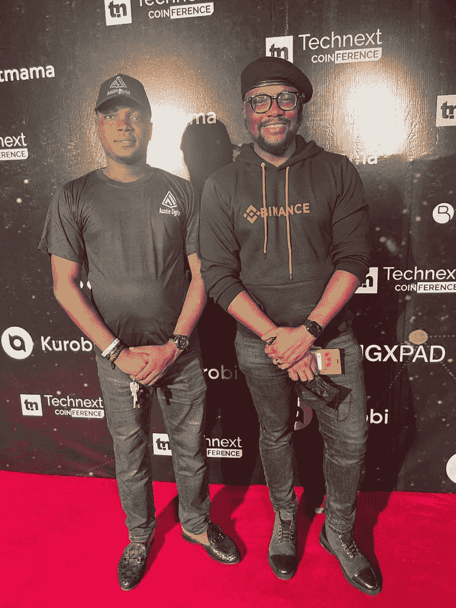

# 澳大利亚数字团队参加了由 Technext 会议发起的加密会议

> 原文：<https://medium.com/coinmonks/aussie-digital-team-attended-crypto-conference-initiated-by-technext-conference-4e4b0d11fe28?source=collection_archive---------59----------------------->

[https://coinference.technext.ng/](https://coinference.technext.ng/)

2022 年 2 月 5 日

我们的团队由 Olanlokun Olajide(经理品牌策略师)带领，参加了由 Technext Conference 发起的 Crypto Conference。尼日利亚预算和国家规划国务部长克莱姆·阿格巴王子是主旨发言人，他实际上在那里讨论了政府在数字货币和整个技术行业中的作用，其他发言人包括 Sparkle 首席执行官 Uzoma Dozie、Bitmama 首席执行官兼创始人 Ruth Iselema、币安非洲董事兼 Bundle 临时首席执行官 Emmanuel Babalola、Quidax 联合创始人兼首席执行官 Buchi Okoro，因此许多技术和加密行业的领导者都出席了会议。

Aussie digital 出席会议是为了促进区块链各行业的合作伙伴关系，我们能够通过与 Bitmama 的团队成员、Technext 员工以及币安营销和社区(非洲)代表和其他人进行深入讨论来实现我们的目标，我们都同意在会议结束后的稍后日期进一步讨论，以便我们可以看到我们如何合作以实现互利。我们在 Aussie digital 的主要目标是通过与主要技术和加密行业的合作来不断建立生态系统，我们将此次活动视为向人们介绍 Aussie Digital 生态系统的机会，我们期待未来有更多的合作伙伴。感谢所有抽出时间聆听的与会者。

[https://coinference.technext.ng/](https://coinference.technext.ng/)

我们的信息:

网站:[https://www.aussiedigital.io/](https://www.aussiedigital.io/)
脸书:[https://www.facebook.com/aussiedigital/](https://www.facebook.com/aussiedigital/)
推特:[https://twitter.com/aussie_digital](https://twitter.com/aussie_digital)
电报:[https://t.me/AUDOfficialGroup](https://t.me/AUDOfficialGroup)
Youtube:[https://www.youtube.com/channel/UCGoncZDbjH21YOi4i4YwroA](https://www.youtube.com/channel/UCGoncZDbjH21YOi4i4YwroA)
insta gram:[https://www.instagram.com/aussiedigital.io/](https://www.instagram.com/aussiedigital.io/)
Github:[https://github.com/aussiedigitalio](https://github.com/aussiedigitalio)
Reddit:[https://www.reddit.com/r/aussiedigital_25b/](https://www.reddit.com/r/aussiedigital_25b/)