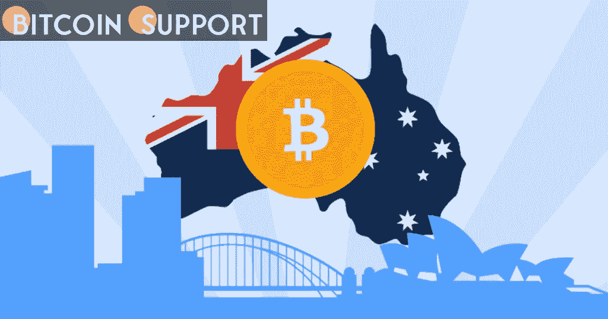

# 澳大利亚专家列出了一系列让人们更容易使用密码的东西

> 原文：<https://medium.com/coinmonks/australian-experts-have-a-list-of-things-that-make-it-easier-for-people-to-use-crypto-75e6e8ff3f30?source=collection_archive---------78----------------------->

**Visit our website:-** [**https://bitcoinsupports.com/**](https://bitcoinsupports.com/)

为了促进澳大利亚更安全地采用加密技术并降低网络安全风险，联邦指南建议关注四个关键领域。

澳大利亚网络安全顾问，网络安全行业咨询委员会，强调了政府在为加密货币在全球主流化做准备时可以寻求的一些与加密相关的机会。

“探索加密货币”(Exploring Cryptocurrencies)是澳大利亚内政部(Department of Home Affairs)进行的一项研究，该研究提到，随着该国面临向先进数字经济的快速转型，加密的接受度大幅上升:

**“需要监管框架，为比特币行业如何在澳大利亚运营提供更大的清晰度和确定性。”**

最低网络安全标准、能力(通过专业培训获得的知识)、跟进策略和运营商开放度都包含在联邦建议中，作为可以“帮助确保加密货币在澳大利亚的安全采用”的领域

该委员会建议对加密交易所和持有加密货币的澳大利亚企业强制执行基线网络安全要求，主要目标是降低针对加密货币的网络安全风险。黄邦贤·米勒是北海巨妖加密交易所的董事总经理，他认为“最低安全标准和增加人力来打击复杂的网络犯罪将大大有助于保护投资者。”

此外，该建议还建议更加重视通过专业培训提高公众对潜在加密可能性以及相应的网络犯罪和危害的认识。这一切都表明澳大利亚在加密领域采取了“跟随领导者”的方法，学习和实施全球最佳实践。

该委员会主张加强注册加密交易所和区块链企业的开放性，理由是加密固有的伪匿名性:

“具有准确、一致信息的教育举措将有助于投资者更好地把握投资和网络安全风险，同时也为所有澳大利亚人揭开加密货币的神秘面纱，”该报告称。

除了建议之外，网络安全行业咨询委员会还指出了加密货币主流化带来的各种机遇。这项研究展示了区块链可能如何被用来表征金融资产，如贷款、碳信用和房地产。接受加密货币也“让企业接触到一群新的客户”最后，随着加密货币变得更加主流，分析发现抵消碳排放是最有希望的机会之一。Voyager Digital 的联合创始人兼首席执行官 Stephen Ehrlich 在接受 Cointelegraph 采访时解释了为什么耐心对加密公司至关重要:

“比特币在 2021 年击败了所有主要的资产类别，表现优于原油、纳斯达克、标准普尔 500 指数和黄金。”此外，“霍德勒”的数量正在增加，这表明加密的长期可持续性。埃利希认为，加密的一个重要好处是，它为那些在之前的繁荣时期被遗漏的投资者提供了机会。

**访问我们的网站:-**[**https://bitcoinsupports.com/**](https://bitcoinsupports.com/)

**免责声明:以上为作者观点，不应视为投资建议。读者应该自己做研究。**

> 加入 Coinmonks [电报频道](https://t.me/coincodecap)和 [Youtube 频道](https://www.youtube.com/c/coinmonks/videos)了解加密交易和投资

# 另外，阅读

*   [阿联酋 5 大最佳加密交易所](https://coincodecap.com/best-crypto-exchanges-in-uae) | [SimpleSwap 点评](https://coincodecap.com/simpleswap-review)
*   购买 Dogecoin 的 7 种最佳方式
*   [最佳期货交易信号](https://coincodecap.com/futures-trading-signals) | [流动性交易所评论](https://coincodecap.com/liquid-exchange-review)
*   [火币加密交易信号](https://coincodecap.com/huobi-crypto-trading-signals) | [Swapzone 审查](/coinmonks/swapzone-review-crypto-exchange-data-aggregator-e0ad78e55ed7)
*   最佳[密码交易机器人](https://coincodecap.com/best-crypto-trading-bots) | [购买索拉纳](https://coincodecap.com/buy-solana) | [矩阵导出评论](https://coincodecap.com/matrixport-review)
*   [Coldcard 评论](https://coincodecap.com/coldcard-review) | [BOXtradEX 评论](https://coincodecap.com/boxtradex-review)|[uni swap 指南](https://coincodecap.com/uniswap)
*   [比特币基地评论](/coinmonks/coinbase-review-6ef4e0f56064) | [德里比特评论](/coinmonks/deribit-review-options-fees-apis-and-testnet-2ca16c4bbdb2) | [FTX 评论](/coinmonks/ftx-crypto-exchange-review-53664ac1198f)
*   [n 零审核](/coinmonks/ngrave-zero-review-c465cf8307fc) | [Phemex 审核](/coinmonks/phemex-review-4cfba0b49e28) | [PrimeXBT 审核](/coinmonks/primexbt-review-88e0815be858)
*   最佳[区块链分析](https://bitquery.io/blog/best-blockchain-analysis-tools-and-software)工具| [赚比特币](/coinmonks/earn-bitcoin-6e8bd3c592d9)
*   [Cloudbet 赌场点评](https://coincodecap.com/cloudbet-casino-review) | [点火赌场点评](https://coincodecap.com/ignition-casino-review)