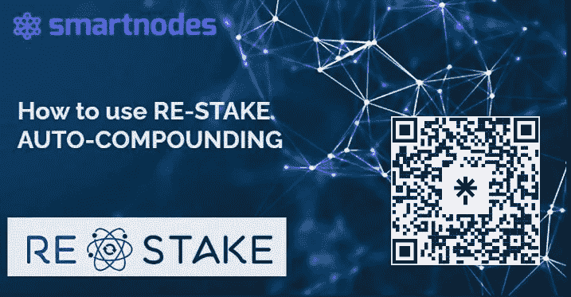
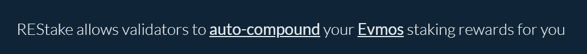
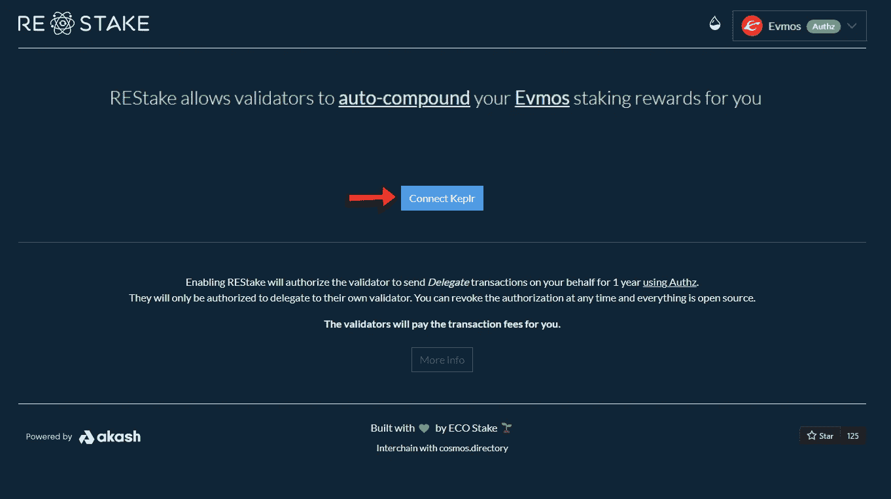
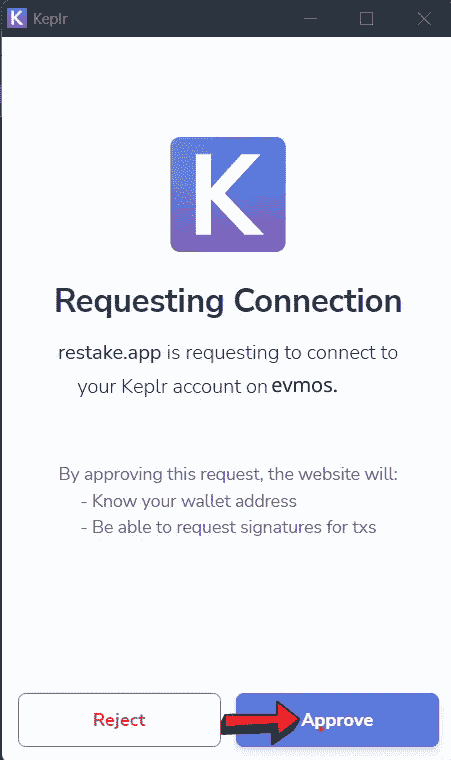
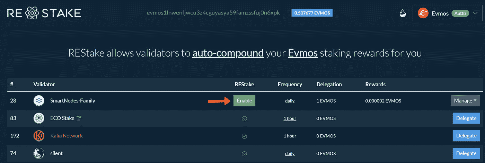
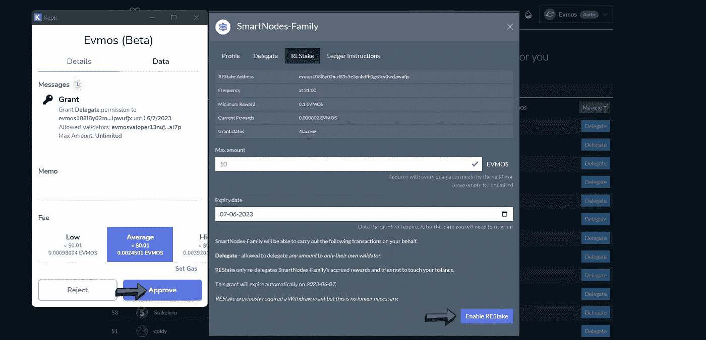
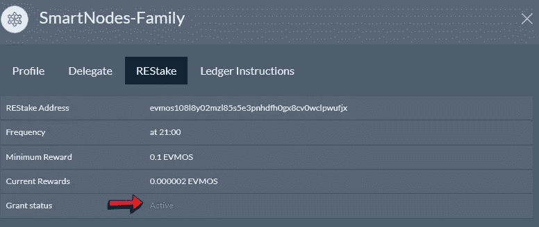

# 自动复合您的密码-超级收取您的奖励

> 原文：<https://medium.com/coinmonks/auto-compound-your-crypto-super-charge-your-rewards-b8c7cd3a1081?source=collection_archive---------11----------------------->

> 在重新下注时启用 Authz 自动复利

REStake 是一个由 ECO Stake 构建的自动复合工具，允许验证器自动复合您的股权奖励证明。这个项目是完全开源的，任何验证者都可以使用这个工具向他们的委托者提供这个服务。​

REStake 利用了名为 Authz 的 Cosmos chains 的新功能，随着加密货币链的更新，该功能正在逐步推出。您首先授权 REStake 验证程序代表您发送委托和索赔事务。然后，验证程序会定期运行一个脚本来检查未决的奖励，并为您执行索赔和委托 TX。

[Auto-Compounding in Re-stake](http://Enabling Authz Auto-Compounding in Re-stake)

**如果您已经使用 Smartnodes-family 授权，如何启用 Restake。**

**步骤**1-【https://restake.app/】T4 打开 Restake 网站。点击**连接开普勒**

Connecting Keplr to Re-stake

**步骤 2**-批准 K **eplr 中的 [**连接请求**。](https://chrome.google.com/webstore/detail/keplr/dmkamcknogkgcdfhhbddcghachkejeap?hl=en)**

Approving Connection Request of Re-stake

**步骤** 3-我们以 **EVMOS** 为例启用**自动复合**。

Enabling Restake

**步骤** 4-点击底部的**启用重新入账**，在 Keplr 弹出窗口中批准交易。

Approving EVMOS Grant access to Keplr

**步骤 3** - **祝贺您**，您已经成功使用 **Smartnodes-family 在您的 EVMOS 代表团上激活了 restake。**

Evmos Restake

**访问他们的官方** [**网站**](https://restake.app/osmosis) **了解更多关于重新入股项目的信息。**

**Smartnodes 重新确定 API 可用性**

*   地狱犬，阿卡什网络，宇宙原子，渗透，Bitsong & Evmos。

我们将很快添加以下链到 Restake(它支持 Authz ),并将尝试推动批准。

这些代币将自动复利 2 x 每日->

*   资产挑战
*   Cheqd
*   德斯莫斯
*   数字链
*   费特猜
*   朱诺
*   亮度
*   表情包
*   卡瓦
*   坚持一
*   秘密网络
*   哨兵
*   眺望星星

# 关于智能节点

1.  [Smartnodes](http://smartnodes.one/) Validator 是一个提供 100%斜线和双符号退款保护的利益证明服务。
2.  我们在宇宙中非常活跃，尽我们所能给予支持。我们是社区驱动的。 [Smartnodes](https://smartnodes.one/#choose) validator 积极地对提案进行投票，以帮助确保适当的治理。
3.  [Smartnodes](https://smartnodes.one/#faq) 使用的基础设施是最好的，有 10 层安全措施来保护您的资产。
4.  我们目前正在 33 个加密货币链上提供利益相关证明服务(POS ),并在不断增长，请查看我们的验证器节点网站。 [Smartnodes.one](https://smartnodes.one/staking/evmos?apr=144.57&link=https%3A%2F%2Fsmartnodes.one%2Fdashboard%2Fevmos%2Fstaking%2Fevmosvaloper13nujml9r2dg85nucffe82xq3yg8f35qxmfal7p)
5.  如有任何其他问题，请随时在我们的社交媒体上联系团队成员，或发邮件至 hello@smartnodes.one

# 成为我们不断发展的社区的一部分

关注我们|[*Reddit*](https://www.reddit.com/r/smart_nodes/)|[*Twitter*](https://twitter.com/nodes_smart)|[|*网站*|](https://smartnodes.one/)|[|*电报*](https://t.me/smartnodesvalidators)*|[*insta gram*](https://www.instagram.com/smartnodes_validator/)*

> *加入 Coinmonks [电报频道](https://t.me/coincodecap)和 [Youtube 频道](https://www.youtube.com/c/coinmonks/videos)了解加密交易和投资*

# *另外，阅读*

*   *[BigONE 交易所评论](/coinmonks/bigone-exchange-review-64705d85a1d4) | [电网交易机器人](https://coincodecap.com/grid-trading)*
*   *[氹欞侊贸易评论](https://coincodecap.com/anny-trade-review) | [货币现场评论](https://coincodecap.com/coinspot-review)*
*   *[新加坡十大最佳加密交易所](https://coincodecap.com/crypto-exchange-in-singapore) | [购买 AXS](https://coincodecap.com/buy-axs-token)*
*   *[投资印度的最佳加密软件](https://coincodecap.com/best-crypto-to-invest-in-india-in-2021) | [WazirX P2P](https://coincodecap.com/wazirx-p2p)*
*   *[西班牙 5 大最佳文案交易平台](https://coincodecap.com/copy-trading-spain)*
*   *[Pionex 双投](https://coincodecap.com/pionex-dual-investment) | [AdvCash 审核](https://coincodecap.com/advcash-review) | [支持审核](https://coincodecap.com/uphold-review)*