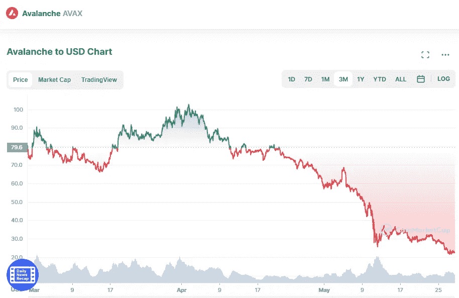

# 5 月 28 日雪崩(AVAX)价格分析

> 原文：<https://medium.com/coinmonks/avalanche-avax-price-analyse-28th-of-may-864c50126103?source=collection_archive---------22----------------------->

Source photo [Avalanche price today, AVAX to USD live, marketcap and chart | CoinMarketCap](https://coinmarketcap.com/currencies/avalanche/)

截至本文撰写之时，雪崩的价格一直在 21.47 美元至 23.69 美元之间波动。AVAX 的价格最近上涨并突破了其上限，表明仍有进一步上涨的空间。RSI 的熊市分歧在盘中得到证实，此后 AVAX 价格向上修正。在 24 美元的水平上有很大的阻力，如果突破可能会导致上涨…